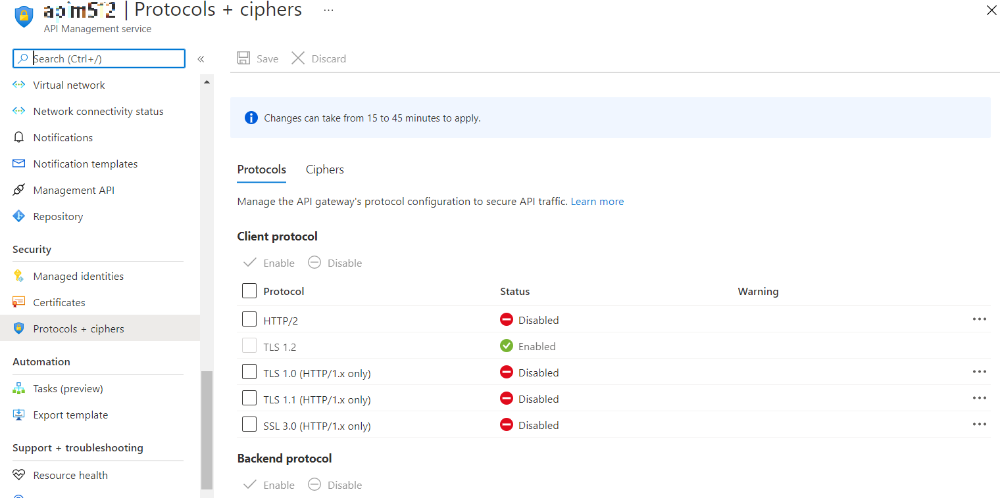

# Manage protocols and ciphers in Azure API Management

Azure API Management supports multiple versions of TLS protocol for both client and backend sides as well as the 3DES cipher.

This guide shows you how to manage protocols and ciphers configuration for an Azure API Management instance.

## Prerequisites

To follow the steps in this article, you must have:

* An API Management instance

## How to manage TLS protocols and 3DES cipher

1. Navigate to your **API Management instance** in the Azure portal.
2. Select **Protocol settings** from the menu.  
3. Enable or disable desired protocols or ciphers.
4. Click **Save**. Changes will be applied within an hour.  

## Next steps

* Learn more about [TLS (Transport Layer Security)](https://docs.microsoft.com/dotnet/framework/network-programming/tls).
* Check out more [videos](https://azure.microsoft.com/documentation/videos/index/?services=api-management) about API Management.