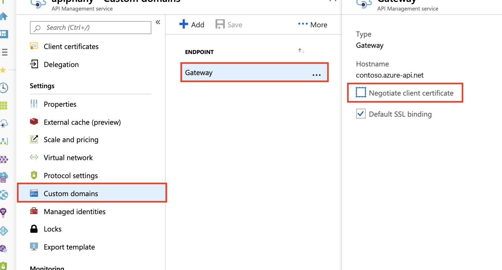
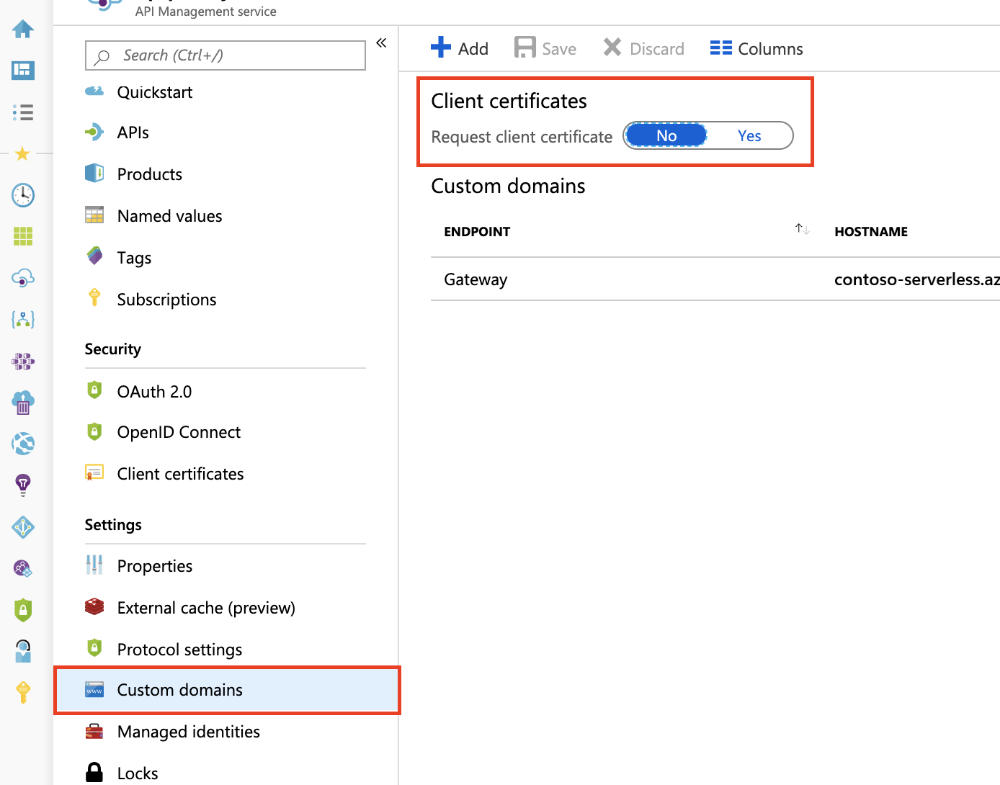

# How to secure APIs using client certificate authentication in API Management

API Management provides the capability to secure access to APIs (that is, client to API Management) using client certificates and mutual TLS authentication. You can validate certificates presented by the connecting client and check certificate properties against desired values using policy expressions.

For information about securing access to the backend service of an API using client certificates (that is, API Management to backend), see [How to secure back-end services using client certificate authentication](./api-management-howto-mutual-certificates.md).

For a conceptual overview of API authorization, see [Authentication and authorization to APIs in API Management](authentication-authorization-overview.md). 

## Certificate options

For certificate validation, API Management can check against certificates managed in your API Management instance. If you choose to use API Management to manage client certificates, you have the following options:

* Reference a certificate managed in [Azure Key Vault](../key-vault/general/overview.md) 
* Add a certificate file directly in API Management

Using key vault certificates is recommended because it helps improve API Management security:

* Certificates stored in key vaults can be reused across services
* Granular [access policies](../key-vault/general/security-features.md#privileged-access) can be applied to certificates stored in key vaults
* Certificates updated in the key vault are automatically rotated in API Management. After update in the key vault, a certificate in API Management is updated within 4 hours. You can also manually refresh the certificate using the Azure portal or via the management REST API.

## Prerequisites

* If you have not created an API Management service instance yet, see [Create an API Management service instance](get-started-create-service-instance.md).
* You need access to the certificate and the password for management in an Azure key vault or upload to the API Management service. The certificate must be in either CER or PFX format. Self-signed certificates are allowed. 

    If you use a self-signed certificate, also install trusted root and intermediate [CA certificates](api-management-howto-ca-certificates.md) in your API Management instance.
    
    > [!NOTE]
    > CA certificates for certificate validation are not supported in the Consumption tier.

[!INCLUDE [api-management-client-certificate-key-vault](../../includes/api-management-client-certificate-key-vault.md)]

   > [!NOTE]
   > If you only wish to use the certificate to authenticate the client with API Management, you can upload a CER file.

## Enable API Management instance to receive and verify client certificates

### Developer, Basic, Standard, or Premium tier

To receive and verify client certificates over HTTP/2 in the Developer, Basic, Standard, or Premium tiers, you must enable the **Negotiate client certificate** setting on the **Custom domain** blade as shown below.



### Consumption tier
To receive and verify client certificates in the Consumption tier, you must enable the **Request client certificate** setting on the **Custom domains** blade as shown below.



## Policy to validate client certificates

Use the [validate-client-certificate](validate-client-certificate-policy.md) policy to validate one or more attributes of a client certificate used to access APIs hosted in your API Management instance.

Configure the policy to validate one or more attributes including certificate issuer, subject, thumbprint, whether the certificate is validated against online revocation list, and others.

## Certificate validation with context variables

You can also create policy expressions with the [`context` variable](api-management-policy-expressions.md#ContextVariables) to check client certificates. Examples in the following sections show expressions using the `context.Request.Certificate` property and other `context` properties.

> [!NOTE]
> Mutual certificate authentication might not function correctly when the API Management gateway endpoint is exposed through the Application Gateway. This is because Application Gateway functions as a Layer 7 load balancer, establishing a distinct SSL connection with the backend API Management service. Consequently, the certificate attached by the client in the initial HTTP request will not be forwarded to APIM. However, as a workaround, you can transmit the certificate using the server variables option. For detailed instructions, refer to [Mutual Authentication Server Variables](../application-gateway/rewrite-http-headers-url.md#mutual-authentication-server-variables).

> [!IMPORTANT]
> * Starting May 2021, the `context.Request.Certificate` property only requests the certificate when the API Management instance's [`hostnameConfiguration`](/rest/api/apimanagement/current-ga/api-management-service/create-or-update#hostnameconfiguration) sets the `negotiateClientCertificate` property to True. By default, `negotiateClientCertificate` is set to False.
> * If TLS renegotiation is disabled in your client, you may see TLS errors when requesting the certificate using the `context.Request.Certificate` property. If this occurs, enable TLS renegotiation settings in the client. 

### Checking the issuer and subject

Below policies can be configured to check the issuer and subject of a client certificate:

```xml
<choose>
    <when condition="@(context.Request.Certificate == null || !context.Request.Certificate.Verify() || context.Request.Certificate.Issuer != "trusted-issuer" || context.Request.Certificate.SubjectName.Name != "expected-subject-name")" >
        <return-response>
            <set-status code="403" reason="Invalid client certificate" />
        </return-response>
    </when>
</choose>
```

> [!NOTE]
> To disable checking certificate revocation list, use `context.Request.Certificate.VerifyNoRevocation()` instead of `context.Request.Certificate.Verify()`.
> If client certificate is self-signed, root (or intermediate) CA certificate(s) must be [uploaded](api-management-howto-ca-certificates.md) to API Management for `context.Request.Certificate.Verify()` and `context.Request.Certificate.VerifyNoRevocation()` to work.

### Checking the thumbprint

Below policies can be configured to check the thumbprint of a client certificate:

```xml
<choose>
    <when condition="@(context.Request.Certificate == null || !context.Request.Certificate.Verify() || context.Request.Certificate.Thumbprint != "DESIRED-THUMBPRINT-IN-UPPER-CASE")" >
        <return-response>
            <set-status code="403" reason="Invalid client certificate" />
        </return-response>
    </when>
</choose>
```

> [!NOTE]
> To disable checking certificate revocation list, use `context.Request.Certificate.VerifyNoRevocation()` instead of `context.Request.Certificate.Verify()`.
> If client certificate is self-signed, root (or intermediate) CA certificate(s) must be [uploaded](api-management-howto-ca-certificates.md) to API Management for `context.Request.Certificate.Verify()` and `context.Request.Certificate.VerifyNoRevocation()` to work.

### Checking a thumbprint against certificates uploaded to API Management

The following example shows how to check the thumbprint of a client certificate against certificates uploaded to API Management:

```xml
<choose>
    <when condition="@(context.Request.Certificate == null || !context.Request.Certificate.Verify()  || !context.Deployment.Certificates.Any(c => c.Value.Thumbprint == context.Request.Certificate.Thumbprint))" >
        <return-response>
            <set-status code="403" reason="Invalid client certificate" />
        </return-response>
    </when>
</choose>

```

> [!NOTE]
> To disable checking certificate revocation list, use `context.Request.Certificate.VerifyNoRevocation()` instead of `context.Request.Certificate.Verify()`.
> If client certificate is self-signed, root (or intermediate) CA certificate(s) must be [uploaded](api-management-howto-ca-certificates.md) to API Management for `context.Request.Certificate.Verify()` and `context.Request.Certificate.VerifyNoRevocation()` to work.

> [!TIP]
> Client certificate deadlock issue described in this [article](https://techcommunity.microsoft.com/t5/Networking-Blog/HTTPS-Client-Certificate-Request-freezes-when-the-Server-is/ba-p/339672) can manifest itself in several ways, e.g. requests freeze, requests result in `403 Forbidden` status code after timing out, `context.Request.Certificate` is `null`. This problem usually affects `POST` and `PUT` requests with content length of approximately 60KB or larger.
> To prevent this issue from occurring turn on "Negotiate client certificate" setting for desired hostnames on the "Custom domains" blade as shown in the first image of this document. This feature is not available in the Consumption tier.

## Next steps

-   [How to secure backend services using client certificate authentication](./api-management-howto-mutual-certificates.md)
-   [How to add a custom CA certificate in Azure API Management](./api-management-howto-ca-certificates.md)
-   Learn about [policies in API Management](api-management-howto-policies.md)
