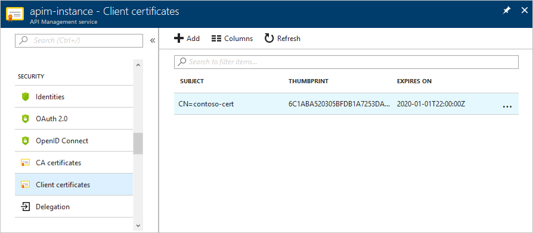
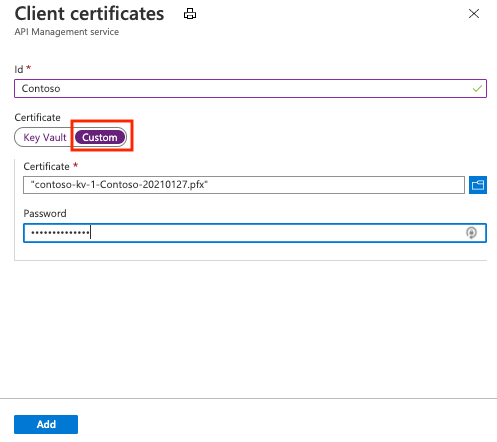
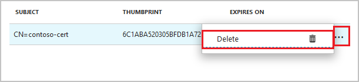
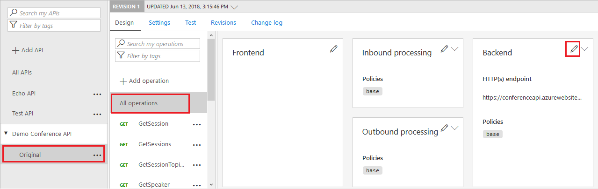
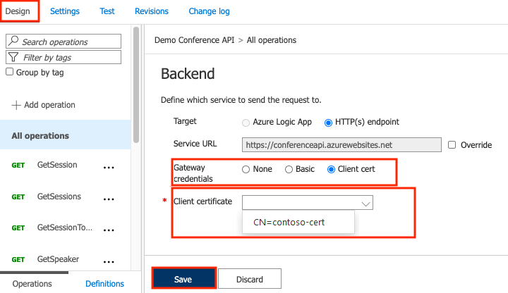

# How to secure back-end services using client certificate authentication in Azure API Management

API Management allows to secure access to the back-end service of an API using client certificates. This guide shows how to manage certificates in the Azure API Management service instance in the Azure portal. It also explains how to configure an API to use a certificate to access a back-end service.

For information about managing certificates using the API Management REST API, see <a href="https://docs.microsoft.com/rest/api/apimanagement/apimanagementrest/azure-api-management-rest-api-certificate-entity">Azure API Management REST API Certificate entity</a>.

## <a name="prerequisites"> </a>Prerequisites

This guide shows you how to configure your API Management service instance to use client certificate authentication to access the back-end service for an API. Before following the steps in this article, you should have your back-end service configured for client certificate authentication ([to configure certificate authentication in Azure WebSites refer to this article][to configure certificate authentication in Azure WebSites refer to this article]). You need access to the certificate and the password for uploading it to the API Management service.

## <a name="step1"> </a>Upload a client certificate



Follow the steps below to upload a new client certificate. If you have not created an API Management service instance yet, see the tutorial [Create an API Management service instance][Create an API Management service instance].

1. Navigate to your Azure API Management service instance in the Azure portal.
2. Select **Client certificates** from the menu.
3. Click the **+ Add** button.  
      
4. Browse for the certificate, provide its ID and password.  
5. Click **Create**.

> [!NOTE]
> The certificate must be in **.pfx** format. Self-signed certificates are allowed.

Once the certificate is uploaded, it shows in the **Client certificates**.  If you have many certificates, make a note of the thumbprint of the desired certificate in order to [Configure an API to use a client certificate for gateway authentication][Configure an API to use a client certificate for gateway authentication].

> [!NOTE]
> To turn off certificate chain validation when using, for example, a self-signed certificate, follow the steps described in this FAQ [item](api-management-faq.md#can-i-use-a-self-signed-ssl-certificate-for-a-back-end).

## <a name="step1a"> </a>Delete a client certificate

To delete a certificate, click context menu **...** and select **Delete** beside the certificate.



If the certificate is in use by an API, then a warning screen is displayed. To delete the certificate, you must first remove the certificate from any APIs that are configured to use it.


## <a name="step2"> </a>Configure an API to use a client certificate for gateway authentication

1. Click **APIs** from the **API Management** menu on the left and navigate to the API.  
    

2. In the **Design** tab, click on a pencil icon of the **Backend** section. 
3. Change the **Gateway credentials** to **Client cert** and select your certificate from the dropdown.  
    

4. Click **Save**. 

> [!WARNING]
> This change is effective immediately, and calls to operations of that API will use the certificate to authenticate on the back-end server.


> [!TIP]
> When a certificate is specified for gateway authentication for the back-end service of an API, it becomes part of the policy for that API, and can be viewed in the policy editor.

## Self-signed certificates

If you are using self-signed certificates, you will need to disable certificate chain validation in order for API Management to communicate with the backend system. Otherwise it will return a 500 error code. To configure this, you can use the [`New-AzureRmApiManagementBackend`](https://docs.microsoft.com/powershell/module/azurerm.apimanagement/new-azurermapimanagementbackend) (for new back end) or [`Set-AzureRmApiManagementBackend`](https://docs.microsoft.com/powershell/module/azurerm.apimanagement/set-azurermapimanagementbackend) (for existing back end) PowerShell cmdlets and set the `-SkipCertificateChainValidation` parameter to `True`.

```
$context = New-AzureRmApiManagementContext -resourcegroup 'ContosoResourceGroup' -servicename 'ContosoAPIMService'
New-AzureRmApiManagementBackend -Context  $context -Url 'https://contoso.com/myapi' -Protocol http -SkipCertificateChainValidation $true
```

[How to add operations to an API]: api-management-howto-add-operations.md
[How to add and publish a product]: api-management-howto-add-products.md
[Monitoring and analytics]: ../api-management-monitoring.md
[Add APIs to a product]: api-management-howto-add-products.md#add-apis
[Publish a product]: api-management-howto-add-products.md#publish-product
[Get started with Azure API Management]: get-started-create-service-instance.md
[API Management policy reference]: api-management-policy-reference.md
[Caching policies]: api-management-policy-reference.md#caching-policies
[Create an API Management service instance]: get-started-create-service-instance.md

[Azure API Management REST API Certificate entity]: http://msdn.microsoft.com/library/azure/dn783483.aspx
[WebApp-GraphAPI-DotNet]: https://github.com/AzureADSamples/WebApp-GraphAPI-DotNet
[to configure certificate authentication in Azure WebSites refer to this article]: ../app-service/app-service-web-configure-tls-mutual-auth.md

[Prerequisites]: #prerequisites
[Upload a client certificate]: #step1
[Delete a client certificate]: #step1a
[Configure an API to use a client certificate for gateway authentication]: #step2
[Test the configuration by calling an operation in the Developer Portal]: #step3
[Next steps]: #next-steps
