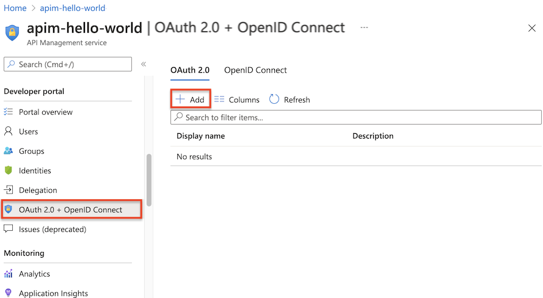
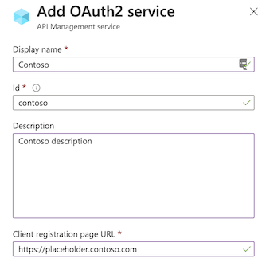
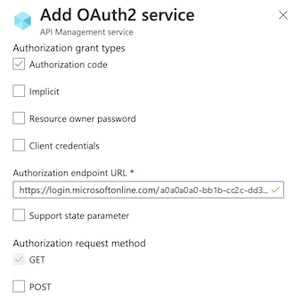
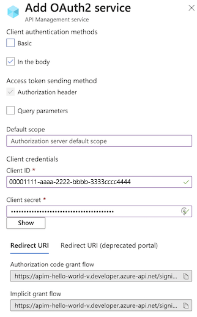
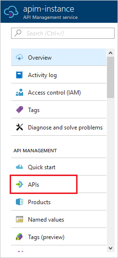
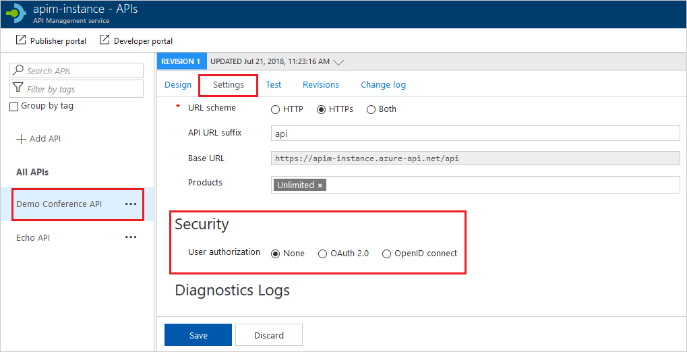
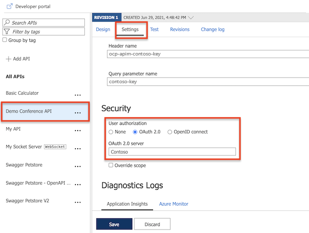

# How to authorize developer accounts using OAuth 2.0 in Azure API Management

Many APIs support [OAuth 2.0](https://oauth.net/2/) to secure the API and ensure that only valid users have access, and they can only access resources to which they're entitled. In order to use Azure API Management's interactive Developer Console with such APIs, the service allows you to configure your service instance to work with your OAuth 2.0 enabled API.

> [!IMPORTANT]
> OAuth 2.0 authorization is not yet available in the interactive console of the new developer portal.

## Prerequisites

This guide shows you how to configure your API Management service instance to use OAuth 2.0 authorization for developer accounts, but does not show you how to configure an OAuth 2.0 provider. The configuration for each OAuth 2.0 provider is different, although the steps are similar, and the required pieces of information used in configuring OAuth 2.0 in your API Management service instance are the same. This topic shows examples using Azure Active Directory as an OAuth 2.0 provider.

> [!NOTE]
> For more information on configuring OAuth 2.0 using Azure Active Directory, see the [WebApp-GraphAPI-DotNet][WebApp-GraphAPI-DotNet] sample.

[!INCLUDE [premium-dev-standard-basic.md](../../includes/api-management-availability-premium-dev-standard-basic.md)]

## Configure an OAuth 2.0 authorization server in API Management

> [!NOTE]
> If you have not yet created an API Management service instance, see [Create an API Management service instance][Create an API Management service instance].

1. Click on the OAuth 2.0 tab in the menu on the left and click on **+Add**.

    

2. Enter a name and an optional description in the **Name** and **Description** fields.

    > [!NOTE]
    > These fields are used to identify the OAuth 2.0 authorization server within the current API Management service instance and their values do not come from the OAuth 2.0 server.

3. Enter the **Client registration page URL**. This page is where users can create and manage their accounts, and varies depending on the OAuth 2.0 provider used. The **Client registration page URL** points to the page that users can use to create and configure their own accounts for OAuth 2.0 providers that support user management of accounts. Some organizations do not configure or use this functionality even if the OAuth 2.0 provider supports it. If your OAuth 2.0 provider does not have user management of accounts configured, enter a placeholder URL here such as the URL of your company, or a URL such as `https://placeholder.contoso.com`.

    

4. The next section of the form contains the **Authorization grant types**, **Authorization endpoint URL**, and **Authorization request method** settings.

    Specify the **Authorization grant types** by checking the desired types. **Authorization code** is specified by default.

    Enter the **Authorization endpoint URL**. For Azure Active Directory, this URL will be similar to the following URL, where `<tenant_id>` is replaced with the ID of your Azure AD tenant.

    `https://login.microsoftonline.com/<tenant_id>/oauth2/authorize`

    The **Authorization request method** specifies how the authorization request is sent to the OAuth 2.0 server. By default **GET** is selected.

5. Then, **Token endpoint URL**, **Client authentication methods**, **Access token sending method** and **Default scope** need to be specified.

    

    For an Azure Active Directory OAuth 2.0 server, the **Token endpoint URL** will have the following format, where `<TenantID>`  has the format of `yourapp.onmicrosoft.com`.

    `https://login.microsoftonline.com/<TenantID>/oauth2/token`

    The default setting for **Client authentication methods** is **Basic**, and  **Access token sending method** is **Authorization header**. These values are configured on this section of the form, along with the **Default scope**.

6. The **Client credentials** section contains the **Client ID** and **Client secret**, which are obtained during the creation and configuration process of your OAuth 2.0 server. Once the **Client ID** and **Client secret** are specified, the **redirect_uri** for the **authorization code** is generated. This URI is used to configure the reply URL in your OAuth 2.0 server configuration.

    

    If **Authorization grant types** is set to **Resource owner password**, the **Resource owner password credentials** section is used to specify those credentials; otherwise you can leave it blank.

    Once the form is complete, click **Create** to save the API Management OAuth 2.0 authorization server configuration. Once the server configuration is saved, you can configure APIs to use this configuration, as shown in the next section.

## Configure an API to use OAuth 2.0 user authorization

1. Click **APIs** from the **API Management** menu on the left.

    

2. Click the name of the desired API and click **Settings**. Scroll to the **Security** section, and then check the box for **OAuth 2.0**.

    

3. Select the desired **Authorization server** from the drop-down list, and click **Save**.

    

## Legacy developer portal - test the OAuth 2.0 user authorization

[!INCLUDE [api-management-portal-legacy.md](../../includes/api-management-portal-legacy.md)]

Once you have configured your OAuth 2.0 authorization server and configured your API to use that server, you can test it by going to the Developer Portal and calling an API. Click **Developer portal (legacy)** in the top menu from your Azure API Management instance **Overview** page.

Click **APIs** in the top menu and select **Echo API**.

![Echo API][api-management-apis-echo-api]

> [!NOTE]
> If you have only one API configured or visible to your account, then clicking APIs takes you directly to the operations for that API.

Select the **GET Resource** operation, click **Open Console**, and then select **Authorization code** from the drop-down.

![Open console][api-management-open-console]

When **Authorization code** is selected, a pop-up window is displayed with the sign-in form of the OAuth 2.0 provider. In this example the sign-in form is provided by Azure Active Directory.

> [!NOTE]
> If you have pop-ups disabled you will be prompted to enable them by the browser. After you enable them, select **Authorization code** again and the sign-in form will be displayed.

![Sign in][api-management-oauth2-signin]

Once you have signed in, the **Request headers** are populated with an `Authorization : Bearer` header that authorizes the request.

![Request header token][api-management-request-header-token]

At this point you can configure the desired values for the remaining parameters, and submit the request.

## Next steps

For more information about using OAuth 2.0 and API Management, see the following video and accompanying [article](api-management-howto-protect-backend-with-aad.md).

[api-management-oauth2-signin]: ./media/api-management-howto-oauth2/api-management-oauth2-signin.png
[api-management-request-header-token]: ./media/api-management-howto-oauth2/api-management-request-header-token.png
[api-management-open-console]: ./media/api-management-howto-oauth2/api-management-open-console.png
[api-management-apis-echo-api]: ./media/api-management-howto-oauth2/api-management-apis-echo-api.png

[How to add operations to an API]: api-management-howto-add-operations.md
[How to add and publish a product]: api-management-howto-add-products.md
[Monitoring and analytics]: api-management-monitoring.md
[Add APIs to a product]: api-management-howto-add-products.md#add-apis
[Publish a product]: api-management-howto-add-products.md#publish-product
[Get started with Azure API Management]: get-started-create-service-instance.md
[API Management policy reference]: api-management-policy-reference.md
[Caching policies]: api-management-policy-reference.md#caching-policies
[Create an API Management service instance]: get-started-create-service-instance.md

[https://oauth.net/2/]: https://oauth.net/2/
[WebApp-GraphAPI-DotNet]: https://github.com/AzureADSamples/WebApp-GraphAPI-DotNet

[Prerequisites]: #prerequisites
[Configure an OAuth 2.0 authorization server in API Management]: #step1
[Configure an API to use OAuth 2.0 user authorization]: #step2
[Test the OAuth 2.0 user authorization in the Developer Portal]: #step3
[Next steps]: #next-steps

