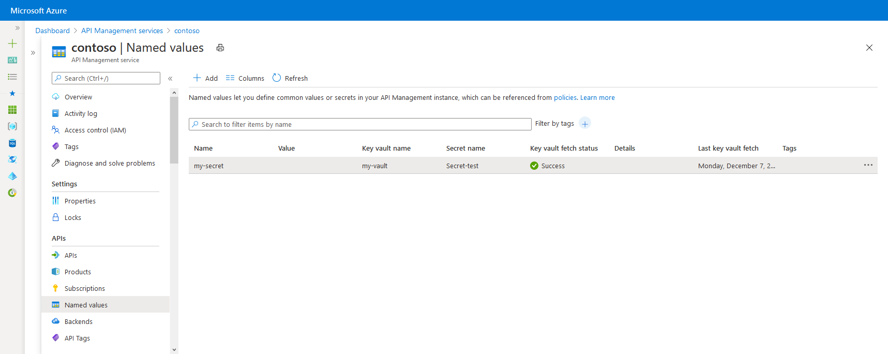
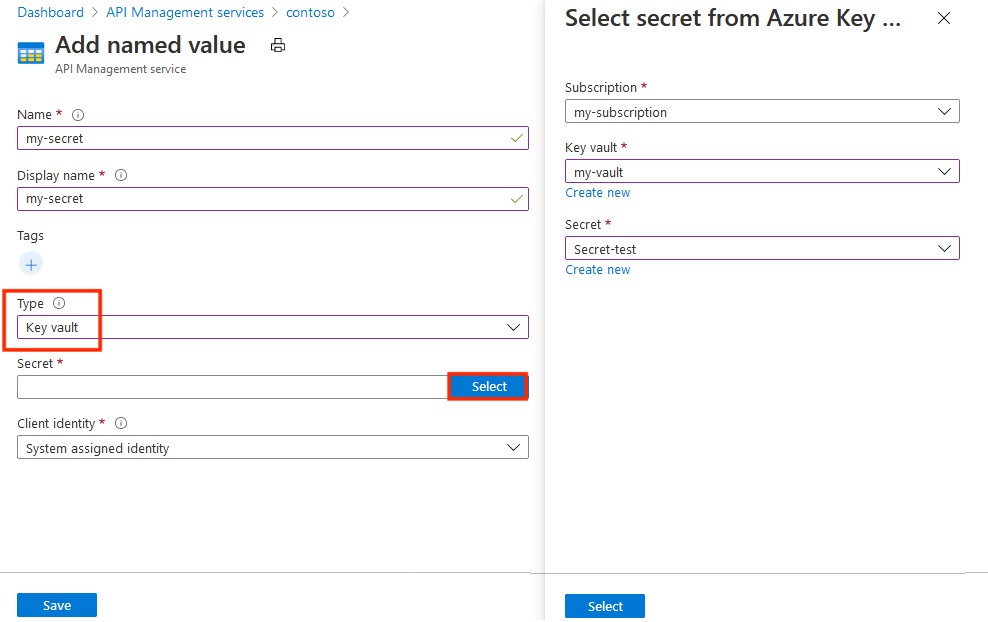

# How to use Named Values in Azure API Management policies
API Management policies are a powerful capability of the system that allow the Azure portal to change the behavior of the API through configuration. Policies are a collection of statements that are executed sequentially on the request or response of an API. Policy statements can be constructed using literal text values, policy expressions, and named values. 

Each API Management service instance has a properties collection of key/value pairs, which is called Named Values, that are global to the service instance. These Named Values can be used to manage constant string values across all API configuration and policies. Each property can have the following attributes:

| Attribute | Type | Description |
| --- | --- | --- |
| `Display name` |string |Alphanumeric string used for referencing the property in the policies. |
| `Value`        |string |The value of the property. It may not be empty or consist only of whitespace. |
| `Secret`       |boolean|Determines whether the value is a secret and should be encrypted or not.|
| `Tags`         |array of string |Optional tags that when provided can be used to filter the property list. |



Property values can contain literal strings and [policy expressions](/azure/api-management/api-management-policy-expressions). For example, the value of `ExpressionProperty` is a policy expression that returns a string containing the current date and time. The property `ContosoHeaderValue` is marked as a secret, so its value is not displayed.

| Name | Value | Secret | Tags |
| --- | --- | --- | --- |
| ContosoHeader |TrackingId |False |Contoso |
| ContosoHeaderValue |•••••••••••••••••••••• |True |Contoso |
| ExpressionProperty |@(DateTime.Now.ToString()) |False | |

## To add and edit a property



1. Select **APIs** from under **API MANAGEMENT**.
2. Select **Named values**.
3. Press **+Add**.

   Name and Value are required values. If this property value is a secret, check the This is a secret checkbox. Enter one or more optional tags to help with organizing your named values, and click Save.
4. Click **Create**.

Once the property is created, you can edit it by clicking on the property. If you change the property name, any policies that reference that property are automatically updated to use the new name.

For information on editing a property using the REST API, see [Edit a property using the REST API](/rest/api/apimanagement/2019-01-01/property?patch).

## To delete a property

To delete a property, click **Delete** beside the property to delete.

> [!IMPORTANT]
> If the property is referenced by any policies, you will be unable to successfully delete it until you remove the property from all policies that use it.
> 
> 

For information on deleting a property using the REST API, see [Delete a property using the REST API](/rest/api/apimanagement/2019-01-01/property/delete).

## To search and filter Named Values

The **Named values** tab includes searching and filtering capabilities to help you manage your named values. To filter the property list by property name, enter a search term in the **Search property** textbox. To display all named values, clear the **Search property** textbox and press enter.

To filter the property list by tag values, enter one or more tags into the **Filter by tags** textbox. To display all named values, clear the **Filter by tags** textbox and press enter.

## To use a property

To use a property in a policy, place the property name inside a double pair of braces like `{{ContosoHeader}}`, as shown in the following example:

```xml
<set-header name="{{ContosoHeader}}" exists-action="override">
  <value>{{ContosoHeaderValue}}</value>
</set-header>
```

In this example, `ContosoHeader` is used as the name of a header in a `set-header` policy, and `ContosoHeaderValue` is used as the value of that header. When this policy is evaluated during a request or response to the API Management gateway, `{{ContosoHeader}}` and `{{ContosoHeaderValue}}` are replaced with their respective property values.

Named values can be used as complete attribute or element values as shown in the previous example, but they can also be inserted into or combined with part of a literal text expression as shown in the following example: `<set-header name = "CustomHeader{{ContosoHeader}}" ...>`

Named values can also contain policy expressions. In the following example, the `ExpressionProperty` is used.

```xml
<set-header name="CustomHeader" exists-action="override">
    <value>{{ExpressionProperty}}</value>
</set-header>
```

When this policy is evaluated, `{{ExpressionProperty}}` is replaced with its value: `@(DateTime.Now.ToString())`. Since the value is a policy expression, the expression is evaluated and the policy proceeds with its execution.

You can test this out in the developer portal by calling an operation that has a policy with named values in scope. In the following example, an operation is called with the two previous example `set-header` policies with named values. Note that the response contains two custom headers that were configured using policies with named values.

![Developer portal][api-management-send-results]

If you look at the [API Inspector trace](api-management-howto-api-inspector.md) for a call that includes the two previous sample policies with named values, you can see the two `set-header` policies with the property values inserted as well as the policy expression evaluation for the property that contained the policy expression.

![API Inspector trace][api-management-api-inspector-trace]

While property values can contain policy expressions, property values can't contain other named values. If text containing a property reference is used for a property value, such as `Property value text {{MyProperty}}`, that property reference won't be replaced and will be included as part of the property value.

## Next steps
* Learn more about working with policies
  * [Policies in API Management](api-management-howto-policies.md)
  * [Policy reference](/azure/api-management/api-management-policies)
  * [Policy expressions](/azure/api-management/api-management-policy-expressions)

[api-management-send-results]: ./media/api-management-howto-properties/api-management-send-results.png
[api-management-properties-filter]: ./media/api-management-howto-properties/api-management-properties-filter.png
[api-management-api-inspector-trace]: ./media/api-management-howto-properties/api-management-api-inspector-trace.png

