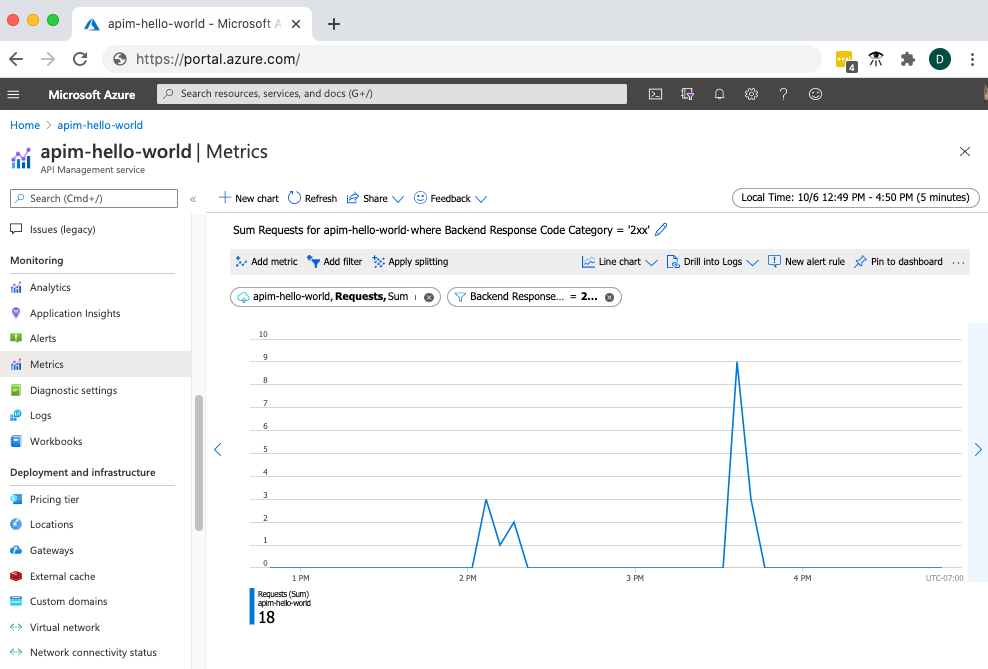
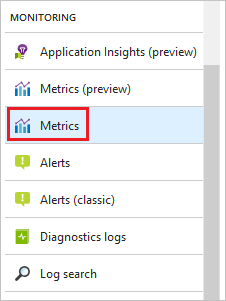
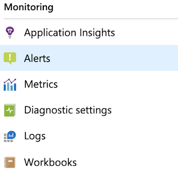
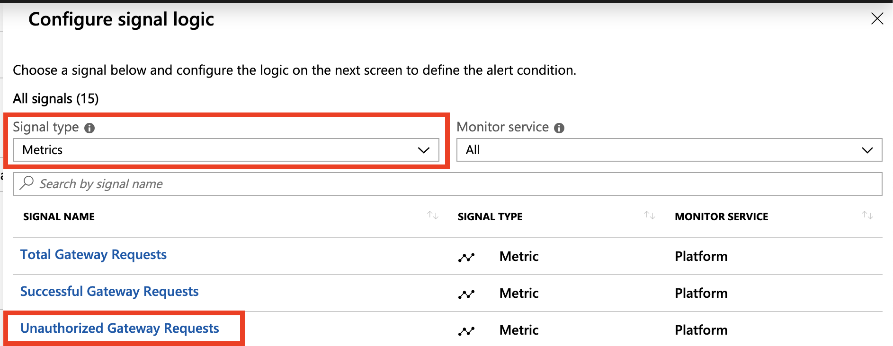
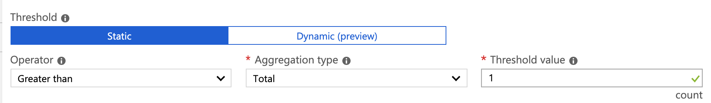
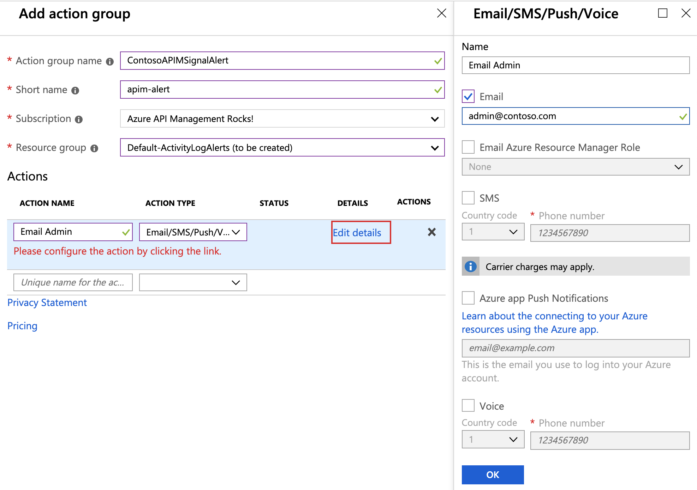
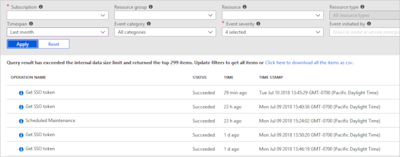
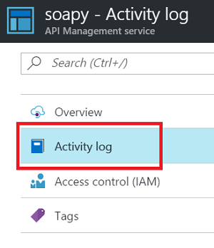
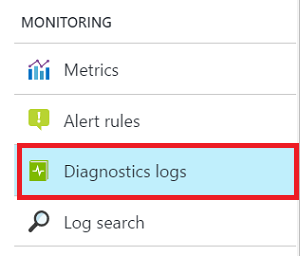

---
# Mandatory fields. See more on aka.ms/skyeye/meta.
title: Monitor published APIs in Azure API Management | Microsoft Docs
description: Follow the steps of this tutorial to learn how to monitor your API in Azure API Management.
services: api-management
author: vladvino
manager: cfowler

ms.service: api-management
ms.workload: mobile
ms.custom: mvc
ms.topic: tutorial
ms.date: 06/15/2018
ms.author: apimpm
---
# Monitor published APIs

With Azure Monitor, you can visualize, query, route, archive, and take actions on the metrics or logs coming from Azure resources.

In this tutorial, you learn how to:

> [!div class="checklist"]
> * View activity logs
> * View resource logs
> * View metrics of your API 
> * Set up an alert rule when your API gets unauthorized calls

The following video shows how to monitor API Management using Azure Monitor. 

> [!VIDEO https://channel9.msdn.com/Blogs/AzureApiMgmt/Monitor-API-Management-with-Azure-Monitor/player]

## Prerequisites

+ Learn the [Azure API Management terminology](api-management-terminology.md).
+ Complete the following quickstart: [Create an Azure API Management instance](get-started-create-service-instance.md).
+ Also, complete the following tutorial: [Import and publish your first API](import-and-publish.md).

[!INCLUDE [premium-dev-standard-basic.md](../../includes/api-management-availability-premium-dev-standard-basic.md)]

## View metrics of your APIs

API Management emits metrics every minute, giving you near real-time visibility into the state and health of your APIs. Following is a summary of some of the available metrics:

* Capacity:  helps you make decisions about upgrading/downgrading your APIM services. The metric is emitted per minute and reflects the gateway capacity at the time of reporting. The metric ranges from 0-100 calculated based on gateway resources such as CPU and memory utilization.
* Total Gateway Requests: the number of API requests in the period. 
* Successful Gateway Requests: the number of API requests that received successful HTTP response codes including 304, 307, and anything smaller than 301 (for example, 200).
* Failed Gateway Requests: the number of API requests that received erroneous HTTP response codes including 400, and anything larger than 500.
* Unauthorized Gateway Requests: the number of API requests that received HTTP response codes including 401, 403, and 429.
* Other Gateway Requests: the number of API requests that received HTTP response codes that do not belong to any of the preceding categories (for example, 418).



To access metrics:

1. Select **Metrics** from the menu near the bottom of the page.

    

1. From the drop-down, select metrics you are interested in. For example, **Requests**. 
1. The chart shows the total number of API calls.
1. The chart can be filtered using the dimensions of the **Requests** metric. For example, click on **Add filter**, choose **Backend Response Code**, enter 500 as the value. Now the chart shows the number of requests that were failed in the API backend.   

## Set up an alert rule for unauthorized request

You can configure to receive alerts based on metrics and activity logs. Azure Monitor allows you to configure an alert to do the following when it triggers:

* Send an email notification
* Call a webhook
* Invoke an Azure Logic App

To configure alerts:

1. Select **Alerts** from the menu bar near the bottom of the page.

    

2. Click on a **New alert rule** for this alert.
3. Click on **Add condition**.
4. Select **Metrics** in the Signal type drop down.
5. Select **Unauthorized Gateway Request** as the signal to monitor.

    

6. In the **Configure signal logic** view, specify a threshold after which the alert should be triggered and click **Done**.

    

7. Select an existing Action Group or create a new one. In the example below, an email will be sent to the admins. 

    

8. Provide a name, description of the alert rule and choose the severity level. 
9. Press **Create alert rule**.
10. Now, try to call the Conference API without an API key. The alert will be triggered and email will be sent to the admins. 

## Activity Logs

Activity logs provide insight into the operations that were performed on your API Management services. Using activity logs, you can determine the "what, who, and when" for any write operations (PUT, POST, DELETE) taken on your API Management services.

> [!NOTE]
> Activity logs do not include read (GET) operations or operations performed in the Azure portal or using the original Management APIs.

You can access activity logs in your API Management service, or access logs of all your Azure resources in Azure Monitor. 



To view activity logs:

1. Select your APIM service instance.
2. Click **Activity log**.

    

3. Select desired filtering scope and click **Apply**.

## Resource Logs

Resource logs provide rich information about operations and errors that are important for auditing as well as troubleshooting purposes. Resource logs differ from activity logs. The activity logs provides insights into the operations that were performed on your Azure resources. Resource logs provide insight into operations that your resource performed.

To configure resource logs:

1. Select your APIM service instance.
2. Click **Diagnostic settings**.

    

3. Click **Turn on diagnostics**. You can archive resource logs along with metrics to a storage account, stream them to an Event Hub, or send them to Azure Monitor logs. 

API Management currently provides resource logs (batched hourly) about individual API request with each entry having the following schema:

```json
{  
    "isRequestSuccess" : "",
    "time": "",
    "operationName": "",
    "category": "",
    "durationMs": ,
    "callerIpAddress": "",
    "correlationId": "",
    "location": "",
    "httpStatusCodeCategory": "",
    "resourceId": "",
    "properties": {   
        "method": "", 
        "url": "", 
        "clientProtocol": "", 
        "responseCode": , 
        "backendMethod": "", 
        "backendUrl": "", 
        "backendResponseCode": ,
        "backendProtocol": "",  
        "requestSize": , 
        "responseSize": , 
        "cache": "", 
        "cacheTime": "", 
        "backendTime": , 
        "clientTime": , 
        "apiId": "",
        "operationId": "", 
        "productId": "", 
        "userId": "", 
        "apimSubscriptionId": "", 
        "backendId": "",
        "lastError": { 
            "elapsed" : "", 
            "source" : "", 
            "scope" : "", 
            "section" : "" ,
            "reason" : "", 
            "message" : ""
        } 
    }      
}  
```

| Property  | Type | Description |
| ------------- | ------------- | ------------- |
| isRequestSuccess | boolean | True if the HTTP request completed with response status code within 2xx or 3xx range |
| time | date-time | Timestamp of when the gateway starts process the request |
| operationName | string | Constant value 'Microsoft.ApiManagement/GatewayLogs' |
| category | string | Constant value 'GatewayLogs' |
| durationMs | integer | Number of milliseconds from the moment gateway received request until the moment response sent in full. It includes clienTime, cacheTime, and backendTime. |
| callerIpAddress | string | IP address of immediate Gateway caller (can be an intermediary) |
| correlationId | string | Unique http request identifier assigned by API Management |
| location | string | Name of the Azure region where the Gateway that processed the request was located |
| httpStatusCodeCategory | string | Category of http response status code: Successful (301 or less or 304 or 307), Unauthorized (401, 403, 429), Erroneous (400, between 500 and 600), Other |
| resourceId | string | ID of the API Management resource /SUBSCRIPTIONS/\<subscription>/RESOURCEGROUPS/\<resource-group>/PROVIDERS/MICROSOFT.APIMANAGEMENT/SERVICE/\<name> |
| properties | object | Properties of the current request |
| method | string | HTTP method of the incoming request |
| url | string | URL of the incoming request |
| clientProtocol | string | HTTP protocol version of the incoming request |
| responseCode | integer | Status code of the HTTP response sent to a client |
| backendMethod | string | HTTP method of the request sent to a backend |
| backendUrl | string | URL of the request sent to a backend |
| backendResponseCode | integer | Code of the HTTP response received from a backend |
| backendProtocol | string | HTTP protocol version of the request sent to a backend | 
| requestSize | integer | Number of bytes received from a client during request processing | 
| responseSize | integer | Number of bytes sent to a client during request processing | 
| cache | string | Status of API Management cache involvement in request processing (i.e., hit, miss, none) | 
| cacheTime | integer | Number of milliseconds spent on overall API Management cache IO (connecting, sending, and receiving bytes) | 
| backendTime | integer | Number of milliseconds spent on overall backend IO (connecting, sending and receiving bytes) | 
| clientTime | integer | Number of milliseconds spent on overall client IO (connecting, sending and receiving bytes) | 
| apiId | string | API entity identifier for current request | 
| operationId | string | Operation entity identifier for current request | 
| productId | string | Product entity identifier for current request | 
| userId | string | User entity identifier for current request | 
| apimSubscriptionId | string | Subscription entity identifier for current request | 
| backendId | string | Backend entity identifier for current request | 
| LastError | object | Last request processing error | 
| elapsed | integer | Number of milliseconds elapsed between when the gateway received the request  and the moment the error occurred | 
| source | string | Name of the policy or processing internal handler caused the error | 
| scope | string | Scope of the policy document containing the policy that caused the error | 
| section | string | Section of the policy document containing the policy that caused the error | 
| reason | string | Error reason | 
| message | string | Error message | 

## Next steps

In this tutorial, you learned how to:

> [!div class="checklist"]
> * View activity logs
> * View resource logs
> * View metrics of your API
> * Set up an alert rule when your API gets unauthorized calls

Advance to the next tutorial:

> [!div class="nextstepaction"]
> [Trace calls](api-management-howto-api-inspector.md)
