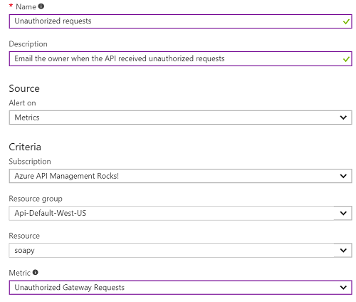

---
# Mandatory fields. See more on aka.ms/skyeye/meta.
title: Monitor published APIs in Azure API Management | Microsoft Docs
description: Follow the steps of this tutorial to learn how to monitor your API in Azure API Management.
services: api-management
documentationcenter: ''
author: juliako
manager: cfowler
editor: ''

ms.service: api-management
ms.workload: mobile
ms.tgt_pltfrm: na
ms.devlang: na
ms.custom: mvc
ms.topic: tutorial
ms.date: 11/19/2017
ms.author: apimpm

---

# Monitor published APIs

Azure Monitor is an Azure service that provides a single source for monitoring all your Azure resources. With Azure Monitor, you can visualize, query, route, archive, and take actions on the metrics and logs coming from Azure resources such as API Management. 

In this tutorial, you learn how to:

> [!div class="checklist"]
> * View activity logs
> * View diagnostic logs
> * View metrics of your API 
> * Set up an alert rule when your API gets unauthorized calls

The following video shows how to monitor API Management using Azure Monitor. 

> [!VIDEO https://channel9.msdn.com/Blogs/AzureApiMgmt/Monitor-API-Management-with-Azure-Monitor/player]
>
>

## Prerequisites

+ Complete the following quickstart: [Create an Azure API Management instance](get-started-create-service-instance.md).
+ Also, complete the following tutorial: [Import and publish your first API](import-and-publish.md).

[!INCLUDE [api-management-navigate-to-instance.md](../../includes/api-management-navigate-to-instance.md)]

## View activity Logs

Activity logs provide insight into the operations that were performed on your API Management services. Using activity logs, you can determine the "what, who, and when" for any write operations (PUT, POST, DELETE) taken on your API Management services. 

> [!NOTE]
> Activity logs do not include read (GET) operations or operations performed in the classic Publisher Portal or using the original Management APIs.

You can access activity logs in your API Management service, or access logs of all your Azure resources in Azure Monitor. 

To view activity logs:

1. From your **API Management** instance, click **Activity log**.

## View diagnostic Logs

Diagnostic logs provide rich information about operations and errors that are important for auditing as well as troubleshooting purposes. Diagnostics logs differ from activity logs. Activity logs provide insights into the operations that were performed on your Azure resources. Diagnostics logs provide insight into operations that your resource performed itself.

To access diagnostic logs:

1. From your **API Management** instance, click **Diagnostic log**.

## View metrics of your APIs

API Management emits metrics every minute, giving you near real-time visibility into the state and health of your APIs. Following is a summary of some of the available metrics:

* Capacity (preview):  helps you make decisions about upgrading/downgrading your APIM services. The metric is emitted per minute and reflects the gateway capacity at the time of reporting. The metric ranges from 0-100 and is calculated based on gateway recourses such as CPU and memory utilization.
* Total Gateway Requests: the number of API requests in the period. 
* Successful Gateway Requests: the number of API requests that received successful HTTP response codes including 304, 307 and anything smaller than 301 (for example, 200). 
* Failed Gateway Requests: the number of API requests that received erroneous HTTP response codes including 400 and anything larger than 500.
* Unauthorized Gateway Requests: the number of API requests that received HTTP response codes including 401, 403, and 429. 
* Other Gateway Requests: the number of API requests that received HTTP response codes that do not belong to any of the preceding categories (for example, 418).

To access metrics:

1. Select **Metrics** from the menu near the bottom of the page.
2. From the drop-down, select metrics you are interested in (you can add multiple metrics). 
    
    For example, select **Total Gateway Requests** and **Failed Gateway Requests** from the list of available metrics.
3. The chart shows the total number of API calls. It also shows the number of API calls that failed. 

## Set up an alert rule for unauthorized request

You can configure to receive alerts based on metrics and activity logs. Azure Monitor allows you to configure an alert to do the following when it triggers:

* Send an email notification
* Call a webhook
* Invoke an Azure Logic App

To configure alerts:

1. Select **Alert rules** from the menu bar near the bottom of the page.
2. Select **Add metric alert**.
3. Enter a **Name** for this alert.
4. Select **Unauthorized Gateway Requests** as the metric to monitor.
5. Select **Email owners, contributors, and readers**.
6. Press **OK**.
7. Try to call our Conference API without an API key. As the owner of this API Management service, you receive an email alert. 

    > [!TIP]
    > The alert rule can also call a Web Hook or an Azure Logic App when it is triggered.

    

## Next steps

In this tutorial, you learned how to:

> [!div class="checklist"]
> * View activity logs
> * View diagnostic logs
> * View metrics of your API 
> * Set up an alert rule when your API gets unauthorized calls

Advance to the next tutorial:

> [!div class="nextstepaction"]
> [Trace calls](api-management-howto-api-inspector.md)