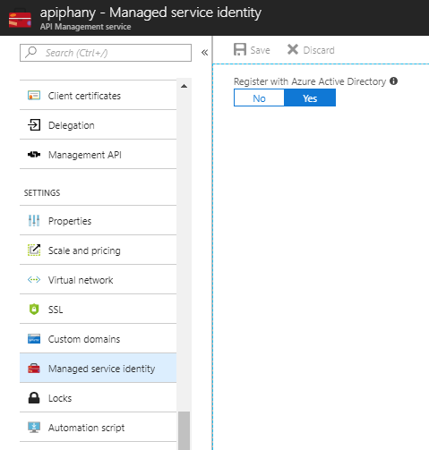

# Use managed identities in Azure API Management

This article shows you how to create a managed identity for an API Management service instance and how to access other resources. A managed identity generated by Azure Active Directory (Azure AD) allows your API Management instance to easily and securely access other Azure AD-protected resources, such as Azure Key Vault. This identity is managed by Azure and does not require you to provision or rotate any secrets. For more information about managed identities, see [What is managed identities for Azure resources](../active-directory/managed-identities-azure-resources/overview.md).

## Create a managed identity for an API Management instance

### Using the Azure portal

To set up a managed identity in the portal, you will first create an API Management instance as normal and then enable the feature.

1. Create an API Management instance in the portal as you normally would. Navigate to it in the portal.
2. Select **Managed service identities**.
3. Switch Register with Azure Active Directory to On. Click Save.



### Using the Azure Resource Manager template

You can create an API Management instance with an identity by including the following property in the resource definition:

```json
"identity" : {
    "type" : "SystemAssigned"
}
```

This tells Azure to create and manage the identity for your API Management instance.

For example, a complete Azure Resource Manager template might look like the following:

```json
{
	"$schema": "https://schema.management.azure.com/schemas/2014-04-01-preview/deploymentTemplate.json#",
	"contentVersion": "0.9.0.0",
	"resources": [{
		"apiVersion": "2017-03-01",
		"name": "contoso",
		"type": "Microsoft.ApiManagement/service",
		"location": "[resourceGroup().location]",
		"tags": {},
		"sku": {
			"name": "Developer",
			"capacity": "1"
		},
		"properties": {
			"publisherEmail": "admin@contoso.com",
			"publisherName": "Contoso"
		},
		"identity": {
			"type": "systemAssigned"
		}
	}]
}
```
## Use the managed service identity to access other resources

> [!NOTE]
> Currently, managed identities can be used to obtain certificates from Azure Key Vault for API Management custom domain names. More scenarios will be supported soon.
>
>


### Obtain a certificate from Azure Key Vault

#### Prerequisites
1. The Key Vault containing the pfx certificate must be in the same Azure subscription and the same Resource Group as the API Management service. This is a requirement of the Azure Resource Manager template.
2. The Content Type of the secret must be *application/x-pkcs12*. You can use the following script to upload the certificate:

```powershell
$pfxFilePath = "PFX_CERTIFICATE_FILE_PATH" # Change this path 
$pwd = "PFX_CERTIFICATE_PASSWORD" # Change this password 
$flag = [System.Security.Cryptography.X509Certificates.X509KeyStorageFlags]::Exportable 
$collection = New-Object System.Security.Cryptography.X509Certificates.X509Certificate2Collection 
$collection.Import($pfxFilePath, $pwd, $flag) 
$pkcs12ContentType = [System.Security.Cryptography.X509Certificates.X509ContentType]::Pkcs12 
$clearBytes = $collection.Export($pkcs12ContentType) 
$fileContentEncoded = [System.Convert]::ToBase64String($clearBytes) 
$secret = ConvertTo-SecureString -String $fileContentEncoded -AsPlainText –Force 
$secretContentType = 'application/x-pkcs12' 
Set-AzureKeyVaultSecret -VaultName KEY_VAULT_NAME -Name KEY_VAULT_SECRET_NAME -SecretValue $Secret -ContentType $secretContentType
```

> [!Important]
> If the object version of the certificate is not provided, API Management will automatically obtain the newer version of the certificate after it is uploaded to Key Vault.

The following example shows an Azure Resource Manager template that contains the following steps:

1. Create an API Management instance with a managed identity.
2. Update the access policies of an Azure Key Vault instance and allow the API Management instance to obtain secrets from it.
3. Update the API Management instance by setting a custom domain name through a certificate from the Key Vault instance.

```json
{
	"$schema": "https://schema.management.azure.com/schemas/2015-01-01/deploymentTemplate.json#",
	"contentVersion": "1.0.0.0",
	"parameters": {
		"publisherEmail": {
			"type": "string",
			"minLength": 1,
			"metadata": {
				"description": "The email address of the owner of the service"
			}
		},
		"publisherName": {
			"type": "string",
			"defaultValue": "Contoso",
			"minLength": 1,
			"metadata": {
				"description": "The name of the owner of the service"
			}
		},
		"sku": {
			"type": "string",
			"allowedValues": ["Developer",
			"Standard",
			"Premium"],
			"defaultValue": "Developer",
			"metadata": {
				"description": "The pricing tier of this API Management service"
			}
		},
		"skuCount": {
			"type": "int",
			"defaultValue": 1,
			"metadata": {
				"description": "The instance size of this API Management service."
			}
		},
		"keyVaultName": {
			"type": "string",
			"metadata": {
				"description": "Name of the vault"
			}
		},
		"proxyCustomHostname1": {
			"type": "string",
			"metadata": {
				"description": "Proxy Custom hostname."
			}
		},
		"keyVaultIdToCertificate": {
			"type": "string",
			"metadata": {
				"description": "Reference to the KeyVault certificate. https://contoso.vault.azure.net/secrets/contosogatewaycertificate."
			}
		}
	},
	"variables": {
		"apiManagementServiceName": "[concat('apiservice', uniqueString(resourceGroup().id))]",
		"apimServiceIdentityResourceId": "[concat(resourceId('Microsoft.ApiManagement/service', variables('apiManagementServiceName')),'/providers/Microsoft.ManagedIdentity/Identities/default')]"
	},
	"resources": [{
		"apiVersion": "2017-03-01",
		"name": "[variables('apiManagementServiceName')]",
		"type": "Microsoft.ApiManagement/service",
		"location": "[resourceGroup().location]",
		"tags": {
		},
		"sku": {
			"name": "[parameters('sku')]",
			"capacity": "[parameters('skuCount')]"
		},
		"properties": {
			"publisherEmail": "[parameters('publisherEmail')]",
			"publisherName": "[parameters('publisherName')]"
		},
		"identity": {
			"type": "systemAssigned"
		}
	},
	{
		"type": "Microsoft.KeyVault/vaults/accessPolicies",
		"name": "[concat(parameters('keyVaultName'), '/add')]",
		"apiVersion": "2015-06-01",
		"dependsOn": [
			"[resourceId('Microsoft.ApiManagement/service', variables('apiManagementServiceName'))]"
		],
		"properties": {
			"accessPolicies": [{
				"tenantId": "[reference(variables('apimServiceIdentityResourceId'), '2015-08-31-PREVIEW').tenantId]",
				"objectId": "[reference(variables('apimServiceIdentityResourceId'), '2015-08-31-PREVIEW').principalId]",
				"permissions": {
					"secrets": ["get"]
				}
			}]
		}
	},
	{
		"apiVersion": "2017-05-10",
		"name": "apimWithKeyVault",
		"type": "Microsoft.Resources/deployments",
		"dependsOn": [
		"[resourceId('Microsoft.ApiManagement/service', variables('apiManagementServiceName'))]"
		],
		"properties": {
			"mode": "incremental",
			"templateLink": {
				"uri": "https://raw.githubusercontent.com/solankisamir/arm-templates/master/basicapim.keyvault.json",
				"contentVersion": "1.0.0.0"
			},
			"parameters": {
				"publisherEmail": { "value": "[parameters('publisherEmail')]"},
				"publisherName": { "value": "[parameters('publisherName')]"},
				"sku": { "value": "[parameters('sku')]"},
				"skuCount": { "value": "[parameters('skuCount')]"},
				"proxyCustomHostname1": {"value" : "[parameters('proxyCustomHostname1')]"},
				"keyVaultIdToCertificate": {"value" : "[parameters('keyVaultIdToCertificate')]"}
			}
		}
	}]
}
```

## Next steps

Learn more about managed identities for Azure resources:

* [What is managed identities for Azure resources](../active-directory/managed-identities-azure-resources/overview.md)
* [Azure Resource Manager templates](https://github.com/Azure/azure-quickstart-templates)
* [Authenticate with a managed identity in a policy](./api-management-authentication-policies.md#ManagedIdentity)
