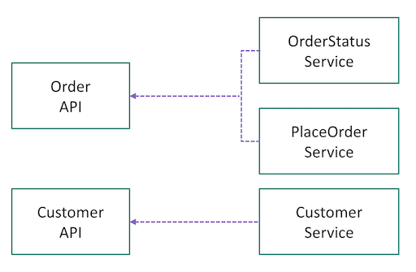
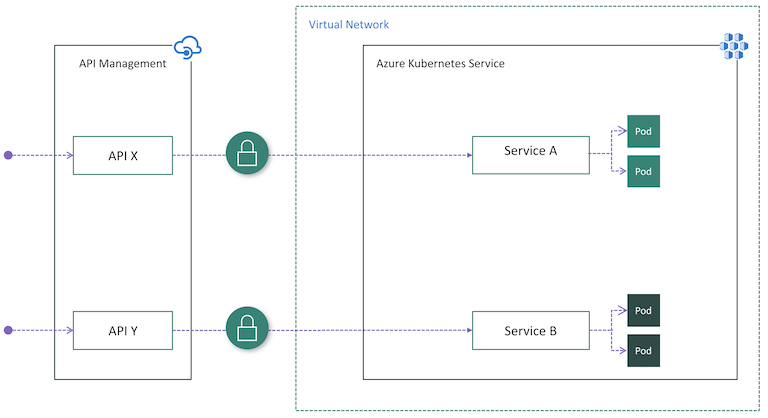
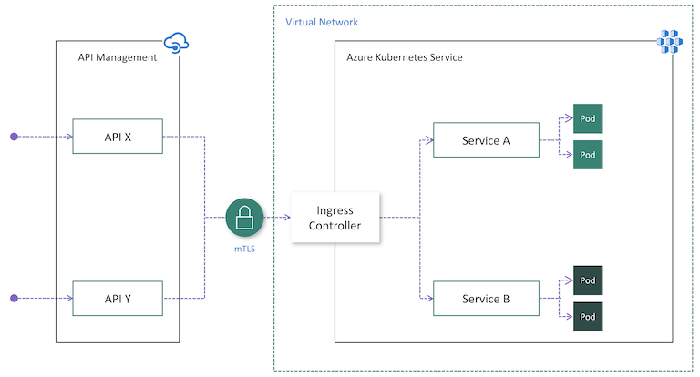
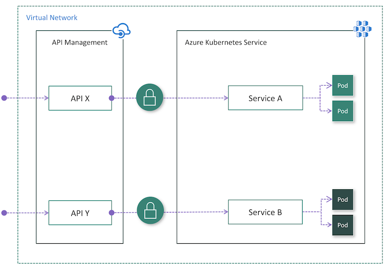
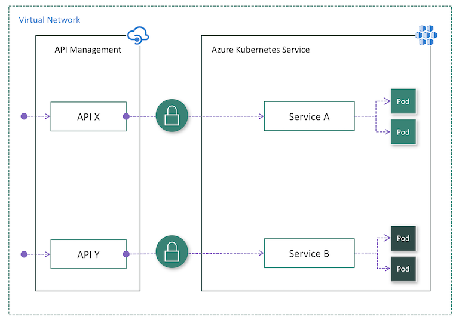

# Use Azure API Management with microservices deployed in Azure Kubernetes Service

Microservices are perfect for building APIs. With [Azure Kubernetes Service](https://azure.microsoft.com/services/kubernetes-service/) (AKS), you can quickly deploy and operate a [microservices-based architecture](https://docs.microsoft.com/azure/architecture/guide/architecture-styles/microservices) in the cloud. You can then leverage [Azure API Management](https://aka.ms/apimrocks) (API Management) to publish your microservices as APIs for internal and external consumption. This article describes the options of deploying API Management with AKS. It assumes basic knowledge of Kubernetes, API Management, and Azure networking. 

## Background

When publishing microservices as APIs for consumption, it can be challenging to manage the communication between the microservices and the clients that consume them. There is a multitude of cross-cutting concerns such as authentication, authorization, throttling, caching, transformation, and monitoring. These concerns are valid regardless of whether the microservices are exposed to internal or external clients. 

The [API Gateway](https://docs.microsoft.com/dotnet/architecture/microservices/architect-microservice-container-applications/direct-client-to-microservice-communication-versus-the-api-gateway-pattern) pattern addresses these concerns. An API gateway serves as a front door to the microservices, decouples clients from your microservices, adds an additional layer of security, and decreases the complexity of your microservices by removing the burden of handling cross cutting concerns. 

[Azure API Management](https://aka.ms/apimrocks) is a turnkey solution to solve your API gateway needs. You can quickly create a consistent and modern gateway for your microservices and publish them as APIs. As a full-lifecycle API management solution, it also provides additional capabilities including a self-service developer portal for API discovery, API lifecycle management, and API analytics.

When used together, AKS and API Management provide a platform for deploying, publishing, securing, monitoring, and managing your microservices-based APIs. In this article, we will go through a few options of deploying AKS in conjunction with API Management. 

## Kubernetes Services and APIs

In a Kubernetes cluster, containers are deployed in [Pods](https://kubernetes.io/docs/concepts/workloads/pods/pod/), which are ephemeral and have a lifecycle. When a worker node dies, the Pods running on the node are lost. Therefore, the IP address of a Pod can change anytime. We cannot rely on it to communicate with the pod. 

To solve this problem, Kubernetes introduced the concept of [Services](https://kubernetes.io/docs/concepts/services-networking/service/). A Kubernetes Service is an abstraction layer which defines a logic group of Pods and enables external traffic exposure, load balancing and service discovery for those Pods. 

When we are ready to publish our microservices as APIs through API Management, we need to think about how to map our Services in Kubernetes to APIs in API Management. There are no set rules. It depends on how you designed and partitioned your business capabilities or domains into microservices at the beginning. For instance, if the pods behind a Service is responsible for all operations on a given resource (e.g., Customer), the Service may be mapped to one API. If operations on a resource are partitioned into multiple microservices (e.g., GetOrder, PlaceOrder), then multiple Services may be logically aggregated into one single API in API management (See Fig. 1). 

The mappings can also evolve. Since API Management creates a façade in front of the microservices, it allows us to refactor and right-size our microservices over time. 

## Deploy API Management in front of AKS

There are a few options of deploying API Management in front of an AKS cluster. 

While an AKS cluster is always deployed in a virtual network (VNet), an API Management instance is not required to be deployed in a VNet. When API Management does not reside within the cluster VNet, the AKS cluster has to publish public endpoints for API Management to connect to. In that case, there is a need to secure the connection between API Management and AKS. In other words, we need to ensure the cluster can only be accessed exclusively through API Management. Let’s go through the options. 

### Option 1: Expose Services publicly

Services in an AKS cluster can be exposed publicly using [Service types](https://docs.microsoft.com/azure/aks/concepts-network) of NodePort, LoadBalancer, or ExternalName. In this case, Services are accessible directly from public internet. After deploying API Management in front of the cluster, we need to ensure all inbound traffic goes through API Management by applying authentication in the microservices. For instance, API Management can include an access token in each request made to the cluster. Each microservice is responsible for validating the token before processing the request. 

This might be the easiest option to deploy API Management in front of AKS, especially if you already have authentication logic implemented in your microservices. 

Pros:
* Easy configuration on the API Management side because it does not need to be injected into the cluster VNet
* No change on the AKS side if Services are already exposed publicly and authentication logic already exists in microservices

Cons:
* Potential security risk due to public visibility of Service endpoints
* No single-entry point for inbound cluster traffic
* Complicates microservices with duplicate authentication logic

### Option 2: Install an Ingress Controller

Although Option 1 might be easier, it has notable drawbacks as mentioned above. If an API Management instance does not reside in the cluster VNet, Mutual TLS authentication (mTLS) is a robust way of ensuring the traffic is secure and trusted in both directions between an API Management instance and an AKS cluster. 

Mutual TLS authentication is [natively supported](https://docs.microsoft.com/azure/api-management/api-management-howto-mutual-certificates) by API Management and can be enabled in Kubernetes by [installing an Ingress Controller](https://docs.microsoft.com/azure/aks/ingress-own-tls) (Fig. 3). As a result, authentication will be performed in the Ingress Controller, which simplifies the microservices. Additionally, you can add the IP addresses of API Management to the allowed list by Ingress to make sure only API Management has access to the cluster.  

 

Pros:
* Easy configuration on the API Management side because it does not need to be injected into the cluster VNet and mTLS is natively supported
* Centralizes protection for inbound cluster traffic at the Ingress Controller layer
* Reduces security risk by minimizing publicly visible cluster endpoints

Cons:
* Increases complexity of cluster configuration due to extra work to install, configure and maintain the Ingress Controller and manage certificates used for mTLS
* Security risk due to public visibility of Ingress Controller endpoint(s)

When you publish APIs through API Management, it's easy and common to secure access to those APIs by using subscription keys. Developers who need to consume the published APIs must include a valid subscription key in HTTP requests when they make calls to those APIs. Otherwise, the calls are rejected immediately by the API Management gateway. They aren't forwarded to the back-end services.

To get a subscription key for accessing APIs, a subscription is required. A subscription is essentially a named container for a pair of subscription keys. Developers who need to consume the published APIs can get subscriptions. And they don't need approval from API publishers. API publishers can also create subscriptions directly for API consumers.

### Option 3: Deploy APIM inside the cluster VNet

In some cases, customers with regulatory constraints or strict security requirements may find Option 1 and 2 not viable solutions due to publicly exposed endpoints. In others, the AKS cluster and the applications that consume the microservices might reside within the same VNet, hence there is no reason to expose the cluster publicly as all API traffic will remain within the VNet. For these scenarios, you can deploy API Management into the cluster VNet. [API Management Premium tier](https://aka.ms/apimpricing) supports VNet deployment. 

There are two modes of [deploying API Management into a VNet](https://docs.microsoft.com/azure/api-management/api-management-using-with-vnet) – External and Internal. 

If API consumers do not reside in the cluster VNet, the External mode (Fig. 4) should be used. In this mode, the API Management gateway is injected into the cluster VNet but accessible from public internet via an external load balancer. It helps to hide the cluster completely while still allow external clients to consume the microservices. Additionally, you can use Azure networking capabilities such as Network Security Groups (NSG) to restrict network traffic.

If all API consumers reside within the cluster VNet, then the Internal mode (Fig. 5) could be used. In this mode, the API Management gateway is injected into the cluster VNET and accessible only from within this VNet via an internal load balancer. There is no way to reach the API Management gateway or the AKS cluster from public internet. 

 In both cases, the AKS cluster is not publicly visible. Compared to Option 2, the Ingress Controller may not be necessary. Depending on your scenario and configuration, authentication might still be required between API Management and your microservices. For instance, if a Service Mesh is adopted, it always requires mutual TLS authentication. 

Pros:
* The most secure option because the AKS cluster has no public endpoint
* Simplifies cluster configuration since it has no public endpoint
* Ability to hide both API Management and AKS inside the VNet using the Internal mode
* Ability to control network traffic using Azure networking capabilities such as Network Security Groups (NSG)

Cons:
* Increases complexity of deploying and configuring API Management to work inside the VNet

## Next steps

* Learn more about [Network concepts for applications in AKS](https://docs.microsoft.com/azure/aks/concepts-network)
* Learn more about [How to use API Management with virtual networks](https://docs.microsoft.com/azure/api-management/api-management-using-with-vnet)

