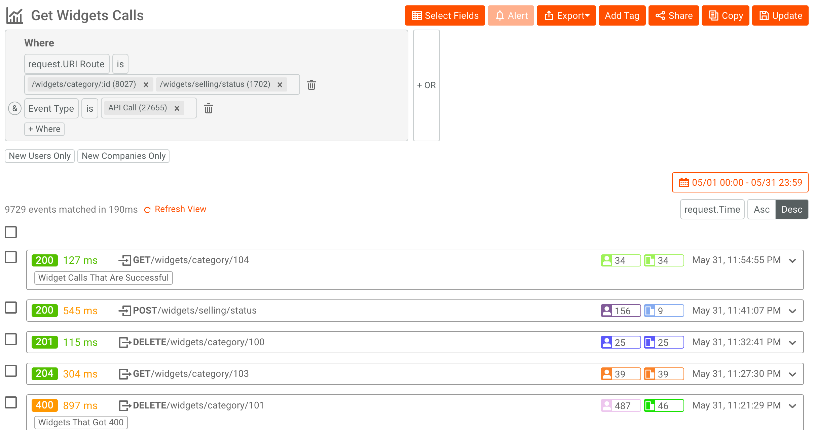

# Monitor your APIs with Azure API Management, Event Hubs, and Moesif
[Azure API Management service](api-management-key-concepts.md) provides many capabilities to enhance the processing of HTTP requests sent to your HTTP API. However, the existence of the requests and responses is transient. The request is made and it flows through the API Management service to your backend API. Your API processes the request and a response flows back through to the API consumer. The API Management service keeps some important statistics about the APIs for display in the Azure portal dashboard, but beyond that, the details are gone.

By using the `log-to-eventhub` policy in the API Management service, you can send any details from the request and response to an [Azure Event Hub](../event-hubs/event-hubs-about.md). There are a variety of reasons why you may want to generate events from HTTP messages being sent to your APIs. Some examples include audit logging of API calls, API usage analytics, monitoring for API errors, and security analysis.

## Solution overview
This article demonstrates how to capture the entire HTTP request and response message, send it to an Event Hub and then relay that message to [Moesif](https://www.moesif.com/?language=azure-api-management), a third-party service that provides HTTP analytics and monitoring. 

This solution works by three components:

> [!div class="checklist"]
> * A APIM policy to send application/HTTP messages to Event Hub
> * An Event Hub to buffer logged HTTP requests
> * An Azure WebJob to process events and send to Moesif 

## Installation tutorial

> [!NOTE]
> An Azure Resource Template and tutorial is available to automatically deploy this solution and start a Azure WebJob.
 
To deploy this solution, view [Analyze API logs using Azure API Management and Moesif](api-management-howto-analyze-api-logs-in-moesif.md).

## Why Send From API Management Service?
It is possible to write HTTP middleware that can plug into HTTP API frameworks to capture HTTP requests and responses and feed them into logging and monitoring systems. The downside to this approach is the HTTP middleware needs to be integrated into the backend API and must match the platform of the API. If there are multiple APIs, then each one must deploy the middleware. Often there are reasons why backend APIs cannot be updated.

Using the Azure API Management service to integrate with logging infrastructure provides a centralized and platform-independent solution. It is also scalable, in part due to the [geo-replication](api-management-howto-deploy-multi-region.md) capabilities of Azure API Management.

## Why send to an Azure Event Hub?
It is a reasonable to ask, why create a policy that is specific to Azure Event Hubs? There are many different places where I might want to log my requests. Why not just send the requests directly to the final destination?  That is an option. However, when making logging requests from an API management service, it is necessary to consider how logging messages impact the performance of the API. Gradual increases in load can be handled by increasing available instances of system components or by taking advantage of geo-replication. However, short spikes in traffic can cause requests to be delayed if requests to logging infrastructure start to slow under load.

The Azure Event Hubs is designed to ingress huge volumes of data, with capacity for dealing with a far higher number of events than the number of HTTP requests most APIs process. The Event Hub acts as a kind of sophisticated buffer between your API management service and the infrastructure that stores and processes the messages. This ensures that your API performance will not suffer due to the logging infrastructure.

Once the data has been passed to an Event Hub, it is persisted and will wait for Event Hub consumers to process it. The Event Hub does not care how it is processed, it just cares about making sure the message will be successfully delivered.

Event Hubs has the ability to stream events to multiple consumer groups. This allows events to be processed by different systems. This enables supporting many integration scenarios without putting addition delays on the processing of the API request within the API Management service as only one event needs to be generated.

## A policy to send application/http messages
An Event Hub accepts event data as a simple string. The content of that string is up to you. To be able to package up an HTTP request and send it off to Event Hubs, we need to format the string with the request or response information.

One option is to use the `application/http` media type as described in the HTTP specification [RFC 7230](https://tools.ietf.org/html/rfc7230). This media type uses the exact same format that is used to actually send HTTP messages over the wire, but the entire message can be put in the body of another HTTP request. In our case, we are just going to use the body as our message to send to Event Hubs. Conveniently, there is a parser that exists in [Microsoft ASP.NET Web API Client](https://www.nuget.org/packages/Microsoft.AspNet.WebApi.Client/) libraries that can parse this format and convert it into the native `HttpRequestMessage` and `HttpResponseMessage` objects.

To be able to create this message, we need to take advantage of C# based [Policy expressions](./api-management-policy-expressions.md) in Azure API Management. Here is a set of sample policies you can add to your APIM APIs, which sends an HTTP request and response messages to Azure Event Hubs. For more information, see [How to set or edit policies](set-edit-policies.md). 

```xml
<policies>
  <inbound>
      <set-variable name="message-id" value="@(Guid.NewGuid())" />
      <log-to-eventhub logger-id="moesif-log-to-event-hub" partition-id="0">
      @{
          var requestLine = string.Format("{0} {1} HTTP/1.1\r\n",
                                                      context.Request.Method,
                                                      context.Request.Url.Path + context.Request.Url.QueryString);

          var body = context.Request.Body?.As<string>(true);
          if (body != null && body.Length > 1024)
          {
              body = body.Substring(0, 1024);
          }

          var headers = context.Request.Headers
                               .Where(h => h.Key != "Authorization" && h.Key != "Ocp-Apim-Subscription-Key")
                               .Select(h => string.Format("{0}: {1}", h.Key, String.Join(", ", h.Value)))
                               .ToArray<string>();

          var headerString = (headers.Any()) ? string.Join("\r\n", headers) + "\r\n" : string.Empty;

          return "request:"   + context.Variables["message-id"] + "\n"
                              + requestLine + headerString + "\r\n" + body;
      }
  </log-to-eventhub>
  </inbound>
  <backend>
      <forward-request follow-redirects="true" />
  </backend>
  <outbound>
      <log-to-eventhub logger-id="moesif-log-to-event-hub" partition-id="1">
      @{
          var statusLine = string.Format("HTTP/1.1 {0} {1}\r\n",
                                              context.Response.StatusCode,
                                              context.Response.StatusReason);

          var body = context.Response.Body?.As<string>(true);
          if (body != null && body.Length > 1024)
          {
              body = body.Substring(0, 1024);
          }

          var headers = context.Response.Headers
                                          .Select(h => string.Format("{0}: {1}", h.Key, String.Join(", ", h.Value)))
                                          .ToArray<string>();

          var headerString = (headers.Any()) ? string.Join("\r\n", headers) + "\r\n" : string.Empty;

          return "response:"  + context.Variables["message-id"] + "\n"
                              + statusLine + headerString + "\r\n" + body;
     }
  </log-to-eventhub>
  </outbound>
</policies>
```

### Policy declaration
There a few particular things worth mentioning about this policy expression which contains three policies:

- Set a message-id
- Log request to Event Hub
- Log response to Event Hub

The `log-to-eventhub` policy has an attribute called logger-id, which refers to the name of the logger that has been created within the API Management service. The details of how to set up an Event Hub logger in the API Management service can be found in the document [How to log events to Azure Event Hubs in Azure API Management](api-management-howto-log-event-hubs.md). The second attribute is an optional parameter that instructs Event Hubs which partition to store the message in. Event Hubs uses partitions to enable scalability and require a minimum of two. The ordered delivery of messages is only guaranteed within a partition. If we do not instruct Event Hub in which partition to place the message, it uses a round-robin algorithm to distribute the load. However, that may cause some of our messages to be processed out of order.

### Partitions
To ensure our messages are delivered to Event Hub consumers in order and take advantage of the load distribution capability of partitions, I chose to send HTTP request messages to one partition and HTTP response messages to a second partition. This ensures an even load distribution and we can guarantee that all requests will be consumed in order and all responses are consumed in order. It is possible for a response to be consumed before the corresponding request, but that is not a problem as we have a different mechanism for correlating requests to responses and we know that requests always come before responses.

### HTTP payloads
After building the `requestLine`, we check to see if the request body should be truncated. Individual Event Hub messages are limited to 256 KB for the Event Hub basic tier, so the request body is truncated to 1024 characters.
This could be increased if using the Event Hub standard tier which has a limit of 1MB. For more information, view [Event Hub quotas and limits](../../includes/event-hubs-limits.md).

When doing logging and analytics a significant amount of information can be derived from just the HTTP request line and headers. Also, many APIs request only return small bodies and so the loss of information value by truncating large bodies is fairly minimal in comparison to the reduction in transfer, processing, and storage costs to keep all body contents. One final note about processing the body is that we need to pass `true` to the `As<string>()` method because we are reading the body contents, but was also want the backend API to be able to read the body. By passing true to this method, we cause the body to be buffered so that it can be read a second time. This is important to be aware of if you have an API that does uploading of large files or uses long polling. In these cases, it would be best to avoid reading the body at all.

### HTTP headers
HTTP Headers can be transferred over into the message format in a simple key/value pair format. We have chosen to strip out certain security sensitive fields, to avoid unnecessarily leaking credential information. It is unlikely that API keys and other credentials would be used for analytics purposes. If we wish to do analysis on the user and the particular product they are using, then we could get that from the `context` object and add that to the message.

### <a name="message-metadata"> </a>Message Id
When building the complete message to send to the event hub, the first line is not actually part of the `application/http` message. The first line is additional metadata consisting of whether the message is a request or response message and a message ID, which is used to correlate requests to responses. The message ID is created by the `set-variable` policy which looks like so:

```xml
<set-variable name="message-id" value="@(Guid.NewGuid())" />
```
The `set-variable` policy creates a value that is accessible by both the `log-to-eventhub` policy in the `<inbound>` section and the `<outbound>` section.

By sending the request and response independently and using a message id to correlate the two, we get a bit more flexibility in the message size, the ability to take advantage of multiple partitions whilst maintaining message order and the request will appear in our logging dashboard sooner. There also may be some scenarios where a valid response is never sent to the event hub, possibly due to a fatal request error in the API Management service, but we still have a record of the request.

## Receiving events from Event Hubs
Events from Azure Event Hub are received using the [AMQP protocol](https://www.amqp.org/). The Microsoft Service Bus team have made client libraries available to make the consuming events easier. There are two different approaches supported, one is being a *Direct Consumer* and the other is using the `EventProcessorHost` class. Examples of these two approaches can be found in the [Event Hubs Programming Guide](../event-hubs/event-hubs-programming-guide.md). The short version of the differences is, `Direct Consumer` gives you complete control and the `EventProcessorHost` does some of the plumbing work for you but makes certain assumptions about how you process those events.

### EventProcessorHost
In this sample, we use the `EventProcessorHost` for simplicity, however it may not the best choice for this particular scenario. `EventProcessorHost` does the hard work of making sure you don't have to worry about threading issues within a particular event processor class. However, in our scenario, we are simply converting the message to another format and passing it along to another service using an async method. There is no need for updating shared state and therefore no risk of threading issues. For most scenarios, `EventProcessorHost` is probably the best choice and it is certainly the easier option.

### IEventProcessor
The central concept when using `EventProcessorHost` is to create an implementation of the `IEventProcessor` interface, which contains the method `ProcessEventAsync`. The essence of that method is shown here:

```csharp
async Task IEventProcessor.ProcessEventsAsync(PartitionContext context, IEnumerable<EventData> messages)
{

    foreach (EventData eventData in messages)
    {
        _Logger.LogInfo(string.Format("Event received from partition: {0} - {1}", context.Lease.PartitionId,eventData.PartitionKey));

        try
        {
            var httpMessage = HttpMessage.Parse(eventData.GetBodyStream());
            await _MessageContentProcessor.ProcessHttpMessage(httpMessage);
        }
        catch (Exception ex)
        {
            _Logger.LogError(ex.Message);
        }
    }
    ... checkpointing code snipped ...
}
```

A list of EventData objects are passed into the method and we iterate over that list. The bytes of each method are parsed into an HttpMessage object and that object is passed to an instance of IHttpMessageProcessor.

### HttpMessage
The `HttpMessage` instance contains three pieces of data:

```csharp
public class HttpMessage
{
    public Guid MessageId { get; set; }
    public bool IsRequest { get; set; }
    public HttpRequestMessage HttpRequestMessage { get; set; }
    public HttpResponseMessage HttpResponseMessage { get; set; }

... parsing code snipped ...

}
```

The `HttpMessage` instance contains a `MessageId` GUID that allows us to connect the HTTP request to the corresponding HTTP response and a boolean value that identifies if the object contains an instance of a HttpRequestMessage and HttpResponseMessage. By using the built-in HTTP classes from `System.Net.Http`, I was able to take advantage of the `application/http` parsing code that is included in `System.Net.Http.Formatting`.  

### IHttpMessageProcessor
The `HttpMessage` instance is then forwarded to implementation of `IHttpMessageProcessor`, which is an interface I created to decouple the receiving and interpretation of the event from Azure Event Hub and the actual processing of it.

## <a name="forwarding-the-http-message"> </a>Sending the events to Moesif
For this sample, I decided it would be interesting to push the HTTP Request over to [Moesif API Analytics](https://www.moesif.com). Moesif is a cloud based service that specializes in [HTTP analytics and debugging](https://www.moesif.com/features/api-analytics). They have a free tier, so it is easy to try and it allows us to see the HTTP requests in real-time flowing through our API Management service.

The full `IHttpMessageProcessor` implementation looks like this:

```csharp
public class MoesifHttpMessageProcessor : IHttpMessageProcessor
{
    private readonly string RequestTimeName = "MoRequestTime";
    private MoesifApiClient _MoesifClient;
    private ILogger _Logger;
    private string _SessionTokenKey;
    private string _ApiVersion;
    ConcurrentDictionary<Guid, HttpMessage> requestsCache = new ConcurrentDictionary<Guid, HttpMessage>();
    ConcurrentDictionary<Guid, HttpMessage> responsesCache = new ConcurrentDictionary<Guid, HttpMessage>();
    private readonly object qLock = new object();
    
    public MoesifHttpMessageProcessor(ILogger logger)
    {
        var appId = Environment.GetEnvironmentVariable("APIMEVENTS-MOESIF-APPLICATION-ID", EnvironmentVariableTarget.Process);
        _MoesifClient = new MoesifApiClient(appId);
        _SessionTokenKey = Environment.GetEnvironmentVariable("APIMEVENTS-MOESIF-SESSION-TOKEN", EnvironmentVariableTarget.Process);
        _ApiVersion = Environment.GetEnvironmentVariable("APIMEVENTS-MOESIF-API-VERSION", EnvironmentVariableTarget.Process);
        _Logger = logger;
    }

    public async Task ProcessHttpMessage(HttpMessage message)
    {
        // message will probably contain either HttpRequestMessage or HttpResponseMessage
        // So we cache both request and response and cache them. 
        // Note, response message might be processed before request
        if (message.HttpRequestMessage != null){
            _Logger.LogDebug("Received req: " + message.MessageId);
            message.HttpRequestMessage.Properties.Add(RequestTimeName, DateTime.UtcNow);
            requestsCache.TryAdd(message.MessageId, message);
        }
        if (message.HttpResponseMessage != null){
            _Logger.LogDebug("Received resp: " + message.MessageId);
            responsesCache.TryAdd(message.MessageId, message);
        }
        await SendCompletedMessagesToMoesif();
    }

    /*
    From requestCache and responseCache, find all messages that have request and response
    Send them to Moesif asynchronously.
    */
    public async Task SendCompletedMessagesToMoesif()
    {
        var completedMessages = RemoveCompletedMessages();
        _Logger.LogDebug("Sending completed Messages to Moesif. Count: " + completedMessages.Count);
        if (completedMessages.Count > 0)
        {
            var moesifEvents = await BuildMoesifEvents(completedMessages);
            // Send async to Moesif. To send synchronously, use CreateEventsBatch instead
            await _MoesifClient.Api.CreateEventsBatchAsync(moesifEvents);
        }
    }

    public Dictionary<Guid, KeyValuePair<HttpMessage, HttpMessage>> RemoveCompletedMessages(){
        Dictionary<Guid, KeyValuePair<HttpMessage, HttpMessage>> messages = new Dictionary<Guid, KeyValuePair<HttpMessage, HttpMessage>>();
        lock(qLock){
            foreach(Guid messageId in requestsCache.Keys.Intersect(responsesCache.Keys))
            {
                HttpMessage reqm, respm;
                requestsCache.TryRemove(messageId, out reqm);
                responsesCache.TryRemove(messageId, out respm);
                messages.Add(messageId, new KeyValuePair<HttpMessage, HttpMessage>(reqm, respm));
            }
        }
        return messages;
    }

    public async Task<List<EventModel>> BuildMoesifEvents(Dictionary<Guid, KeyValuePair<HttpMessage, HttpMessage>> completedMessages)
    {
        List<EventModel> events = new List<EventModel>();
        foreach(KeyValuePair<HttpMessage, HttpMessage> kv in completedMessages.Values)
        {
            events.Add(await BuildMoesifEvent(kv.Key, kv.Value));
        }
        return events;
    }

    /**
    From Http request and response, construct the moesif EventModel
    */
    public async Task<EventModel> BuildMoesifEvent(HttpMessage request, HttpMessage response){
        _Logger.LogDebug("Building Moesif event");
        EventRequestModel moesifRequest = new EventRequestModel()
        {
            Time = (DateTime) request.HttpRequestMessage.Properties[RequestTimeName],
            Uri = request.HttpRequestMessage.RequestUri.OriginalString,
            Verb = request.HttpRequestMessage.Method.ToString(),
            Headers = ToHeaders(request.HttpRequestMessage.Headers),
            ApiVersion = _ApiVersion,
            IpAddress = null,
            Body = request.HttpRequestMessage.Content != null ? System.Convert.ToBase64String(await request.HttpRequestMessage.Content.ReadAsByteArrayAsync()) : null,
            TransferEncoding = "base64"
        };

        EventResponseModel moesifResponse = new EventResponseModel()
        {
            Time = DateTime.UtcNow,
            Status = (int) response.HttpResponseMessage.StatusCode,
            IpAddress = Environment.MachineName,
            Headers = ToHeaders(response.HttpResponseMessage.Headers),
            Body = response.HttpResponseMessage.Content != null ? System.Convert.ToBase64String(await response.HttpResponseMessage.Content.ReadAsByteArrayAsync()) : null,
            TransferEncoding = "base64"
        };

        Dictionary<string, string> metadata = new Dictionary<string, string>();
        metadata.Add("ApimMessageId", request.MessageId.ToString());

        String skey = null;
        if((_SessionTokenKey != null) && (request.HttpRequestMessage.Headers.Contains(_SessionTokenKey)) )
            skey = request.HttpRequestMessage.Headers.GetValues(_SessionTokenKey).FirstOrDefault();
        
        EventModel moesifEvent = new EventModel()
        {
            Request = moesifRequest,
            Response = moesifResponse,
            SessionToken = skey,
            Tags = null,
            UserId = null,
            Metadata = metadata
        };
        return moesifEvent;
    }

    private static Dictionary<string, string> ToHeaders(HttpHeaders headers)
    {
        IEnumerable<KeyValuePair<string, IEnumerable<string>>> enumerable = headers.GetEnumerator().ToEnumerable();
        return enumerable.ToDictionary(p => p.Key, p => p.Value.GetEnumerator()
                                                            .ToEnumerable()
                                                            .ToList()
                                                            .Aggregate((i, j) => i + ", " + j));
    }
}
```

The `MoesifHttpMessageProcessor` takes advantage of a [C# API library for Moesif](https://www.moesif.com/docs/api?csharp#events) that makes it easy to push HTTP event data into their service. In order to send HTTP data to the Moesif Collector API, you need an account and an Application Id. You get a Moesif Application Id by creating an account on [Moesif's website](https://www.moesif.com) and then go to the _Top Right Menu_ -> _App Setup_.

## Complete sample
The [source code](https://github.com/Moesif/ApimEventProcessor) and tests for the sample are on GitHub. You need an [API Management Service](get-started-create-service-instance.md), [a connected Event Hub](api-management-howto-log-event-hubs.md), and a [Storage Account](../storage/common/storage-account-create.md) to run the sample for yourself.  The sample is a Console application that listens for events coming from Event Hub, converts them into a Moesif `EventRequestModel` and `EventResponseModel` objects and then forwards them on to the Moesif Collector API.

> [!NOTE]
> An Azure Resource Template is available to deploy the entire solution automatically and start `ApimEventProcessor` as an Azure WebJob. To get started, view [Analyze API logs using Azure API Management and Moesif](api-management-howto-analyze-api-logs-in-moesif.md).



## Summary
Azure API Management service provides an ideal place to capture the HTTP traffic traveling to and from your APIs. Azure Event Hubs is a highly scalable, low-cost solution for capturing that traffic and feeding it into secondary processing systems for logging, monitoring, and other sophisticated analytics. Connecting to third-party traffic monitoring systems like Moesif is as simple as a few dozen lines of code.

## Next steps
* Learn more about Azure Event Hubs
  * [Get started with Azure Event Hubs](../event-hubs/event-hubs-c-getstarted-send.md)
  * [Receive messages with EventProcessorHost](../event-hubs/event-hubs-dotnet-standard-getstarted-send.md)
  * [Event Hubs programming guide](../event-hubs/event-hubs-programming-guide.md)
* Learn more about API Management and Event Hubs integration
  * [How to log events to Azure Event Hubs in Azure API Management](api-management-howto-log-event-hubs.md)
  * [Logger entity reference](/rest/api/apimanagement/apimanagementrest/azure-api-management-rest-api-logger-entity)
  * [log-to-eventhub policy reference](./api-management-advanced-policies.md#log-to-eventhub)
* Deploy this solution
  * [How to analyze API calls from Azure API Management in Moesif](./api-management-howto-analyze-api-logs-in-moesif.md))
