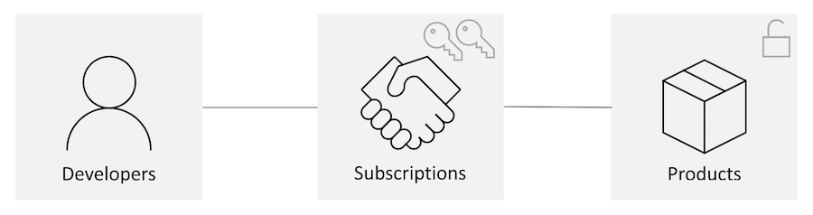

# Subscriptions in Azure API Management

In Azure API Management, *subscriptions* are the most common way for API consumers to access APIs published through an API Management instance. This article provides an overview of the concept.

> [!NOTE]
> An API Management subscription is used specifically to call APIs through API Management using a subscription key. It's not the same as an Azure subscription.

## What are subscriptions?

By publishing APIs through API Management, you can easily secure API access using subscription keys. Developers who need to consume the published APIs must include a valid subscription key in HTTP requests when calling those APIs. Without a valid subscription key, the calls are:
* Rejected immediately by the API Management gateway. 
* Not forwarded to the back-end services.

To access APIs, developers need a subscription and a subscription key. A *subscription* is a named container for a pair of subscription keys. 

In addition,

* Developers can get subscriptions without needing approval from API publishers. 
* API publishers can create subscriptions directly for API consumers.

> [!TIP]
> API Management also supports other mechanisms for securing access to APIs, including the following examples:
> - [OAuth2.0](api-management-howto-protect-backend-with-aad.md)
> - [Client certificates](api-management-howto-mutual-certificates-for-clients.md)
> - [Restrict caller IPs](ip-filter-policy.md)

## Manage subscription keys

Regularly regenerating keys is a common security precaution. Like most Azure services requiring a subscription key, API Management generates keys in pairs. Each application using the service can switch from *key A* to *key B* and regenerate key A with minimal disruption, and vice versa.
> [!NOTE]
> * API Management doesn't provide built-in features to manage the lifecycle of subscription keys, such as setting expiration dates or automatically rotating keys. You can develop workflows to automate these processes using tools such as Azure PowerShell or the Azure SDKs. 
> * To enforce time-limited access to APIs, API publishers may be able to use policies with subscription keys, or use a mechanism that provides built-in expiration such as token-based authentication.

## Scope of subscriptions

Subscriptions can be associated with various scopes: [product](api-management-howto-add-products.md), all APIs, or an individual API.

### Subscriptions for a product

Traditionally, subscriptions in API Management were associated with a single [product](api-management-terminology.md) scope. Developers:
* Found the list of products on the developer portal. 
* Submitted subscription requests for the products they wanted to use. 
* Use the keys in those subscriptions (approved either automatically or by API publishers) to access all APIs in the product. 

Currently, the developer portal only shows the product scope subscriptions under the **User Profile** section. 

### Subscriptions for all APIs or an individual API

You can also create keys that grant access to either:
* A single API, or 
* All APIs within an API Management instance. 

In these cases, you don't need to create a product and add APIs to it first. 

### All-access subscription

Each API Management instance comes with a built in all-access subscription that grants access to all APIs. This service-scoped subscription makes it straightforward for service owners to test and debug APIs within the test console.

> [!WARNING]
> The all-access subscription enables access to every API in the API Management instance and should only be used by authorized users. Never use this subscription for routine API access or embed the all-access subscription key in client apps.

> [!NOTE]
> If you're using an API-scoped subscription or the all-access subscription, any [policies](api-management-howto-policies.md) configured at the product scope aren't applied to requests from that subscription.

### Standalone subscriptions

API Management also allows *standalone* subscriptions, which aren't associated with a developer account. This feature proves useful in scenarios similar to several developers or teams sharing a subscription.

Creating a subscription without assigning an owner makes it a standalone subscription. To grant developers and the rest of your team access to the standalone subscription key, either:
* Manually share the subscription key.
* Use a custom system to make the subscription key available to your team.

## Create and manage subscriptions in Azure portal

API publishers can [create subscriptions](api-management-howto-create-subscriptions.md) directly in the Azure portal. 

When created in the portal, a subscription is in the **Active** state, meaning a subscriber can call an associated API using a valid subscription key. You can change the state of the subscription as needed. For example, you can suspend, cancel, or delete any subscription (including the built-in all-access subscription) to prevent API access.

## Use a subscription key

A subscriber can use an API Management subscription key in one of two ways:

* Add the **Ocp-Apim-Subscription-Key** HTTP header to the request, passing the value of a valid subscription key.

* Include the **subscription-key** query parameter and a valid value in the URL. The query parameter is checked only if the header isn't present.

> [!TIP]
> **Ocp-Apim-Subscription-Key** is the default name of the subscription key header, and **subscription-key** is the default name of the query parameter. If desired, you may modify these names in the settings for each API. For example, in the portal, update these names on the **Settings** tab of an API.

## Enable or disable subscription requirement for API or product access

By default when you create an API, a subscription key is required for API access. Similarly, when you create a product, by default a subscription key is required to access any API that's added to the product. Under certain scenarios, an API publisher might want to publish a product or a particular API to the public without the requirement of subscriptions. While a publisher could choose to enable unsecured (anonymous) access to certain APIs, configuring another mechanism to secure client access is recommended.

> [!CAUTION]
> Use care when configuring a product or an API that doesn't require a subscription. This configuration may be overly permissive and may make an API more vulnerable to certain [API security threats](mitigate-owasp-api-threats.md#security-misconfiguration).

You can disable the subscription requirement at the time you create an API or product, or at a later date.

To disable the subscription requirement using the portal:

* **Disable requirement for product** - On the **Settings** page of the product, disable **Requires subscription**  
* **Disable requirement for API** - In the **Settings** page of the API, disable **Subscription required**. 

After the subscription requirement is disabled, the selected API or APIs can be accessed without a subscription key. 

## How API Management handles requests with or without subscription keys

### API request with a subscription key

When API Management receives an API request from a client with a subscription key, it handles the request according to these rules: 

1. Check if it's a valid key associated with an active subscription, either:

    * A subscription scoped to the API
    * A subscription scoped to a product that's assigned to the API
    * A subscription scoped to all APIs
    * The service-scoped subscription (built-in all access subscription)

    If a valid key for an active subscription at an appropriate scope is provided, access is allowed. Policies are applied depending on the configuration of the policy definition at that scope.

1. Otherwise, access is denied (401 Access denied error).

### API request without a subscription key

When API Management receives an API request from a client without a subscription key, it handles the request according to these rules: 

1. Check first for the existence of a product that includes the API but doesn't require a subscription (an *open* product). If the open product exists, handle the request in the context of the APIs, policies, and access rules configured for the product. An API can be associated with at most one open product.
1. If an open product including the API isn't found, check whether the API requires a subscription. If a subscription isn't required, handle the request in the context of that API and operation.
1. If no configured product or API is found, then access is denied (401 Access denied error).

### Summary table

The following table summarizes how the gateway handles API requests with or without subscription keys in different scenarios. Configurations that could potentially enable unintended, anonymous API access are noted.

|All products assigned to API require subscription  |API requires subscription  |API call with subscription key  |API call without subscription key  | Typical scenarios |
|---------|---------|---------|---------|----|
|✔️     | ✔️     | Access allowed:  • Product-scoped key • API-scoped key • All APIs-scoped key • Service-scoped key  Access denied:  • Other key not scoped to applicable product or API        | Access denied        | Protected API access using product-scoped or API-scoped subscription  |
|✔️     |  ❌    | Access allowed:  • Product-scoped key • API-scoped key • All APIs-scoped key • Service-scoped key  Access denied:  • Other key not scoped to applicable product or API        |  Access allowed (API context)   | • Protected API access with product-scoped subscription  • Anonymous access to API. If anonymous access isn’t intended, configure API-level policies to enforce authentication and authorization. |
|❌1     | ✔️    | Access allowed:  • Product-scoped key • API-scoped key • All APIs-scoped key • Service-scoped key  Access denied:  • Other key not scoped to applicable product or API        |    Access allowed (open product context)     | •	Protected API access with API-scoped subscription  •	Anonymous access to API. If anonymous access isn’t intended, configure with product policies to enforce authentication and authorization  |
|❌1     |  ❌      | Access allowed:  • Product-scoped key • API-scoped key • All APIs-scoped key • Service-scoped key  Access denied:  • Other key not scoped to applicable product or API        | Access allowed (open product context)        | Anonymous access to API. If anonymous access isn’t intended, configure with product policies to enforce authentication and authorization  |

1 An open product exists that's associated with the API. 

### Considerations

-	API access in a product context is the same, whether the product is published or not. Unpublishing the product hides it from the developer portal, but it doesn’t invalidate new or existing subscription keys.
-	Even if a product or API doesn't require a subscription, a valid key from an active subscription that enables access to the product or API can still be used.
-	API access "context" means the policies and access controls that are applied at a particular scope (for example, API or product).

## Next steps
Get more information on API Management:

+ Learn how API Management [policies](set-edit-policies.md#configure-policies-at-different-scopes) get applied at different scopes.
+ Learn other [concepts](api-management-terminology.md) in API Management.
+ Follow our [tutorials](import-and-publish.md) to learn more about API Management.
+ Check our [FAQ page](api-management-faq.yml) for common questions.
