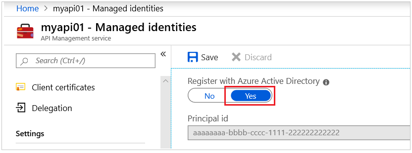
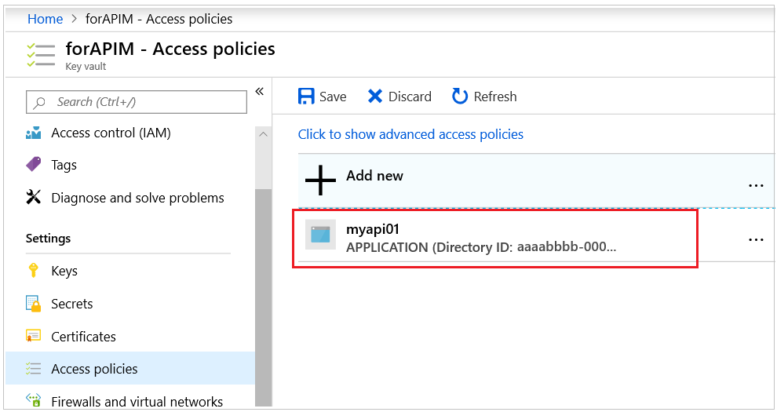

# Failed to update API Management service hostnames

This article describes the "Failed to update API Management service hostnames" error that you may experience when you add a custom domain for the Azure API Management service. This article provides troubleshooting steps to help you resolve the issue.

## Symptoms

When you try to add a custom domain for your API Management service by using a certificate from Azure Key Vault, you receive the following error message:

- Failed to update API Management service hostnames. Request to resource 'https://vaultname.vault.azure.net/secrets/secretname/?api-version=7.0' failed with StatusCode: Forbidden for RequestId: . Exception message: Operation returned an invalid status code 'Forbidden'.

## Cause

The API Management service does not have permission to access the key vault that you're trying to use for the custom domain.

## Solution

To resolve this issue, follow these steps:

1. Go to the [Azure portal](https://portal.azure.com), select your API Management instance, and then select **Managed identities**. Make sure that the **Register with Microsoft Entra ID** option is set to **Yes**. 
    
1. In the Azure portal, open the **Key vaults** service, and select the key vault that you're trying to use for the custom domain.
1. Select **Access policies**, and check whether there is a service principal that matches the name of the API Management service instance. If there is, select the service principal, and make sure that it has the **Get** permission listed under **Secret permissions**.  
    
1. If the API Management service is not in the list, select **Add access policy**, and then create the following access policy:
    - **Configure from Template**: None
    - **Select principal**: Search the name of the API Management service, and then select it from the list
    - **Key permissions**: None
    - **Secret permissions**: Get
    - **Certificate permissions**: None
1. Select **OK** to create the access policy.
1. Select **Save** to save the changes.

Check whether the issue is resolved. To do this, try to create the custom domain in the API Management service by using the Key Vault certificate.

## Next steps
Learn more about API Management service:

- Check out more [videos](https://azure.microsoft.com/documentation/videos/index/?services=api-management) about API Management.
* For other ways to secure your back-end service, see [Mutual Certificate authentication](api-management-howto-mutual-certificates.md).

* [Create an API Management service instance](get-started-create-service-instance.md).
* [Manage your first API](import-and-publish.md).
