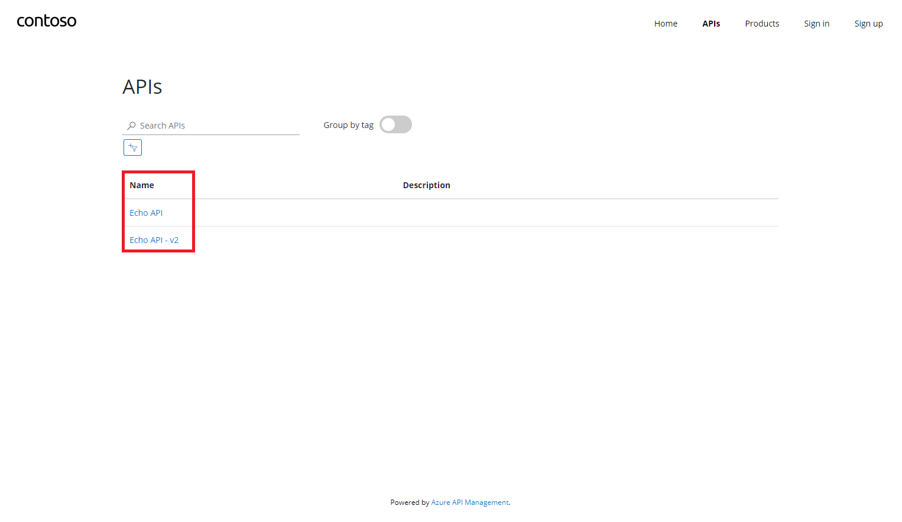
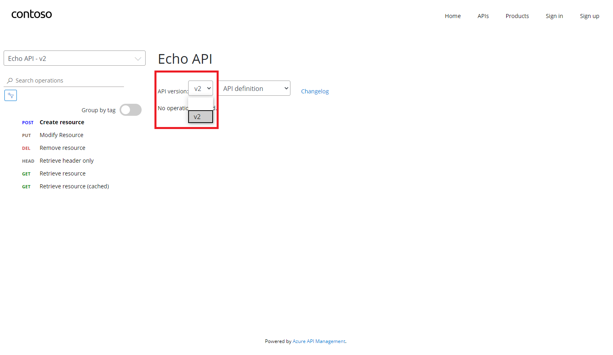

# Versions in Azure API Management

Versions allow you to present groups of related APIs to your developers. You can use versions to handle breaking changes in your API safely. Clients can choose to use your new API version when they're ready, while existing clients continue to use an older version. Versions are differentiated through a version identifier (which is any string value you choose), and a versioning scheme allows clients to identify which version of an API they want to use.

For most purposes, each API version can be considered its own independent API. Two different API versions might have different sets of operations and different policies.

With versions you can:

- Publish multiple versions of your API at the same time.
- Use a path, query string, or header to differentiate between versions.
- Use any string value you wish to identify your version, which could be a number, a date, or a name.
- Show your API versions grouped together on the developer portal.
- Take an existing (non-versioned) API, and create a new version of it without breaking existing clients.

[Get started with versions by following our walkthrough.](./api-management-get-started-publish-versions.md)

## Versioning schemes

Different API developers have different requirements for versioning. Azure API Management doesn't prescribe a single approach to versioning, but instead provides several options.

### Path-based versioning

When the path versioning scheme is used, the version identifier needs to be included in the URL path for any API requests.

For example, `https://apis.contoso.com/products/v1` and `https://apis.contoso.com/products/v2` could refer to the same `products` API but to versions `v1` and `v2` respectively.

The format of an API request URL when using path-based versioning is: `https://{yourDomain}/{apiName}/{versionIdentifier}/{operationId}`.

### Header-based versioning

When the header versioning scheme is used, the version identifier needs to be included in an HTTP request header for any API requests. You can specify the name of the HTTP request header.

For example, you might create a custom header named `Api-Version`, and clients could specify `v1` or `v2` in the value of this header.

### Query string-based versioning

When the query string versioning scheme is used, the version identifier needs to be included in a query string parameter for any API requests. You can specify the name of the query string parameter.

The format of an API request URL when using query string-based versioning is: `https://{yourDomain}/{apiName}/{operationId}?{queryStringParameterName}={versionIdentifier}`.

For example, `https://apis.contoso.com/products?api-version=v1` and `https://apis.contoso.com/products?api-version=v2` could refer to the same `products` API but to versions `v1` and `v2` respectively.

> [!NOTE]
> Query parameters aren't allowed in the `servers` propery of an OpenAPI specification. If you export an OpenAPI specification from an API version, a query string won't appear in the server URL.

## Original versions

If you add a version to a non-versioned API, an `Original` version will be automatically created and will respond on the default URL, without a version identifier specified. The `Original` version ensures that any existing callers are not broken by the process of adding a version. If you create a new API with versions enabled at the start, an `Original` version isn't created.

## How versions are represented

Azure API Management maintains a resource called a *version set*, which represents a set of versions for a single logical API. A version set contains the display name of the versioned API and the [versioning scheme used](#versioning-schemes) to direct requests to specified versions.

Each version of an API is maintained as its own API resource, which is then associated with a version set. A version set might contain APIs with different operations or policies. You might make significant changes between versions in a set.

The Azure portal creates version sets for you. You can modify the name and description for a version set in the Azure portal.

A version set is automatically deleted when the final version is deleted.

You can view and manage version sets directly by using [Azure CLI](/cli/azure/apim/api/versionset), [Azure PowerShell](/powershell/module/az.apimanagement/#api-management), [Resource Manager templates](/azure/templates/microsoft.apimanagement/service/apiversionsets), or the [Azure Resource Manager API](/rest/api/apimanagement/current-ga/api-version-set).

> [!NOTE]
> All versions in a version set have the same versioning scheme, based on the versioning scheme used when you first add a version to an API.
### Migrating a non-versioned API to a versioned API

When you use the Azure portal to enable versioning on an existing API, the following changes are made to your API Management resources:

 * A new version set is created.
 * The existing version is maintained and [configured as the `Original` API version](#original-versions). The API is linked to the version set but doesn't require a version identifier to be specified.
 * The new version is created as a new API, and is linked to the version set. This new API must be accessed using the versioning scheme and identifier.

## Versions and revisions

Versions and revisions are distinct features. Each version can have multiple revisions, just like a non-versioned API. You can use revisions without using versions, or the other way around. Typically versions are used to separate API versions with breaking changes, while revisions can be used for minor and non-breaking changes to an API.

Should you find that your revision has breaking changes, or if you wish to formally turn your revision into a beta/test version, you can create a version from a revision. Using the Azure portal, click the 'Create Version from Revision' on the revision context menu on the Revisions tab.

## Developer portal

The [developer portal](./api-management-howto-developer-portal.md) lists each version of an API separately.

The details of an API also show a list of all of the versions of that API. An `Original` version is displayed without a version identifier.

> [!TIP]
> API versions need to be added to a product before they will be visible on the developer portal.

