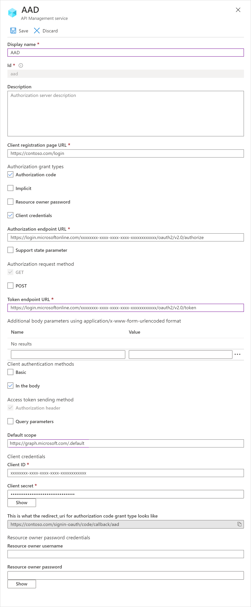

# Configure OAuth 2.0

This article provides an example of what your Azure Active Directory endpoints and scope will look like as well as the callback URLs.

## Azure Active Directory example

**Authorization endpoint**:

```http
https://login.microsoftonline.com/{tenantId}/oauth2/v2.0/authorize
```

**Token endpoint**:

```http
https://login.microsoftonline.com/{tenantId}/oauth2/v2.0/token
```

**Scope**:
```http
https://graph.microsoft.com/.default
```



## Callback URLs

**Authorization code grant flow**:

```http
/signin-oauth/code/callback/{authServerName}
```

**Implicit grant flow**:

```http
/signin-oauth/implicit/callback
```

## Next steps

This article is the last step in the process of creating a self-hosted developer portal. If you'd like to learn more about the developer portal, see these articles:

- [Migrate to the new developer portal](developer-portal-deprecated-migration.md)

- [Authenticate with Azure AD](api-management-howto-aad.md)

- [Authenticate with Azure AD B2C](api-management-howto-aad-b2c.md)

- [Delegated authentication](api-management-howto-setup-delegation.md)


