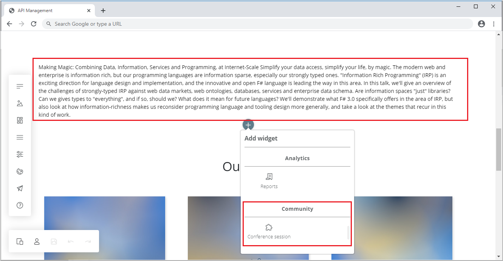
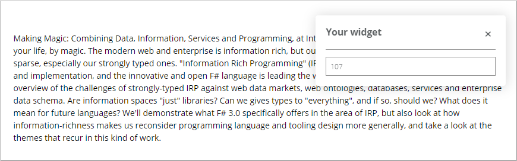

---
title: Implement widgets
titleSuffix: Azure API Management
description: Learn how to implement widgets that consume data from external APIs and shows it in developer portal.
author: erikadoyle
ms.author: apimpm
ms.date: 02/03/2021
ms.service: api-management
ms.topic: how-to
---

# Implement widgets

In this tutorial, you're going to implement a widget that consumes data from an external API and shows it in developer portal.

The widget retrieves the session description from the [Conference API](https://conferenceapi.azurewebsites.net/?format=json) sample. You'll set the session identifier through a widget editor.

If you're lost in the development process, refer to the finished widget. It's located in the [/examples/widgets/conference-session](https://github.com/Azure/api-management-developer-portal/tree/master/examples/widgets/conference-session) folder of the **api-management-developer-portal** repository.



## Prerequisites

Before diving in to the implementation details, learn the anatomy of the [Paperbits widget](https://paperbits.io/wiki/widget-anatomy).

## Implement the widget

### Copy the scaffold

Use a `widget` scaffold from the `/scaffolds` folder as a starting point to build the new widget.

1. Copy the folder `/scaffolds/widget` into `/community/widgets`.

1. Rename the folder to `conference-session`.

### Rename exported module classes

1. Rename the exported module classes by replacing the `Widget` prefix with `ConferenceSession` in the following files:

    - `widget.design.module.ts`

    - `widget.publish.module.ts`

    - `widget.runtime.module.ts`
    
    For example, change `WidgetDesignModule` to `ConferenceSessionDesignModule` in the `widget.design.module.ts`:
    
    **From**
    
    ```typescript
    export class WidgetDesignModule implements IInjectorModule {
    ```
    
    **To**
    
    ```typescript
    export class ConferenceSessionDesignModule implements IInjectorModule {
    ```
    
### Register the widget

Register a widget's modules in the portal's root modules. Do so by adding these lines to the files:

1. `src/apim.design.module.ts` - a module that registers design-time dependencies.

    ```typescript
    import { ConferenceSessionDesignModule } from "../community/widgets/conference-session/widget.design.module";

    ...

        injector.bindModule(new ConferenceSessionDesignModule());
    ```

1. `src/apim.publish.module.ts` - publish-time dependencies.

    ```typescript
    import { ConferenceSessionPublishModule } from "../community/widgets/conference-session/widget.publish.module";

    ...

        injector.bindModule(new ConferenceSessionPublishModule());
    ```

1. `src/apim.runtime.module.ts` - run-time dependencies.

    ```typescript
    import { ConferenceSessionRuntimeModule } from "../community/widgets/conference-session/widget.runtime.module";

    ...

        injector.bindModule(new ConferenceSessionRuntimeModule());
    ```

### Place the widget in the portal

You're now ready to plug in the duplicated scaffold and use it in developer portal.

1. Run the `npm start` command.

1. When the application loads, place the new widget on a page. You can find it under the name **Your widget** in the **Community** category in the widget selector.

    

1. Save the page by pressing **Ctrl** + **S** (or **⌘** + **S** on Apple computers).

    > [!NOTE]
    > In design-time, you can still interact with the website by holding the **Ctrl** (or **⌘**) key.

### Add custom properties

In order for the widget to fetch session description, it needs to be aware of the session identifier. Add the `Session ID` property to the respective interfaces and classes:

1. `widgetContract.ts` - data contract (data layer) defining how the widget configuration is persisted.

    ```typescript
    export interface WidgetContract extends Contract {
        sessionNumber: string;
    }
    ```

1. `widgetModel.ts` - model (business layer) - a primary representation of the widget in the system. It's updated by editors and rendered by the presentation layer.

    ```typescript
    export class WidgetModel {
        public sessionNumber: string;
    }
    ```

1. `ko/widgetViewModel.ts` - viewmodel (presentation layer) - a UI framework-specific object, which is rendered with HTML template. You don't need to change anything in this file.

### Set up binders

You now need to let the `sessionNumber` flow from the data source to the widget presentation. Edit the `ModelBinder` and `ViewModelBinder` entities:

1. `widgetModelBinder.ts` helps to prepare the model using data described in the contract.

    ```typescript
    export class WidgetModelBinder implements IModelBinder<WidgetModel> {
        public async contractToModel(contract: WidgetContract): Promise<WidgetModel> {
            model.sessionNumber = contract.sessionNumber || "107"; // 107 is the default session id
            ...
        }
    
        public modelToContract(model: WidgetModel): Contract {
            const contract: WidgetContract = {
                sessionNumber: model.sessionNumber
                ...
            };
            ...
        }
    }
    ```

1. `widgetViewModelBinder.ts` knows how the model needs to be presented (as a viewmodel) in a specific UI framework.

    ```typescript
    ...
    public async updateViewModel(model: WidgetModel, viewModel: WidgetViewModel): Promise<void> {
            viewModel.runtimeConfig(JSON.stringify({
                sessionNumber: model.sessionNumber
            }));
        }
    }
    ...
    ```

### Adjust design-time widget template

The components of each scope run independently and aren't aware of each other. They have separate dependency injection containers, their own configuration, lifecycle, and so on. It's possible that they're powered by different UI frameworks. In this example, it's Knockout JS.

From design-time perspective, any run-time component is just an HTML tag with certain attributes and content. Configuration (if necessary) is passed with plain markup. In simple cases, like in this example, the parameter is passed in the attribute. If the configuration is more complex, use an identifier of the required setting(s) fetched by a chosen configuration provider (for example, `ISettingsProvider`).

1. Update the `ko/widgetView.html` file:

    ```html
    <widget-runtime data-bind="attr: { params: runtimeConfig }"></widget-runtime>
    ```

    When `attr` binding is run (in *design-* or *publish-time*), the resulting HTML is:

    ```html
    <widget-runtime params="{ sessionNumber: 107 }"></widget-runtime>
    ```

    Then, in run-time, `widget-runtime` component will read `sessionNumber` and use it in the initialization code (see below).

1. Update the `widgetHandlers.ts` file to assign the session ID on creation:

    ```typescript
        ...
        createModel: async () => {
            var model = new ConferenceSessionModel();
            model.sessionNumber = "107";
            return model;
        }
        ...
    ```

### Revise run-time viewmodel

Run-time components are the code running in the website itself. For example, in API Management developer portal, they're all the scripts behind dynamic components. *API details* and *API console* are both dynamic components. They're handling tasks like code sample generation, sending requests, and so on.

Your run-time component's viewmodel needs to have the following methods and properties:

- The `sessionNumber` property (marked with `Param` decorator) used as a component input parameter passed from outside (the markup generated in design-time, see: the previous step).

- The `sessionDescription` property bound to the widget template (see: `widget-runtime.html` below).

- The `initialize` method (with `OnMounted` decorator) invoked after the widget is created and all its parameters are assigned. It's a good place to read the `sessionNumber` and invoke the API using the `HttpClient`. The `HttpClient` is a dependency injected by the IoC (Inversion of Control) container.

1. Update the `ko/runtime/widget-runtime.ts` file:

    ```typescript
    ...
    import * as ko from "knockout";
    import { Component, RuntimeComponent, OnMounted, OnDestroyed, Param } from "@paperbits/common/ko/decorators";
    import { HttpClient, HttpRequest } from "@paperbits/common/http";
    ...

    export class WidgetRuntime {
        public readonly sessionDescription: ko.Observable<string>;

        constructor(private readonly httpClient: HttpClient) {
            ...
            this.sessionNumber = ko.observable();
            this.sessionDescription = ko.observable();
            ...
        }

        @Param()
        public readonly sessionNumber: ko.Observable<string>;

        @OnMounted()
        public async initialize(): Promise<void> {
            ...
            const sessionNumber = this.sessionNumber();

            const request: HttpRequest = {
                url: `https://conferenceapi.azurewebsites.net/session/${sessionNumber}`,
                method: "GET"
            };

            const response = await this.httpClient.send<string>(request);
            const sessionDescription = response.toText();
    
            this.sessionDescription(sessionDescription);
            ...
        }
        ...
    }
    ```

### Tweak the widget template

Your widget is going to display the session description.

Use a paragraph tag and a `markdown` (or `text`) binding in the `ko/runtime/widget-runtime.html` file to render the description:

```html
<p data-bind="markdown: sessionDescription"></p>
```

### Add the widget editor

The widget should now fetch the description of the session `107`, which was specified in the code as the default session. To check that you did everything right, run `npm start` and confirm the description is shown on the page.

Allow the user to set up the session ID through a widget editor:

1. Update the `ko/widgetEditorViewModel.ts` file:

    ```typescript
    export class WidgetEditor implements WidgetEditor<WidgetModel> {
        public readonly sessionNumber: ko.Observable<string>;

        constructor() {
            this.sessionNumber = ko.observable();
        }

        @Param()
        public model: WidgetModel;

        @Event()
        public onChange: (model: WidgetModel) => void;

        @OnMounted()
        public async initialize(): Promise<void> {
            this.sessionNumber(this.model.sessionNumber);
            this.sessionNumber.subscribe(this.applyChanges);
        }

        private applyChanges(): void {
            this.model.sessionNumber = this.sessionNumber();
            this.onChange(this.model);
        }
    }
    ```

    The editor viewmodel uses the same approach as you've seen previously, but there's a new property `onChange`, decorated with `@Event()`. It wires the callback to notify the listeners (in this case - a content editor) of changes to the model.

1. Update the `ko/widgetEditorView.html` file:

    ```html
    <input type="text" class="form-control" data-bind="textInput: sessionNumber" />
    ```

1. Run `npm start` again. Now you can change `sessionNumber` in the widget editor. Change the ID to `108`, save the changes, and refresh the browser. If you're experiencing problems, you may need to readd the widget onto the page.

    

### Rename the widget

Change the widget name in the `constants.ts` file:

```typescript
...
export const widgetName = "conference-session";
export const widgetDisplayName = "Conference session";
...
```

> [!NOTE]
> If you're contributing the widget to the repository, the `widgetName` value needs to be the same as its folder name and needs to be derived from the display name. Make sure the whole value is lowercase and the spaces are replaced with dashes. The category ust remain `Community`.

## Next steps

[Widget contribution guidelines](dev-portal-widget-contribution-guidelines.md) - we welcome and encourage community contributions.