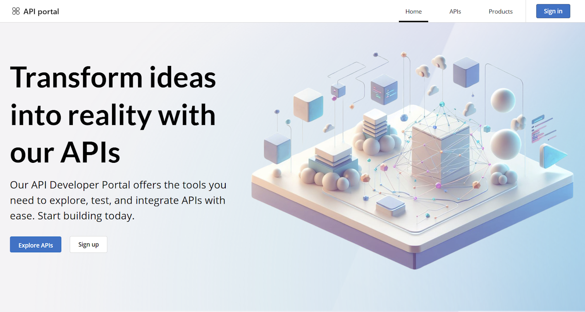

# Overview of the developer portal

The API Management developer portal is an automatically generated, fully customizable website with the documentation of your APIs. It's where API consumers can discover your APIs, learn how to use them, request access, and try them out.

As introduced in this article, you can customize and extend the developer portal for your specific scenarios. 

[!INCLUDE [premium-dev-standard-basic.md](../../includes/api-management-availability-premium-dev-standard-basic.md)]

## Customize and style the portal

Out of the box, the developer portal is managed and maintained by Azure but ready to be customized for your needs. As an API publisher, you can use the developer portal's administrative interface to customize the appearance and functionality of the developer portal. Access the administrative interface from the Azure portal interface and readily make changes to placeholder content provided by default.

For a step-by-step walkthrough of customizing the developer portal, see [Tutorial: Access and customize the developer portal](api-management-howto-developer-portal-customize.md).

### Default content 

If you're accessing the portal for the first time, the default content is automatically provisioned in the background. The placeholder content you see has been designed to showcase the portal's capabilities and minimize the customizations needed to personalize your portal. 

### Visual editor

You can customize the content of the portal with the visual editor. 
* The menu sections on the left let you create or modify pages, media, layouts, menus, styles, or website settings. 
* The menu items on the bottom let you switch between viewports (for example, mobile or desktop), view the elements of the portal visible to users in different [groups](api-management-howto-create-groups.md), or save or undo actions. For example, you might want to display certain pages only to groups that are associated with particular products, or to users that can access specific APIs.
* Add sections to a page by clicking on a blue icon with a plus sign. 
* Widgets (for example, text, images, or APIs list) can be added by pressing a grey icon with a plus sign.
* Rearrange items in a page with the drag-and-drop interaction. 

### Layouts and pages

:::image type="content" source="media/developer-portal-overview/pages-layouts.png" alt-text="Screenshot of the visual editor in the developer portal." border="false":::

Layouts define how pages are displayed. For example, in the default content, there are two layouts: one applies to the home page, and the other to all remaining pages.

A layout gets applied to a page by matching its URL template to the page's URL. For example, a layout with a URL template of `/wiki/*` will be applied to every page with the `/wiki/` segment in the URL: `/wiki/getting-started`, `/wiki/styles`, etc.

In the preceding image, content belonging to the layout is marked in blue, while the page is marked in red. The menu sections are marked respectively.

### Styling guide

:::image type="content" source="media/developer-portal-overview/styling-guide.png" alt-text="Screenshot of the styling guide in the developer portal." border="false":::

Styling guide is a panel created with designers in mind. It allows for overseeing and styling all the visual elements in your portal. The styling is hierarchical - many elements inherit properties from other elements. For example, button elements use colors for text and background. To change a button's color, you need to change the original color variant.

To edit a variant, select it and select the pencil icon that appears on top of it. After you make the changes in the pop-up window, close it.

##  Options to extend portal functionality
In some cases you might need functionality beyond the customization and styling options provided in the managed developer portal. If you need to implement custom logic, which isn't supported out-of-the-box, you have [several options](developer-portal-extend-custom-functionality.md):
* [Add custom HTML](developer-portal-extend-custom-functionality.md#use-custom-html-code-widget) directly through a developer portal widget designed for small customizations - for example, add HTML for a form or to embed a video player. The custom code is rendered in an inline frame (IFrame).
* [Create and upload a custom widget](developer-portal-extend-custom-functionality.md#create-and-upload-custom-widget) to develop and add more complex custom portal features.
* [Self-host the portal](developer-portal-self-host.md), only if you need to make modifications to the core of the developer portal [codebase](https://github.com/Azure/api-management-developer-portal). This option requires advanced configuration. Azure Support's assistance is limited only to the basic setup of self-hosted portals.

> [!NOTE]
> Because the API Management developer portal codebase is maintained on [GitHub](https://github.com/Azure/api-management-developer-portal), you can open issues and make pull requests for the API Management team to merge new functionality at any time.
>

## Manage portal access

API Management supports several ways to secure access to the developer portal: 

*  By default, the developer portal authenticates developers with credentials for API Management [user accounts](api-management-howto-create-or-invite-developers.md). Developers can sign up for an account directly through the portal, or you can create accounts for them.

* Depending on your scenarios, you can also restrict access to the portal by requiring users to sign-up or sign-in with an [Azure Active Directory](api-management-howto-aad.md) (Azure AD) or [Azure AD B2C](api-management-howto-aad-b2c.md) account.

* If you already manage developer sign-up and sign-in through an existing website, you can [delegate authentication](api-management-howto-setup-delegation.md) instead of using the developer portal's built-in authentication.

[Learn more](secure-developer-portal-access.md) about options to secure user sign-up and sign-in to the developer portal.

## API Management content

The developer portal synchronizes with your API Management instance to display content such as your APIs, operations, products, and subscriptions.

By default, the developer portal also provides a "Try it" capability on the API reference pages so that portal visitors can test your APIs directly through an interactive console. You can disable this feature in the portal's settings.

> [!IMPORTANT]
> To let the visitors of your portal test the APIs through the built-in interactive console, enable CORS (cross-origin resource sharing) on your APIs. For details, see [Enable CORS for interactive console in the API Management developer portal](enable-cors-developer-portal.md).

### Content visibility and access

In API Management, [groups of users](api-management-howto-create-groups.md) are used to manage the visibility of products and their associated APIs to developers. Products are first made visible to groups, and then developers in those groups can view and subscribe to the products that are associated with the groups.

You can also control the other portal content (such as pages and sections) appears to different users, based on their identity. For example, you might want to display certain pages only to users who have access to a specific product or API. Or, make a section of a page appear only for certain [groups of users](api-management-howto-create-groups.md). The developer portal has built-in controls for these needs.

> [!NOTE]
> Visibility and access controls are supported only in the managed developer portal. They aren't supported in the [self-hosted portal](developer-portal-self-host.md).

* When you add or edit a page, select the **Access** tab to control the users or groups that can access the page
    
    :::image type="content" source="media/developer-portal-overview/page-access-control.png" alt-text="Screenshot of the page access control settings in the developer portal.":::

* When you customize page content such as a page section, menu, or button, select the **Change visibility** icon to control the users or groups that can see the element on the page

    :::image type="content" source="media/developer-portal-overview/change-visibility-button.png" alt-text="Screenshot of the change visibility button in the developer portal.":::

    * You can change the visibility of the following page content: sections, menus, buttons, and sign-in for OAuth authorization.    

    * Media files such as images on a page inherit the visibility of the elements that contain them.

When a user visits the developer portal with visibility and access controls applied:

* The developer portal automatically hides buttons or navigation items that point to pages that a user doesn't have access to.

* An attempt by a user to access a page they aren't authorized to will result in a 404 Not Found error.

> [!TIP]
> Using the administrative interface, you can preview pages as a user associated with any built-in or custom group by selecting the **Impersonate** icon in the menu at the bottom. 
> 

## Manage portal content

After you update the developer portal content, you need to save and publish your changes to make them available to portal visitors. The developer portal maintains a record of the content you've published, and you can revert to a previous portal *revision* when you need to.

### Save the portal
:::image type="content" source="media/developer-portal-overview/save-button.png" alt-text="Screenshot of the Save button in the developer portal." :::

Whenever you make a change in the portal, you need to save it manually by selecting the **Save** button in the menu at the bottom, or press [Ctrl]+[S]. When you save your changes, the modified content is automatically uploaded to your API Management service.

> [!NOTE]
> The managed developer portal receives and applies updates automatically. Changes that you've saved but not published to the developer portal remain in that state during an update.

## Publish the portal

To make your portal and its latest changes available to visitors, you need to *publish* it. You can publish the portal within the portal's administrative interface or from the Azure portal.

> [!IMPORTANT]
> You need to publish the portal any time you make changes to the portal's content or styling. The portal also needs to be republished after API Management service configuration changes. For example, republish the portal after assigning a custom domain, updating the identity providers, setting delegation, or specifying sign-in and product terms.

### Publish from the administrative interface

1. Make sure you saved your changes by selecting the **Save** icon.
1. In the **Operations** section of the menu, select **Publish website**. This operation may take a few minutes.  

    :::image type="content" source="media/developer-portal-overview/publish-portal.png" alt-text="Screenshot of the Publish website button in the developer portal." border="false":::

### Publish from the Azure portal

1. In the [Azure portal](https://portal.azure.com), navigate to your API Management instance.
1. In the left menu, under **Developer portal**, select **Portal overview**.
1. In the **Portal overview** window, select **Publish**.

    :::image type="content" source="media/developer-portal-overview/pubish-portal-azure-portal.png" alt-text="Publish portal from Azure portal":::

## Migrate from the legacy portal

An earlier version of the developer portal ("legacy portal") is also provided with your API Management service. If you've previously customized the legacy portal, you should plan to migrate to the new developer portal. For more information, see the [migration guide](developer-portal-deprecated-migration.md).

> [!IMPORTANT]
> The legacy developer portal is now deprecated and it will receive security updates only. You can continue to use it, as per usual, until its retirement in October 2023, when it will be removed from all API Management services.

## Next steps

Learn more about the developer portal:

- [Access and customize the managed developer portal](api-management-howto-developer-portal-customize.md)
- [Extend functionality of the managed developer portal](developer-portal-extend-custom-functionality.md)
- [Set up self-hosted version of the portal](developer-portal-self-host.md)

Browse other resources:

- [GitHub repository with the source code](https://github.com/Azure/api-management-developer-portal)
- [Frequently asked questions about the developer portal](developer-portal-faq.md)
