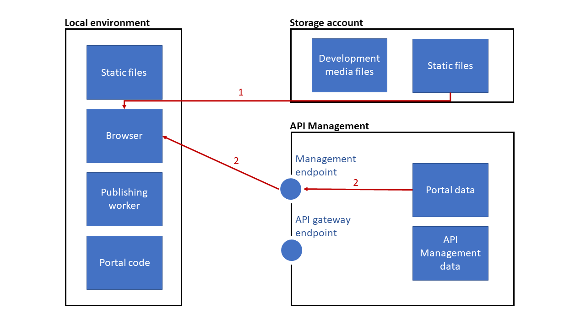

# Self-host the API Management developer portal

This tutorial describes how to set up your local development environment, carry out changes in the developer portal for API Management, and publish and deploy them to an Azure storage account.

If you have already uploaded or modified media files in the managed portal, you need to follow the [Move from managed to self-hosted](developer-portal-move-managed-self-hosted.md) guide instead.

## Prerequisites

To set up a local development environment, you need to have:

- An API Management service instance. If you don't have one, see [Quickstart - Create an Azure API Management instance](get-started-create-service-instance.md).
- An Azure storage account with [the static websites feature](../storage/blobs/storage-blob-static-website.md) enabled. See [Create a storage account](../storage/common/storage-account-create.md).
- Git on your machine. Install it by following [this Git tutorial](https://git-scm.com/book/en/v2/Getting-Started-Installing-Git).
- Node.js (LTS version, `v10.15.0` or later) and npm on your machine. See [Downloading and installing Node.js and npm](https://docs.npmjs.com/downloading-and-installing-node-js-and-npm).
- Azure CLI. Follow [the Azure CLI installation steps](/cli/azure/install-azure-cli-windows).

## Set up local environment

To set up your local environment, you'll have to clone the repository, switch to the latest release of the developer portal, and install npm packages.

1. Clone the api-management-developer-portal repo from GitHub:

    ```console
    git clone https://github.com/Azure/api-management-developer-portal.git
    ```
1. Go to your local copy of the repo:

    ```console
    cd api-management-developer-portal
    ```

1. Check out the latest release of the portal.

    Before you run the following code, check the current release tag in the [Releases section of the repository](https://github.com/Azure/api-management-developer-portal/releases) and replace `<current-release-tag>` value with the latest release tag.
    
    ```console
    git checkout <current-release-tag>
    ```

1. Install any available npm packages:

    ```console
    npm install
    ```

> [!TIP]
> Always use the [latest portal release](https://github.com/Azure/api-management-developer-portal/releases) and keep your forked portal up-to-date. The Software Engineers use the `master` branch of this repository for daily development purposes. It has unstable versions of the software.

## Configure JSON files, static website, and CORS settings

The developer portal requires API Management's REST API to manage the content.

### config.design.json file

Go to the `src` folder and open the `config.design.json` file.

```json
{
  "environment": "development",
  "managementApiUrl": "https://<service-name>.management.azure-api.net",
  "managementApiAccessToken": "SharedAccessSignature ...",
  "backendUrl": "https://<service-name>.developer.azure-api.net",
  "useHipCaptcha": false
}
```

Configure the file:

1. In the `managementApiUrl` value, replace `<service-name>` with the name of your API Management instance. For example:

    ```json
    {
    ...
    "managementApiUrl": "https://contoso-api.management.azure-api.net"
    ...
    ``` 

1. [Manually create a SAS token](/rest/api/apimanagement/apimanagementrest/azure-api-management-rest-api-authentication#ManuallyCreateToken) to enable the direct REST API access to your API Management instance.

1. Copy the generated token and paste it as the `managementApiAccessToken` value.

1. In the `backendUrl` value, replace `<service-name>` with the name of your API Management instance. For example:

    ```json
    {
    ...
    "backendUrl": "https://contoso-api.management.azure-api.net"
    ...
    ```

1. If you'd like to enable CAPTCHA in your developer portal, see [Enable CAPTCHA](developer-portal-enable-captcha.md).

### config.publish.json file

Go to the `src` folder and open the `config.publish.json` file.

```json
{
  "environment": "publishing",
  "managementApiUrl": "https://<service-name>.management.azure-api.net/subscriptions/xxxxxxxx-xxxx-xxxx-xxxx-xxxxxxxxxxxx/resourceGroups/xxxxx/providers/Microsoft.ApiManagement/service/<service-name>",
  "managementApiAccessToken": "SharedAccessSignature...",
  "useHipCaptcha": false
}
```

Configure the file:

1. Copy and paste the `managementApiUrl`, and `managementApiAccessToken` values from the previous configuration file.

1. If you'd like to enable CAPTCHA in your developer portal, see [Enable CAPTCHA](developer-portal-enable-captcha.md).

### config.runtime.json file

Go to the `src` folder and open the `config.runtime.json` file.

```json
{
  "environment": "runtime",
  "managementApiUrl": "https://<service-name>.management.azure-api.net/subscriptions/xxxxxxxx-xxxx-xxxx-xxxx-xxxxxxxxxxxx/resourceGroups/xxxxx/providers/Microsoft.ApiManagement/service/<service-name>",
  "backendUrl": "https://<service-name>.developer.azure-api.net"
}
```

Configure the file:

1. Copy and paste the `managementApiUrl` value from the previous configuration file.

1. In the `backendUrl` value, replace `<service-name>` with the name of your API Management instance. For example:

    ```json
    {
    ...
    "backendUrl": "https://contoso-api.management.azure-api.net"
    ...
    ```
### Configure the static website

Configure the **Static website** feature in your storage account by providing routes to the index and error pages:

1. Go to your storage account in the Azure portal and select **Static website** from the menu on the left.

1. On the **Static website** page, select **Enabled**.

1. In the **Index document name** field, enter *index.html*.

1. In the **Error document path** field, enter *404/index.html*.

1. Select **Save**.

### Configure the CORS settings

Configure the Cross-Origin Resource Sharing (CORS) settings:

1. Go to your storage account in the Azure portal and select **CORS** from the menu on the left.

1. In the **Blob service** tab, configure the following rules:

    | Rule | Value |
    | ---- | ----- |
    | Allowed origins | * |
    | Allowed methods | Select all the HTTP verbs. |
    | Allowed headers | * |
    | Exposed headers | * |
    | Max age | 0 |

1. Select **Save**.

## Run the portal

Now you can build and run a local portal instance in the development mode. In development mode, all the optimizations are turned off and the source maps are turned on.

Run the following command:

```console
npm start
```

After a short time, the default browser automatically opens with your local developer portal instance. The default address is `http://localhost:8080`, but the port can change if `8080` is already occupied. Any changes to the codebase of the project will trigger a rebuild and refresh your browser window.

## Edit through the visual editor

Use the visual editor to carry out these tasks:

- Customize your portal
- Author content
- Organize the structure of the website
- Stylize its appearance

See [Tutorial: Access and customize the developer portal](api-management-howto-developer-portal-customize.md). It covers the basics of the administrative user interface and lists recommended changes to the default content. Save all changes in the local environment, and press **Ctrl + C** to close it.

:::image type="content" source="media/developer-portal-self-host/save-content.png" alt-text="Save content for API Management developer portal" border="false":::

## Publish locally

The portal data originates in the form of strong-typed objects. The following command translates them into static files and places the output in the `./dist/website` directory:

```console
npm run publish
```

:::image type="content" source="media/developer-portal-self-host/generate-content.png" alt-text="Generate static files for developer portal" border="false":::

## Upload static files to a blob

Use Azure CLI to upload the locally generated static files to a blob, and make sure your visitors can get to them:

1. Open Windows Command Prompt, PowerShell, or other command shell.

1. Run the following Azure CLI command.
   
    Replace `<account-connection-string>` with the connection string of your storage account. You can get it from the **Access keys** section of your storage account.

    ```azurecli
    az storage blob upload-batch --source dist/website \
        --destination '$web' \
        --connection-string <account-connection-string>
    ```

:::image type="content" source="media/developer-portal-self-host/upload-content.png" alt-text="Publish developer portal" border="false":::

## Go to your website

Your website is now live under the hostname specified in your Azure Storage properties (**Primary endpoint** in **Static websites**).



## Change API Management notification templates

Replace the developer portal URL in the API Management notification templates to point to your self-hosted portal. See [How to configure notifications and email templates in Azure API Management](api-management-howto-configure-notifications.md).

In particular, carry out the following changes to the default templates:

> [!NOTE]
> The values in the following **Updated** sections assume that you're hosting the portal at **https:\//portal.contoso.com/**. 

### Email change confirmation

Update the developer portal URL in the **Email change confirmation** notification template:

**Original content**

```html
<a id="confirmUrl" href="$ConfirmUrl" style="text-decoration:none">
  <strong>$ConfirmUrl</strong></a>
```

**Updated**

```html
<a id="confirmUrl" href="https://portal.contoso.com/signup?$ConfirmQuery" style="text-decoration:none">
  <strong>https://portal.contoso.com/signup?$ConfirmQuery</strong></a>
```

### New developer account confirmation

Update the developer portal URL in the **New developer account confirmation** notification template:

**Original content**

```html
<a id="confirmUrl" href="$ConfirmUrl" style="text-decoration:none">
  <strong>$ConfirmUrl</strong></a>
```

**Updated**

```html
<a id="confirmUrl" href="https://portal.contoso.com/signup?$ConfirmQuery" style="text-decoration:none">
  <strong>https://portal.contoso.com/signup?$ConfirmQuery</strong></a>
```

### Invite user

Update the developer portal URL in the **Invite user** notification template:

**Original content**

```html
<a href="$ConfirmUrl">$ConfirmUrl</a>
```

**Updated**

```html
<a href="https://portal.contoso.com/confirm-v2/identities/basic/invite?$ConfirmQuery">https://portal.contoso.com/confirm-v2/identities/basic/invite?$ConfirmQuery</a>
```

### New subscription activated

Update the developer portal URL in the **New subscription activated** notification template:

**Original content**

```html
Thank you for subscribing to the <a href="http://$DevPortalUrl/products/$ProdId"><strong>$ProdName</strong></a> and welcome to the $OrganizationName developer community. We are delighted to have you as part of the team and are looking forward to the amazing applications you will build using our API!
```

**Updated**

```html
Thank you for subscribing to the <a href="https://portal.contoso.com/product#product=$ProdId"><strong>$ProdName</strong></a> and welcome to the $OrganizationName developer community. We are delighted to have you as part of the team and are looking forward to the amazing applications you will build using our API!
```

**Original content**

```html
Visit the developer <a href="http://$DevPortalUrl/developer">profile area</a> to manage your subscription and subscription keys
```

**Updated**

```html
Visit the developer <a href="https://portal.contoso.com/profile">profile area</a> to manage your subscription and subscription keys
```

**Original content**

```html
<a href="http://$DevPortalUrl/docs/services?product=$ProdId">Learn about the API</a>
```

**Updated**

```html
<a href="https://portal.contoso.com/product#product=$ProdId">Learn about the API</a>
```

**Original content**

```html
<p style="font-size:12pt;font-family:'Segoe UI'">
  <strong>
    <a href="http://$DevPortalUrl/applications">Feature your app in the app gallery</a>
  </strong>
</p>
<p style="font-size:12pt;font-family:'Segoe UI'">You can publish your application on our gallery for increased visibility to potential new users.</p>
<p style="font-size:12pt;font-family:'Segoe UI'">
  <strong>
    <a href="http://$DevPortalUrl/issues">Stay in touch</a>
  </strong>
</p>
<p style="font-size:12pt;font-family:'Segoe UI'">
      If you have an issue, a question, a suggestion, a request, or if you just want to tell us something, go to the <a href="http://$DevPortalUrl/issues">Issues</a> page on the developer portal and create a new topic.
</p>
```

**Updated**

```html
<!--Remove the entire block of HTML code above.-->
```

### Password change confirmation

Update the developer portal URL in the **Password change confirmation** notification template:

**Original content**

```html
<a href="$DevPortalUrl">$DevPortalUrl</a>
```

**Updated**

```html
<a href="https://portal.contoso.com/confirm-password?$ConfirmQuery">https://portal.contoso.com/confirm-password?$ConfirmQuery</a>
```

### All templates

Update the developer portal URL in any template that has a link in the footer:

**Original content**

```html
<a href="$DevPortalUrl">$DevPortalUrl</a>
```

**Updated**

```html
<a href="https://portal.contoso.com/">https://portal.contoso.com/</a>
```


## Next steps

- [Enable CAPTCHA](developer-portal-enable-captcha.md)
- Learn about [Alternative processes for self-hosted portal](developer-portal-alternative-processes-self-host.md)
- Learn about the [content management API](developer-portal-content-management-api.md)
