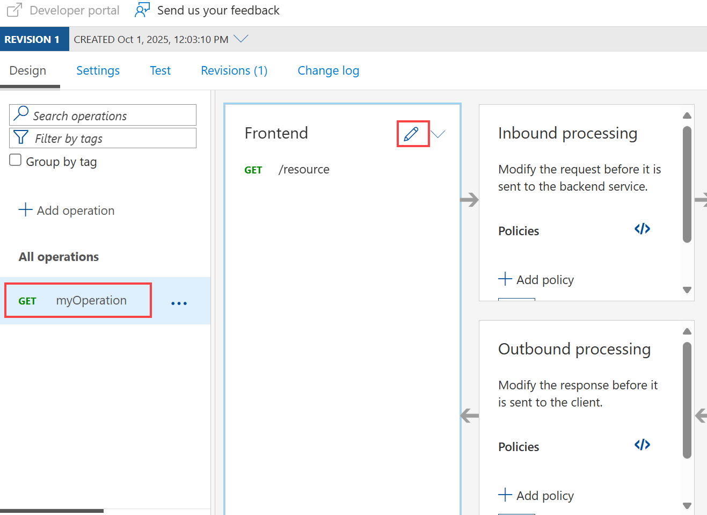
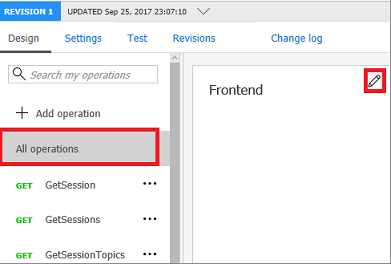
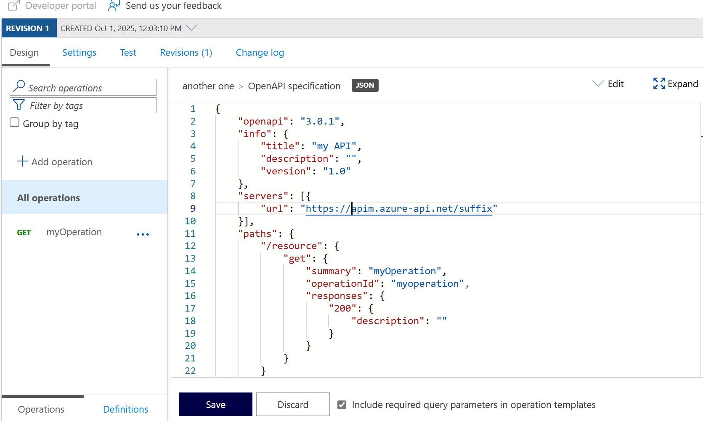

# Edit an API

The steps in this tutorial show you how to use API Management to edit an API.

+ You can add, rename, or delete operations in the Azure portal.
+ You can edit your API's swagger.

## Prerequisites

+ [Create an Azure API Management instance](get-started-create-service-instance.md)
+ [Import and publish your first API](import-and-publish.md)

[!INCLUDE [api-management-navigate-to-instance.md](../../includes/api-management-navigate-to-instance.md)]

## Edit an operation

1. Click the **APIs** tab.
2. Select one of the APIs that you previously imported.
3. Select the **Design** tab.
4. Select an operation, which you want to edit.
5. To rename the operation, select a **pencil** in the **Frontend** window.

## Update the swagger

You can update your backend API from the Azure portal by following these steps:

1. Select **All operations**
2. Click pencil in the **Frontend** window.

    

    Your API's swagger appears.

    

3. Update the swagger.
4. Press **Save**.

> [!CAUTION]
> If you are editing a non-current revision of an API, you cannot change the following properties:
>
> * Name
> * Type
> * Description
> * Subscription required
> * API version
> * API version description
> * Path
> * Protocols
>
> If your edits change any of the above properties of a non-current revision, the error message 
> `Can't change property for non-current revision` will be displayed.

[!INCLUDE [api-management-define-api-topics.md](../../includes/api-management-define-api-topics.md)]

## Next steps

> [!div class="nextstepaction"]
> [APIM policy samples](./policy-reference.md)
> [Transform and protect a published API](transform-api.md)
