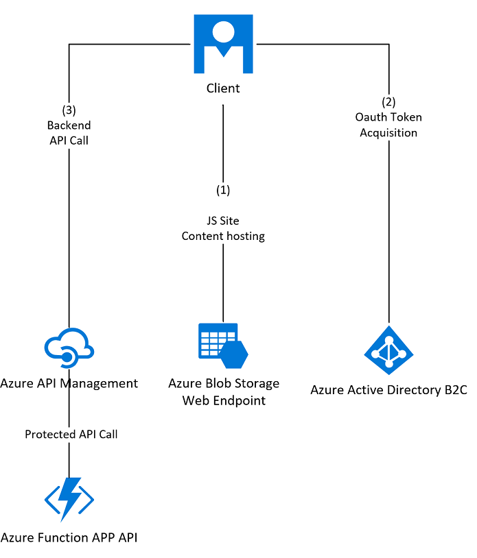

# Protect SPA backend with OAuth 2.0, Azure Active Directory B2C and Azure API Management

This scenario shows you how to configure your Azure API Management instance to protect an API.
We'll use the OAuth 2.0 protocol with Azure AD B2C, alongside API Management to secure an Azure Functions backend using EasyAuth.

## Aims
We're going to see how API Management can be used in a simplified scenario with Azure Functions and Azure AD B2C. You will create a JavaScript (JS) app calling an API, that signs in users with Azure AD B2C. Then you'll use API Management's validate-jwt policy features to protect the Backend API.

For defense in depth, we then use EasyAuth to validate the token again inside the back-end API.

## Prerequisites
To follow the steps in this article, you must have:
* An Azure (StorageV2) General Purpose V2 Storage Account to host the frontend JS Single Page App
* An Azure API Management instance 
* An empty Azure Function app (running the V2 .NET Core runtime, on a Windows Consumption Plan) to host the called API
* An Azure AD B2C tenant, linked to a subscription 

Although in practice you would use resources in the same region in production workloads, for this how-to article the region of deployment isn't important.

## Overview
Here is an illustration of the components in use and the flow between them once this process is complete.


Here is a quick overview of the steps:

1. Create the Azure AD B2C Calling (Frontend, API Management) and API Applications with scopes and grant API Access
1. Create the sign up or sign in policies to allow users to sign in with Azure AD B2C 
1. Configure API Management with the new Azure AD B2C Client IDs and keys to Enable OAuth2 user authorization in the Developer Console
1. Build the Function API
1. Configure the Function API to enable EasyAuth with the new Azure AD B2C Client ID’s and Keys and lock down to APIM VIP 
1. Build the API Definition in API Management
1. Set up Oauth2 for the API Management API configuration
1. Set up the **CORS** policy and add the **validate-jwt** policy to validate the OAuth token for every incoming request
1. Build the calling application to consume the API
1. Upload the JS SPA Sample
1. Configure the Sample JS Client App with the new Azure AD B2C Client ID’s and keys 
1. Test the Client Application

## Configure Azure AD B2C 
Open the Azure AD B2C blade in the portal and do the following steps.
1. Select the **Applications** tab 
1. Click the 'Add' button and create three applications for the following purposes
   * The Frontend Client.
   * The Backend Function API.
   * [Optional] The API Management developer portal (unless you're running Azure API Management in the consumption tier, more on this scenario later).
1. Set WebApp / Web API for all 3 applications and set 'Allow Implicit flow' to yes for only the Frontend Client.
1. Now set the App ID URI, choose something unique and relevant to the service being created.
1. Use placeholders for the reply urls for now such as https://localhost, we’ll update those urls later.
1. Click 'Create', then repeat steps 2-5 for each of the three apps above, recording the AppID URI, name, and Application ID for later use for all three apps.
1. Open the API Management Developer Portal Application from the list of applications and select the *Keys* tab (under General) then click 'Generate Key' to generate an auth key
1. Upon clicking save, record the key somewhere safe for later use - note that this place is the ONLY chance will you get to view and copy this key.
1. Now select the *Published Scopes* Tab (Under API Access)
1. Create and name a scope for your Function API and record the Scope and populated Full Scope Value, then click 'Save'.
   > [!NOTE]
   > Azure AD B2C scopes are effectively permissions within your API that other applications can request access to via the API access blade from their applications, effectively you just created application permissions for your called API.
1. Open the other two applications and then look under the *API Access* tab.
1. Grant them access to the backend API scope and the default one that was already there ("Access the user's profile").
1. Generate them a key each by selecting the *Keys* tab under 'General' to generate an auth key and record those keys somewhere safe for later.

## Create a "Sign up or Sign in" user flow
1. Return to the root (Or 'Overview') of the Azure AD B2C Blade 
1. Then select “User Flows (Policies)” and click "New user flow"
1. Choose the 'Sign up and sign in' user flow type
1. Give the policy a name and record it for later.
1. Then Under 'Identity providers', then check 'User ID sign up' (this may say 'Email sign up') and click OK. 
1. Under 'User Attributes and claims', click 'Show More...' then choose the claim options that you want your users to enter and have returned in the token. Check at least 'Display Name' and 'Email Address' to collect and return, and click 'OK', then click 'Create'.
1. Select the policy that you created in the list, then click the 'Run user flow' button.
1. This action will open the run user flow blade, select the frontend application, then record the address of the b2clogin.com domain that's shown under the dropdown for 'Select domain'.
1. Click on the link at the top to open the 'well-known openid configuration endpoint', and record the authorization_endpoint and token_endpoint values as well of the value of the link itself as the well-known openid configuration endpoint.

   > [!NOTE]
   > B2C Policies allow you to expose the Azure AD B2C login endpoints to be able to capture different data components and sign in users in different ways. 
   > In this case we configured a sign up or sign in endpoint, which exposed a well-known configuration endpoint, specifically our created policy was identified in the URL by the p= parameter.
   > 
   > Once this is done – you now have a functional Business to Consumer identity platform that will sign users into multiple applications. 
   > If you want to you can click the 'Run user flow' button here (to go through the sign up or sign in process) and get a feel for what it will do in practice, but the redirection step at the end will fail as the app has not yet been deployed.

## Build the function API
1. Switch back to your standard Azure AD tenant in the Azure portal so we can configure items in your subscription again 
1. Go to the Function Apps blade of the Azure portal, open your empty function app, then create a new In-Portal 'Webhook + API' function via the quickstart.
1. Paste the sample code from below into Run.csx over the existing code that appears.

   ```csharp
   
   using System.Net;
   using Microsoft.AspNetCore.Mvc;
   using Microsoft.Extensions.Primitives;
   
   public static async Task<IActionResult> Run(HttpRequest req, ILogger log)
   {
      log.LogInformation("C# HTTP trigger function processed a request.");
      
      return (ActionResult)new OkObjectResult($"Hello World, time and date are {DateTime.Now.ToString()}");
   }
   
   ```

   > [!NOTE]
   > The c# script function code you just pasted simply logs a line to the functions logs, and returns the text "Hello World" with some dynamic data (the date and time).

3. Select “Integrate” from the left-hand blade, then select ‘Advanced Editor’ in the top-right-hand corner of the pane.
4. Paste the sample code below over the existing json.

   ```json
   {
      "bindings": [
       {
        "authLevel": "function",
        "name": "req",
        "type": "httpTrigger",
        "direction": "in",
        "methods": [
           "get"
        ],
        "route": "hello"
       },
       {
         "name": "$return",
         "type": "http",
         "direction": "out"
       }
     ]
   }
   ```

5. Switch back to the HttpTrigger1 tab, click 'Get Function URL', then copy the URL that appears.

   > [!NOTE]
   > The bindings you just created simply tell Functions to respond on anonymous http GET requests to the URL you just copied. (`https://yourfunctionappname.azurewebsites.net/api/hello?code=secretkey`)
   > Now we have a scalable serverless https API, that is capable of returning a very simple payload.
   > You can now test calling this API from a web browser using the URL above, you can also strip the ?code=secret portion of the URL and prove that Azure Functions will return a 401 error.

## Configure and secure the function API
1. Two extra areas in the function app need to be configured (Auth and Network Restrictions).
1. Firstly Let's configure Authentication / Authorization, so click on the name of the function app (next to the &lt;Z&gt; functions icon) to show the overview page.
1. Next Select the 'Platform features' tab and select 'Authentication / Authorization'.
1. Turn on the App Service Authentication feature.
1. Under 'Authentication Providers' choose ‘Azure Active Directory’, and choose ‘Advanced’ from the Management Mode switch.
1. Paste the Backend Function API's application ID (from Azure AD B2C into the ‘Client ID’ box)
1. Paste the Well-known open-id configuration endpoint from the sign up or sign in policy into the Issuer URL box (we recorded this configuration earlier).
1. Select OK.
1. Set the Action to take when request is not authenticated dropdown to "Log in with Azure Active Directory", then click Save.

   > [!NOTE]
   > Now your Function API is deployed and should throw 401 responses if the correct key is not supplied, and should return data when a valid request is presented.
   > You added additional defense-in-depth security in EasyAuth by configuring the 'Login With Azure AD' option to handle unauthenticated requests. Be aware that this will change the unauthorized request behavior between the Backend Function App and Frontend SPA as EasyAuth will issue a 302 redirect to AAD instead of a 401 Not Authorized response, we will correct this by using API Management later.
   > We still have no IP security applied, if you have a valid key and OAuth2 token, anyone can call this from anywhere - ideally we want to force all requests to come via API Management.
   > If you are using the API Management consumption tier, you will not be able to perform this lockdown by VIP as there is no dedicated static IP for that tier, you will need to rely on the method of locking down your API calls via the shared secret function key, so steps 11-13 will not be possible.

1. Close the 'Authentication / Authorization' blade 
1. Select 'Networking' and then select 'Access Restrictions'
1. Next, lock down the allowed function app IPs to the API Management instance VIP. This VIP is shown in the API management - overview section of the portal.
1. If you want to continue to interact with the functions portal, and to carry out the optional steps below, you should add your own public IP address or CIDR range here too.
1. Once there’s an allow entry in the list, Azure adds an implicit deny rule to block all other addresses. 

You'll need to add CIDR formatted blocks of addresses to the IP restrictions panel. When you need to add a single address such as the API Management VIP, you need to add it in the format xx.xx.xx.xx.

   > [!NOTE]
   > Now your Function API should not be callable from anywhere other than via API management, or your address.
   
## Import the function app definition
1. Open the *API Management blade*, then open *your instance*.
1. Select the APIs Blade from the API Management section of your instance.
1. From the 'Add a New API' pane, choose 'Function App', then select 'Full' from the top of the popup.
1. Click Browse, choose the function app you're hosting the API inside, and click select.
1. Give the API a name and description for API Management's internal use and add it to the ‘unlimited’ Product.
1. Make sure you record the base URL for later use and then click create.

## Configure Oauth2 for API Management

1. Next, Select the Oauth 2.0 blade from the Security Tab, and click 'Add'
1. Give values for *Display Name* and *Description* for the added Oauth Endpoint (these values will show up in the next step as an Oauth2 endpoint).
1. You can enter any value in the Client registration page URL, as this value won't be used.
1. Check the *Implicit Auth* Grant type and leave the the Authorization code grant type checked.
1. Move to the *Authorization* and *Token* endpoint fields, and enter the values you captured from the well-known configuration xml document earlier.
1. Scroll down and populate an *Additional body parameter* called 'resource' with the Backend Function API client ID from the Azure AD B2C App registration
1. Select 'Client credentials', set the Client ID to the Developer console app's app ID - skip this step if using the consumption API Management model.
1. Set the Client Secret to the key you recorded earlier - skip this step if using the consumption API Management model.
1. Lastly, now record the redirect_uri of the auth code grant from API Management for later use.

## Set up Oauth2 for your API
1. Your API will appear on the left-hand side of the portal under the 'All APIs' section, open your API by clicking on it.
1. Select the 'Settings' Tab.
1. Update your settings by selecting “Oauth 2.0” from the user authorization radio button.
1. Select the Oauth server that you defined earlier.
1. Check the ‘Override scope’ checkbox and enter the scope you recorded for the backend API call earlier on.

   > [!NOTE]
   > Now we have an API Management instance that knows how to get access tokens from Azure AD B2C to authorize requests and understands our Oauth2 Azure Active Directory B2C configuration.

## Set up the **CORS** and **validate-jwt** policies

> The following sections should be followed regardless of the APIM tier being used. 

1. Switch back to the design tab and choose “All APIs”, then click the code view button to show the policy editor.
1. Edit the inbound section and paste the below xml so it reads like the following.

   ```xml
   <inbound>
      <validate-jwt header-name="Authorization" failed-validation-httpcode="401" failed-validation-error-message="Unauthorized. Access token is missing or invalid.">
         <openid-config url="https://tenant.b2clogin.com/tenant.onmicrosoft.com/v2.0/.well-known/openid-configuration?p=B2C_1_MyDefaultPolicy" />
         <required-claims>
            <claim name="aud">
               <value>your-backend-api-application-client-id</value>
            </claim>
         </required-claims>
      </validate-jwt>
      <cors>
         <allowed-origins>
            <origin>*</origin>
         </allowed-origins>
         <allowed-methods>
           <method>GET</method>
         </allowed-methods>
         <allowed-headers>
            <header>*</header>
         </allowed-headers>
         <expose-headers>
           <header>*</header>
         </expose-headers>
       </cors>
   </inbound>
   ```
1. Edit the openid-config url to match your well-known Azure AD B2C endpoint for the sign up or sign in policy.
1. Edit the claim value to match the valid application ID, also known as a client ID for the backend API application and save.

   > [!NOTE]
   > Now API management is able respond to cross origin requests to JS SPA apps, and it will perform throttling, rate-limiting and pre-validation of the JWT auth token being passed BEFORE forwarding the request on to the Function API.

   > [!NOTE]
   > The following section is optional and does not apply to the **Consumption** tier, which does not support the developer portal.
   > If you do not intend to use the developer portal, or cannot use it since you are using the Consumption tier, please skip this step and jump straight to ["Build the JavaScript SPA to consume the API"](#build-the-javascript-spa-to-consume-the-api).

## [Optional] Configure the developer portal

1. Open the Azure AD B2C blade and navigate to the application registration for the Developer Portal
1. Set the 'Reply URL' entry to the one you noted down when you configured the redirect_uri of the auth code grant in API Management earlier.

   Now that the OAuth 2.0 user authorization is enabled on the `Echo API`, the Developer Console obtains an access token for the user, before calling the API.

1. Browse to any operation under the `Echo API` in the developer portal, and select **Try it** to bring you to the Developer Console.
1. Note a new item in the **Authorization** section, corresponding to the authorization server you just added.
1. Select **Authorization code** from the authorization drop-down list, and you're prompted to sign in to the Azure AD tenant. If you're already signed in with the account, you might not be prompted.
1. After successful sign-in, an `Authorization: Bearer` header is added to the request, with an access token from Azure AD B2C encoded in Base64. 
1. Select **Send** and you can call the API successfully.

   > [!NOTE]
   > Now API management is able to acquire tokens for the developer portal to test your API and is able to understand it's definition and render the appropriate test page in the dev portal.

1. From the overview blade of the API Management portal, click 'Developer Portal' to sign in as an administrator of the API.
1. Here, you and other selected consumers of your API can test and call them from a console.
1. Select ‘Products’, then choose ‘Unlimited’, then choose the API we created earlier and click ‘TRY IT’
1. Unhide the API subscription key, and copy it somewhere safe along with the request url that you'll need later.
1. Also select Implicit, from the oauth auth dropdown and you may have to authenticate here with a popup.
1. Click ‘Send’ and if all is well, your Function App should respond back with a hello message via API management with a 200 OK message and some JSON.

   > [!NOTE]
   > Congratulations, you now have Azure AD B2C, API Management and Azure Functions working together to publish, secure AND consume an API. 
   > You might have noticed that the API is in fact secured twice using this method, once with the API Management Ocp-Subscription-Key Header, and once with the Authorization: Bearer JWT.
   > You would be correct, as this example is a JavaScript Single Page Application, we use the API Management Key only for rate-limiting and billing calls.
   > The actual Authorization and Authentication is handled by Azure AD B2C, and is encapsulated in the JWT, which gets validated twice, once by API Management, and then by Azure Functions.

## Build the JavaScript SPA to consume the API
1. Open the storage accounts blade in the Azure portal 
1. Select the account you created and select the 'Static Website' blade from the Settings section (if you don't see a 'Static Website' option, check you created a V2 account).
1. Set the static web hosting feature to 'enabled', and set the index document name to 'index.html', then click 'save'.
1. Note down the contents of the Primary Endpoint, as this location is where the frontend site will be hosted. 

   > [!NOTE]
   > You could use either Azure Blob Storage + CDN rewrite, or Azure App Service - but Blob Storage's Static Website hosting feature gives us a default container to serve static web content / html / js / css from Azure Storage and will infer a default page for us for zero work.

## Upload the JS SPA sample
1. Still in the storage account blade, select the 'Blobs' blade from the Blob Service section and click on the $web container that appears in the right-hand pane.
1. Save the code below to a file locally on your machine as index.html and then upload the file index.html to the $web container.

   ```html
   <!doctype html>
   <html lang="en">
   <head>
        <meta charset="utf-8">
        <meta http-equiv="X-UA-Compatible" content="IE=edge">
        <meta name="viewport" content="width=device-width, initial-scale=1">
        <title>Sample JS SPA</title>
        <link rel="stylesheet" href="https://maxcdn.bootstrapcdn.com/bootstrap/4.0.0/css/bootstrap.min.css" integrity="sha384-Gn5384xqQ1aoWXA+058RXPxPg6fy4IWvTNh0E263XmFcJlSAwiGgFAW/dAiS6JXm" crossorigin="anonymous">
   </head>
   <body>
        <div class="container-fluid">
            <div class="row">
                <div class="col-md-12">
                    <nav class="navbar navbar-expand-lg navbar-light bg-light navbar-dark bg-dark">
                        <a class="navbar-brand" href="#">Sample Code</a>
                        <ul class="navbar-nav ml-md-auto">
                            <li class="nav-item dropdown">
                                <a class="btn btn-large btn-success" onClick="login()">Sign In</a>
                            </li>
                        </ul>
                    </nav>
                </div>
            </div>
            <div class="row">
                <div class="col-md-12">
                    <div class="jumbotron">
                        <h2>
                    <div id="message">Hello, world!</div>
                    </h2>
                        <p>
                            <a class="btn btn-primary btn-large" onClick="GetAPIData()">Call API</a>
                        </p>
                    </div>
                </div>
            </div>
        </div>
        <script src="https://code.jquery.com/jquery-3.2.1.min.js"></script>
        <script src="https://cdnjs.cloudflare.com/ajax/libs/popper.js/1.12.9/umd/popper.min.js" integrity="sha384-ApNbgh9B+Y1QKtv3Rn7W3mgPxhU9K/ScQsAP7hUibX39j7fakFPskvXusvfa0b4Q" crossorigin="anonymous"></script>
        <script src="https://maxcdn.bootstrapcdn.com/bootstrap/4.0.0/js/bootstrap.min.js" integrity="sha384-JZR6Spejh4U02d8jOt6vLEHfe/JQGiRRSQQxSfFWpi1MquVdAyjUar5+76PVCmYl" crossorigin="anonymous"></script>
        <script src="https://secure.aadcdn.microsoftonline-p.com/lib/1.0.0/js/msal.js"></script>
        <script lang="javascript">
            var applicationConfig = {
                clientID: "clientidgoeshere",
                authority: "https://tenant.b2clogin.com/tfp/tenant/policy",
                b2cScopes: ["https://tenant/app/scope"],
                webApi: 'http://functionurl',
                subKey: 'apimkeygoeshere'
            };
            var msalConfig = {
                auth: {
                        clientId: applicationConfig.clientID, 
                        authority:  applicationConfig.authority,
                        validateAuthority: false
                },
                cache: {
                        cacheLocation: "localStorage",
                        storeAuthStateInCookie: true
                }
            };
            var clientApplication = new Msal.UserAgentApplication(msalConfig);
            function login() {
                var loginRequest = {
                    scopes: applicationConfig.b2cScopes
                };
                clientApplication.loginPopup(loginRequest).then(function (loginResponse) {
                    var tokenRequest = {
                        scopes: applicationConfig.b2cScopes
                    };
                    clientApplication.acquireTokenSilent(tokenRequest).then(function (tokenResponse) {
                        document.getElementById("signinbtn").innerHTML = "Logged in as: " + clientApplication.account.name;
                        document.getElementById("callapibtn").hidden = false
                        }).catch(function (error) {
                            clientApplication.acquireTokenPopup(tokenRequest).then(function (tokenResponse) {
                                }).catch (function (error) {
                                    console.log("Error acquiring the popup:\n" + error);
                                });
                        })
                    }).catch (function (error) {
                        console.log("Error during login:\n" + error);
                });
            }
            function GetAPIData() {
                var tokenRequest = {
                    scopes: applicationConfig.b2cScopes
                }
                clientApplication.acquireTokenSilent(tokenRequest).then(function (tokenResponse) {
                    callApiWithAccessToken(tokenResponse.accessToken);
                    }).catch(function (error) {
                        clientApplication.acquireTokenPopup(tokenRequest).then(function (tokenResponse) {
                            callApiWithAccessToken(tokenResponse.accessToken);
                            
                        }).catch(function (error) {
                            console.log("Error acquiring the access token to call the Web api:\n" + error);
                        });
                    })
            }
            function callApiWithAccessToken(token)
            {
                console.log("calling "  + applicationConfig.webApi +  " with " + token);
                    // Make the api call here
                $.ajax({
                    type: "get",
                    headers: {'Authorization': 'Bearer ' + token, 'Ocp-Apim-Subscription-Key': applicationConfig.subKey}, 					url: applicationConfig.webApi
                }
                ).done(function (body) {
                    document.getElementById("message").innerHTML = "The API Said " + body;
                });
            }
        </script>
    </body>
   </html>
   
   ```

1. Browse to the Static Website Primary Endpoint you stored earlier in the last section.

   > [!NOTE]
   > Congratulations, you just deployed a JavaScript Single Page App to Azure Storage
   > Since we haven’t configured the JS app with your keys for the api or configured the JS app with your Azure AD B2C details yet – the page will not work yet if you open it.

## Configure the JS SPA for Azure AD B2C
1. Now we know where everything is: we can configure the SPA with the appropriate API Management API address and the correct Azure AD B2C application / client IDs
1. Go back to the Azure portal storage blade and click on index.html, then choose ‘Edit Blob’ 
1. Update the auth details to match your front-end application you registered in B2C earlier, noting that the 'b2cScopes' values are for the API backend.
1. The webApi key and api url can be found in the API Management test pane for the API operation.
1. Create An APIM subscription key by heading to the API Management back to the API Management blade, selecting 'Subscriptions', and clicking 'Add Subscription' then saving the record. Clicking the Ellipsis (...) next to the created row will allow you to show the keys so you can copy the primary key.
1. It should look something like the below code:-  

   ```javascript
   var applicationConfig =
      clientID: "{aadb2c-clientid-goeshere}",
      authority: "https://{tenant}.b2clogin.com/{tenant}/{policy}",
      b2cScopes: ["https://{tenant}/{app}/{scope}"], 
      webApi: 'http://{apim-url-for-your-function}',
      subKey: '{apim-subscription-key-goes-here}'
   };
   ```

1. Click Save

## Set the redirect URIs for the Azure AD B2C frontend app
1. Open the Azure AD B2C blade and navigate to the application registration for the JavaScript Frontend Application
1. Set the redirect URL to the one you noted down when you previously set up the static website primary endpoint above

   > [!NOTE] 
   > This configuration will result in a client of the frontend application receiving an access token with appropriate claims from Azure AD B2C.
   > The SPA will be able to add this as a bearer token in the https header in the call to the backend API.
   > API Management will pre-validate the token, rate-limit calls to the endpoint by the subscriber key, before passing through the request to the receiving Azure Function API.
   > The SPA will render the response in the browser.

   > *Congratulations, you’ve configured Azure AD B2C, Azure API Management, Azure Functions, Azure App Service Authorization to work in perfect harmony!*

   > [!NOTE]
   > Now we have a simple app with a simple secured API, let's test it.

## Test the client application
1. Open the sample app URL that you noted down from the storage account you created earlier
1. Click “Sign In” in the top-right-hand corner, this click will pop up your Azure AD B2C sign up or sign in profile.
1. Post Sign in the "Logged in as" section of the screen will be populated from your JWT.
1. Now Click "Call Web Api", and you the page should update with the values sent back from your secured API.

## And we're done
The steps above can be adapted and edited to allow many different uses of Azure AD B2C with API Management.

## Next steps
* Learn more about [Azure Active Directory and OAuth2.0](../active-directory/develop/authentication-scenarios.md).
* Check out more [videos](https://azure.microsoft.com/documentation/videos/index/?services=api-management) about API Management.
* For other ways to secure your back-end service, see [Mutual Certificate authentication](api-management-howto-mutual-certificates.md).
* [Create an API Management service instance](get-started-create-service-instance.md).
* [Manage your first API](import-and-publish.md).
