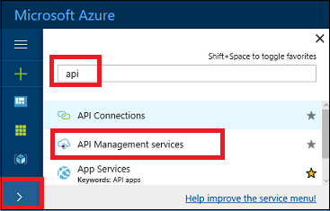
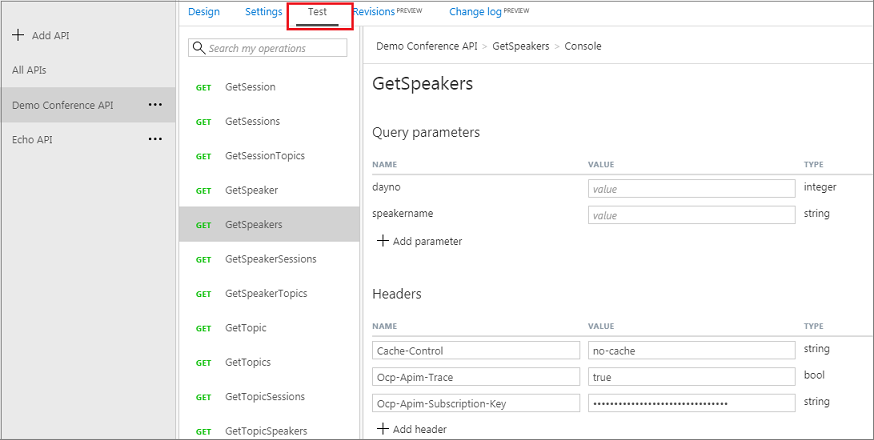

# Import and publish your first API 

This tutorial shows how to import an "OpenAPI specification" backend API residing at http://conferenceapi.azurewebsites.net?format=json. This backend API is provided by Microsoft and hosted on Azure. 

Once the backend API is imported into API Management (APIM), the APIM API becomes a facade for the backend API. At the time you import the backend API, both the source API and the APIM API are identical. APIM enables you to customize the facade according to your needs without touching the backend API. For more information, see [Transform and protect your API](transform-api.md). 

In this tutorial, you learn how to:

> [!div class="checklist"]
> * Import your first API
> * Test the API in the Azure portal
> * Test the API in the Developer portal

## Prerequisites

Complete the following quickstart: [Create an Azure API Management instance](get-started-create-service-instance.md).

## Log in to Azure

Log in to the Azure portal at http://portal.azure.com.

## Navigate to your APIM instance

1. Select **>**.
2. Type "api" in the search box.
3. Click **API Management services**.

    

4. Select the service instance that you created.

## Import and publish a backend API

This section shows how to import and publish an OpenAPI specification backend API.
 
1. Select **APIs** from under **API MANAGEMENT**.
2. Select **OpenAPI specification** from the list.

    

    You can set the API values during creation or later by going to the **Settings** tab.  

    |Setting|Value|Description|
    |---|---|---|
    |**OpenAPI Specification**|http://conferenceapi.azurewebsites.net?format=json|References the service implementing the API. API management forwards requests to this address.|
    |**Display name**|*Demo Conference API*|If you press tab after entering the service URL, APIM will fill out this field based on what is in the json.  This name is displayed in the Developer portal.|
    |**Name**|*demo-conference-api*|Provides a unique name for the API.  If you press tab after entering the service URL, APIM will fill out this field based on what is in the json.|
    |**Description**|Provide an optional description of the API.|If you press tab after entering the service URL, APIM will fill out this field based on what is in the json.|
    |**API URL suffix**|*conference*|The suffix is appended to the base URL for the API management service. API Management distinguishes APIs by their suffix and therefore the suffix must be unique for every API for a given publisher.|
    |**URL scheme**|*HTTPS*|Determines which protocols can be used to access the API. |
    |**Products**|*Unlimited*| Publish the API by associating the API with a product. To optionally add this new API to a product, type the product name. This step can be repeated multiple times to add the API to multiple products. Products are associations of one or more APIs. You can include a number of APIs and offer them to developers through the developer portal. Developers must first subscribe to a product to get access to the API. When they subscribe, they get a subscription key that is good for any API in that product. If you created the APIM instance, you are an administrator already, so you are subscribed to every product by default.  By default, each API Management instance comes with two sample products: **Starter** and **Unlimited**. |
3. Select **Create**.

## Test the new APIM API in the Azure portal

Operations can be called directly from the Azure portal, which provides a convenient way to view and test the operations of an API.  
1. Select the API you created in the previous step.
2. Press the **Test** tab.

    
3. Click on **GetSpeakers**.

    The page displays fields for query parameters but in this case we don't have any. The page also displays fields for the headers. One of the headers is "Ocp-Apim-Subscription-Key", for the subscription key of the product that is associated with this API. If you created the APIM instance, you are an administrator already, so the key is filled in automatically. 
4. Press **Send**.

    Backend responds with **200 OK** and some data.

## Call an operation from the developer portal

Operations can also be called **Developer portal** to test APIs. 

1. Select the API you created in the "Import and publish a back-end API" step.
2. Press **Developer portal**.

    

    The "Developer portal" site opens up.
3. Select **API**.
4. Select **Demo Conference API**.
5. Click **GetSpeakers**.
    
    The page displays fields for query parameters but in this case we don't have any. The page also displays fields for the headers. One of the headers is "Ocp-Apim-Subscription-Key", for the subscription key of the product that is associated with this API. If you created the APIM instance, you are an administrator already, so the key is filled in automatically.
6. Press **Try it**.
7. Press **Send**.
    
    After an operation is invoked, the developer portal displays the **Response status**, the **Response headers**, and any **Response content**.

## Next steps

In this tutorial, you learned how to:

> [!div class="checklist"]
> * Import your first API
> * Test the API in the Azure portal
> * Test the API in the Developer portal

Advance to the next tutorial:

> [!div class="nextstepaction"]
> [Create and publish a product](api-management-howto-add-products.md)