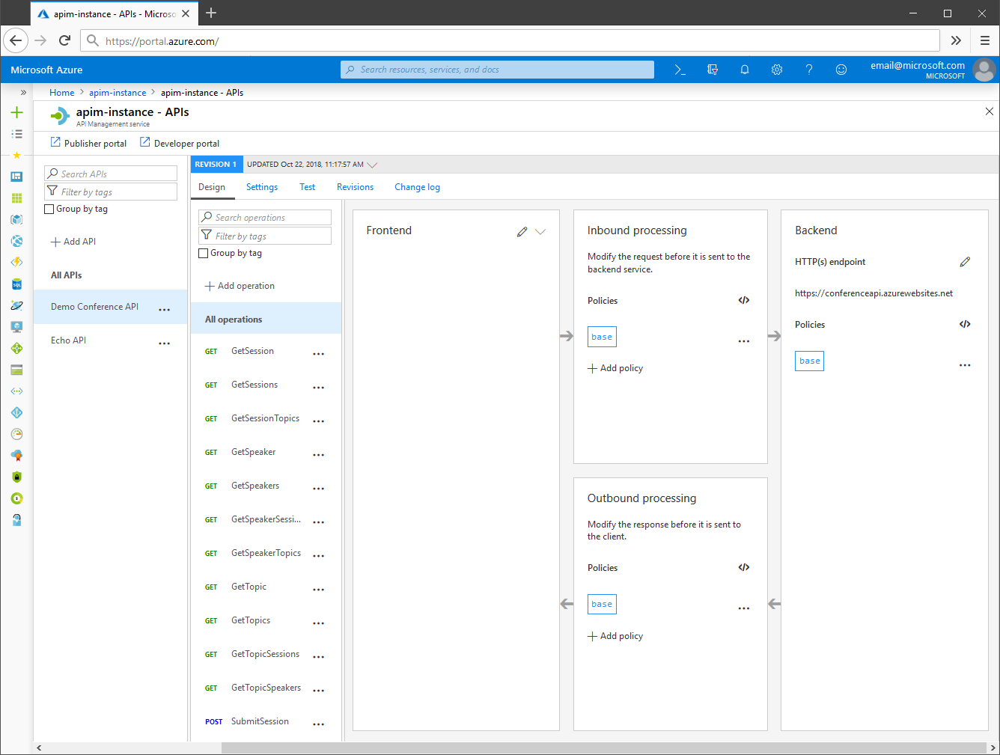
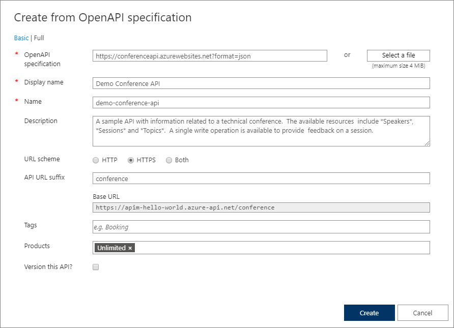
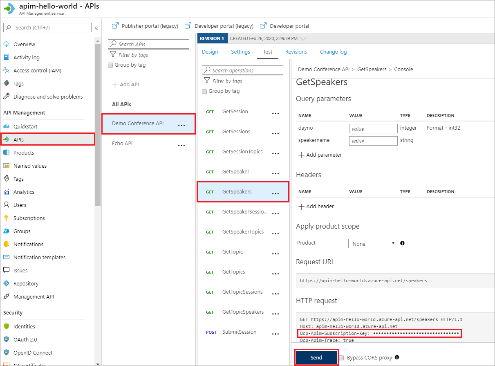

# Import and publish your first API

This tutorial shows how to import an OpenAPI Specification backend API in JSON format into Azure API Management. Microsoft provides the backend API and hosts it on Azure at [https://conferenceapi.azurewebsites.net?format=json](https://conferenceapi.azurewebsites.net?format=json).

Once you import the backend API into API Management, your API Management API becomes a facade for the backend API. You can customize the facade to your needs in API Management without touching the backend API. For more information, see [Transform and protect your API](transform-api.md).

In this tutorial, you learn how to:

> [!div class="checklist"]
> * Import an API into API Management
> * Test the API in the Azure portal

## Prerequisites

- Understand [Azure API Management terminology](api-management-terminology.md).
- [Create an Azure API Management instance](get-started-create-service-instance.md).

[!INCLUDE [api-management-navigate-to-instance.md](../../includes/api-management-navigate-to-instance.md)]

## Import and publish a backend API

This section shows how to import and publish an OpenAPI Specification backend API.

1. In the left navigation of your API Management instance, select **APIs** from the **API Management** section.
1. Select the **OpenAPI** tile, and then select **Full** on the pop-up screen.
1. On the **Create from OpenAPI specification** screen, use the values from the following table to create your API.

   A red star next to a field on the form indicates that the field is required. You can set API values during creation or later by going to the **Settings** tab.

   

   |Setting|Value|Description|
   |-------|-----|-----------|
   |**OpenAPI specification**|*https:\//conferenceapi.azurewebsites.net?format=json*|The service implementing the API. API management forwards requests to this address.|
   |**Display name**|After you enter the preceding service URL, API Management fills out this field based on the JSON.|The name displayed in the developer portal.|
   |**Name**|After you enter the preceding service URL, API Management fills out this field based on the JSON.|A unique name for the API.|
   |**Description**|After you enter the preceding service URL, API Management fills out this field based on the JSON.|An optional description of the API.|
   |**URL scheme**|**HTTPS**|Which protocols can be used to access the API.|
   |**API URL suffix**|*conference*|The suffix appended to the base URL for the API Management service. API Management distinguishes APIs by their suffix, so the suffix must be unique for every API for a given publisher.|
   |**Tags**| |Tags for organizing APIs for searching, grouping, or filtering.|
   |**Products**|**Unlimited**|Association of one or more APIs. Each API Management instance comes with two sample products: **Starter** and **Unlimited**. You publish an API by associating the API with a product, **Unlimited** in this example. You can include several APIs in a product and offer them to developers through the developer portal. To add this API to another product, type or select the product name. Repeat this step to add the API to multiple products. You can also add APIs to products later from the **Settings** page. To get access to the API, developers must first subscribe to a product. When they subscribe, they get a subscription key that's good for any API in that product.  If you created the API Management instance, you're an administrator already, so you're subscribed to every product in the instance.|
   |**Gateways**|**Managed**|API gateway(s) that expose the API. This field is available only in **Developer** and **Premium** tier services. **Managed** gateway indicates the gateway built-into the API Management service and hosted by Microsoft in Azure. Other gateways are [self-hosted gateways](self-hosted-gateway-overview.md) and are available only in the Premium and Developer service tiers. You can deploy them in on premises or in other clouds. If no gateways are selected, the API won't be available and your API requests won't succeed.|
   |**Version this API?**|Select or deselect|For more information about versioning, see [Publish multiple versions of your API](api-management-get-started-publish-versions.md).|

   > [!NOTE]
   > To publish the API to API consumers, you must associate it with a product.

2. Select **Create**.

If you have problems importing an API definition, see the [list of known issues and restrictions](api-management-api-import-restrictions.md).

## Test the new API in the Azure portal

You can call API operations directly from the Azure portal, which provides a convenient way to view and test the operations.

1. In the left navigation of your API Management instance, select **APIs** from the **API Management** section, and then select **Demo Conference API**.
1. Select the **Test** tab, and then select **GetSpeakers**. The page shows **Query parameters** and **Headers**, if any. The **Ocp-Apim-Subscription-Key** is filled in automatically for the subscription key associated with this API.
1. Select **Send**.

   

   The back end responds with **200 OK** and some data.

## Next steps

In this tutorial, you learned how to:

> [!div class="checklist"]
> * Import your first API
> * Test the API in the Azure portal

Advance to the next tutorial to learn how to create and publish a product:

> [!div class="nextstepaction"]
> [Create and publish a product](api-management-howto-add-products.md)
