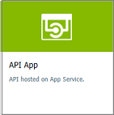

# Import an API App as an API

This article shows how to import an API App as an API. The article also shows how to test the APIM API.

In this article, you learn how to:

> [!div class="checklist"]
> * Import an API App as an API
> * Test the API in the Azure portal
> * Test the API in the Developer portal

## Prerequisites

+ Complete the following quickstart: [Create an Azure API Management instance](get-started-create-service-instance.md)
+ Make sure there is an API App in your subscription. For more information, see [App Service Documentation](https://docs.microsoft.com/azure/app-service/)

[!INCLUDE [api-management-navigate-to-instance.md](../../includes/api-management-navigate-to-instance.md)]

## Import and publish a back-end API

1. Navigate to your API Management service in the Azure portal and select **APIs** from the menu.
2. Select **API App** from the **Add a new API** list.

    
3. Press **Browse** to see the list of API Apps in your subscription.
4. Select the app. APIM finds the swagger associated with the selected app, fetches it, and imports it. 

    In case APIM does not find swagger, it exposes the API as a "pass-through" API. 
5. Add an API URL suffix. The suffix is a name that identifies this specific API in this APIM instance. It has to be unique in this APIM instance.
6. Publish the API by associating the API with a product. In this case, the "*Unlimited*" product is used.  If you want for the API to be published and be available to developers, add it to a product. You can do it during API creation or set it later.

    Products are associations of one or more APIs. You can include a number of APIs and offer them to developers through the developer portal. Developers must first subscribe to a product to get access to the API. When they subscribe, they get a subscription key that is good for any API in that product. If you created the APIM instance, you are an administrator already, so you are subscribed to every product by default.

    By default, each API Management instance comes with two sample products:

    * **Starter**
    * **Unlimited**   
7. Enter other API settings. You can set the values during creation or configure them later by going to the **Settings** tab. The settings are explained in the [Import and publish your first API](import-and-publish.md#-import-and-publish-a-backend-api) tutorial.
8. Select **Create**.

## Test the new API in the Azure portal

Operations can be called directly from the Azure portal, which provides a convenient way to view and test the operations of an API.  

1. Select the API you created in the previous step.
2. Press the **Test** tab.
3. Select some operation.

    The page displays fields for query parameters and fields for the headers. One of the headers is "Ocp-Apim-Subscription-Key", for the subscription key of the product that is associated with this API. If you created the APIM instance, you are an administrator already, so the key is filled in automatically. 
1. Press **Send**.

    Backend responds with **200 OK** and some data.

[!INCLUDE [api-management-navigate-to-instance.md](../../includes/api-management-append-apis.md)]

[!INCLUDE [api-management-define-api-topics.md](../../includes/api-management-define-api-topics.md)]

## Next steps

> [!div class="nextstepaction"]
> [Transform and protect a published API](transform-api.md)
