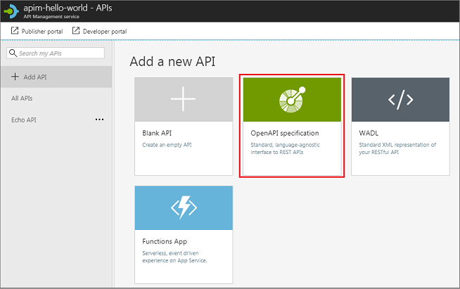

# Import an OpenAPI specification

This article shows how to import an "OpenAPI specification" back-end API residing at http://conferenceapi.azurewebsites.net?format=json. This back-end API is provided by Microsoft and hosted on Azure. The topic also shows how to test the APIM API.

In this article, you learn how to:

> [!div class="checklist"]
> * Import an "OpenAPI specification" back-end API
> * Test the API in the Azure portal
> * Test the API in the Developer portal

## Prerequisites

[Create an Azure API Management instance](get-started-create-service-instance.md).

## Import and publish a back-end API

This section shows how to import and publish an OpenAPI specification back-end API.

1. Navigate to your APIM instance in the [Azure portal](https://portal.azure.com/).
2. Select **APIs** from under **API MANAGEMENT**.
3. Select **OpenAPI specification** from the **Add a new API** list.

        
4. Enter the  http://conferenceapi.azurewebsites.net?format=json URL in the **OpenAPI specification** field.
5. Press tab.

    The following fields get filled up with the info from the specified OpenAPI specification: Display name, Name, Description.
6. Add an API URL suffix. In this case, *conference*. The suffix is a name that identifies this specific API in this APIM instance. It has to be unique in this APIM instance.
9. Publish the API by associating the API with a product. In this case, the "*Unlimited*" product is used.  If you want for the API to be published and be available to developers, add it to a product. You can do it during API creation or set it later.

    Products are associations of one or more APIs. You can include a number of APIs and offer them to developers through the developer portal. Developers must first subscribe to a product to get access to the API. When they subscribe, they get a subscription key that is good for any API in that product. If you created the APIM instance, you are an administrator already, so you are subscribed to every product by default.

    By default, each API Management instance comes with two sample products:

    * **Starter**
    * **Unlimited**   
8. Select **Create**.

    

### Test the new APIM API in the administrative portal

Operations can be called directly from the administrative portal, which provides a convenient way to view and test the operations of an API.  

1. Select the API you created in the previous step.
2. Press the **Test** tab.

    
1. Click on **GetSpeakers**.

    The page displays fields for query parameters but in this case we don't have any. The page also displays fields for the headers. One of the headers is "Ocp-Apim-Subscription-Key", for the subscription key of the product that is associated with this API. If you created the APIM instance, you are an administrator already, so the key is filled in automatically. 
4. Press **Send**.

    Backend responds with **200 OK** and some data.

### Call an operation from the developer portal

Operations can also be called **Developer portal** to test APIs. 

1. Select the API you created in the "Import and publish a back-end API" step.
2. Press **Developer portal**.

    

    The "Developer portal" site opens up.
3. Select **API**.
4. Select **Demo Conference API**.
5. Click **GetSpeakers**.
    
    The page displays fields for query parameters but in this case we don't have any. The page also displays fields for the headers. One of the headers is "Ocp-Apim-Subscription-Key", for the subscription key of the product that is associated with this API. If you created the APIM instance, you are an administrator already, so the key is filled in automatically.
6. Press **Try it**.
7. Press **Send**.
    
    After an operation is invoked, the developer portal displays the **Response status**, the **Response headers**, and any **Response content**.

## Append other APIs

An API can be composed of APIs exposed by different services: **OpenAPI Specification**, **SOAP API**, **API App**, **Function App**, **Logic App**, **Service Fabric**.

To append a different API to your existing API, follow the steps below. Once you import another API, the operations are appended to your current API.

1. Navigate to your APIM instance in the [Azure portal](https://portal.azure.com/).
2. Select **APIs** from under **API MANAGEMENT**.
3. Press ellipsis ". . ." next tp the API that you want to append another API to.
4. Select **Import** from the drop-down menu.
5. Select one of services from which you want to import an API.

## Related topics

+ [Add an API manually](add-api-manually.md)
+ [Import a SOAP API](import-soap-api.md)
+ [Import a SOAP API and convert to REST](restify-soap-api.md)
+ [Import an API App as an API](import-api-app-as-api.md)
+ [Import a Function App as an API](import-function-app-as-api.md)
+ [Import a Logic App as an API](import-logic-app-as-api.md)
+ [Import a Service Fabric app as an API](import-service-fabric-app-as-api.md)

## Next steps

> [!div class="nextstepaction"]
> [Transform and protect a published API](transform-api.md)