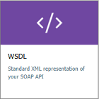
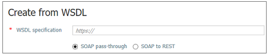

# Import SOAP API

This article shows how to import a standard XML representation of a SOAP API. The article also shows how to test the APIM API.

In this article, you learn how to:

> [!div class="checklist"]
> * Import SOAP API
> * Test the API in the Azure portal
> * Test the API in the Developer portal

## Prerequisites

Complete the following quickstart: [Create an Azure API Management instance](get-started-create-service-instance.md)

[!INCLUDE [api-management-navigate-to-instance.md](../../includes/api-management-navigate-to-instance.md)]

## Import and publish a back-end API

1. Select **APIs** from under **API MANAGEMENT**.
2. Select **WSDL** from the **Add a new API** list.

    
3. In the **WSDL specification**, enter the URL to where your SOAP API resides.
4. The **SOAP pass-through** radio button is selected by default. With this selection, the API is going to be exposed as SOAP. Consumer has to use SOAP rules. If you want to "restify" the API, follow the steps in [Import a SOAP API and convert it to REST](restify-soap-api.md).

    
5. Press tab.

    The following fields get filled up with the info from the SOAP API: Display name, Name, Description.
6. Add an API URL suffix. The suffix is a name that identifies this specific API in this APIM instance. It has to be unique in this APIM instance.
9. Publish the API by associating the API with a product. In this case, the "*Unlimited*" product is used.  If you want for the API to be published and be available to developers, add it to a product. You can do it during API creation or set it later.

    Products are associations of one or more APIs. You can include a number of APIs and offer them to developers through the developer portal. Developers must first subscribe to a product to get access to the API. When they subscribe, they get a subscription key that is good for any API in that product. If you created the APIM instance, you are an administrator already, so you are subscribed to every product by default.

    By default, each API Management instance comes with two sample products:

    * **Starter**
    * **Unlimited**   
10. Select **Create**.

### Test the new APIM API in the administrative portal

Operations can be called directly from the administrative portal, which provides a convenient way to view and test the operations of an API.  

1. Select the API you created in the previous step.
2. Press the **Test** tab.
3. Select some operation.

    The page displays fields for query parameters and fields for the headers. One of the headers is "Ocp-Apim-Subscription-Key", for the subscription key of the product that is associated with this API. If you created the APIM instance, you are an administrator already, so the key is filled in automatically. 
1. Press **Send**.

    Backend responds with **200 OK** and some data.

### Call an operation from the developer portal

Operations can also be called **Developer portal** to test APIs. 

1. Select the API you created in the "Import and publish a back-end API" step.
2. Press **Developer portal**.

    The "Developer portal" site opens up.
3. Select the **API** that you created.
4. Click the operation you want to test.
5. Press **Try it**.
6. Press **Send**.
    
    After an operation is invoked, the developer portal displays the **Response status**, the **Response headers**, and any **Response content**.

[!INCLUDE [api-management-navigate-to-instance.md](../../includes/api-management-append-apis.md)]

[!INCLUDE [api-management-define-api-topics.md](../../includes/api-management-define-api-topics.md)]

## Next steps

> [!div class="nextstepaction"]
> [Transform and protect a published API](transform-api.md)