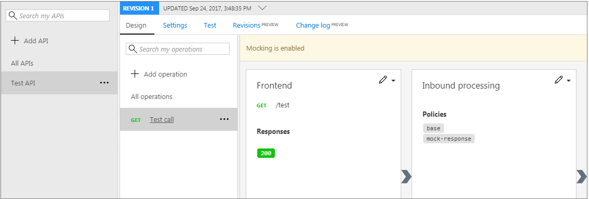
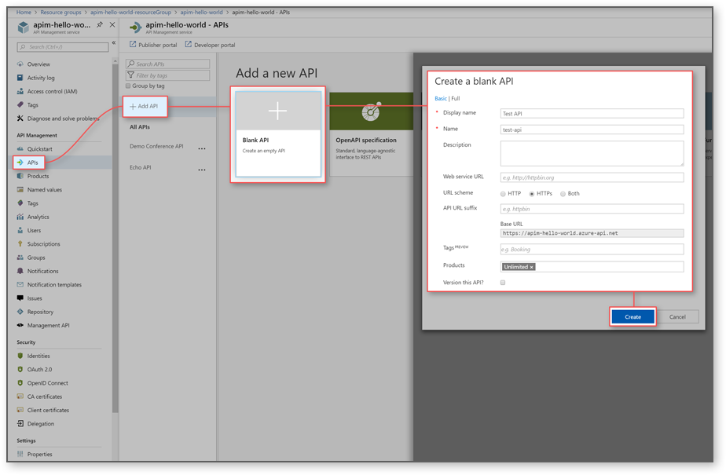
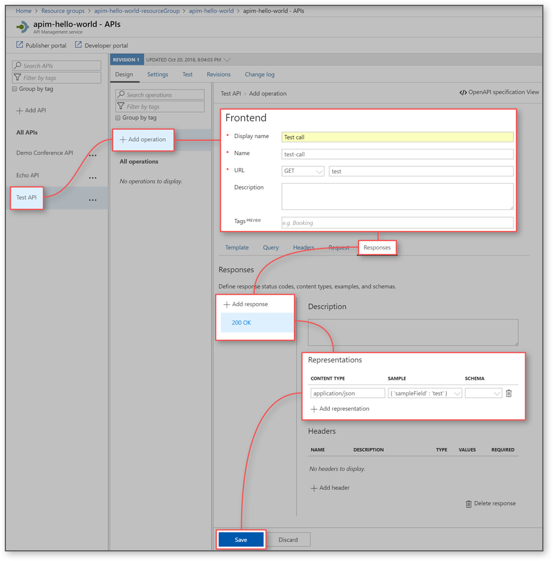
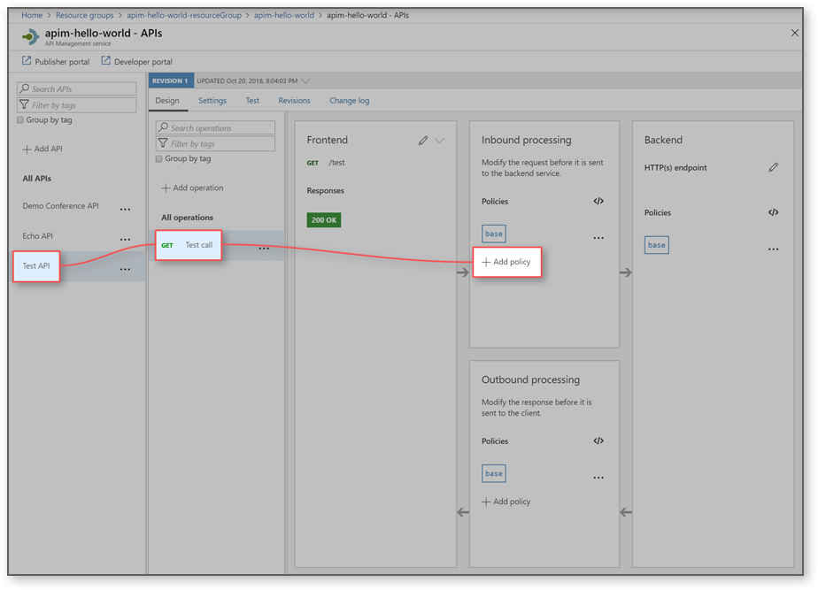
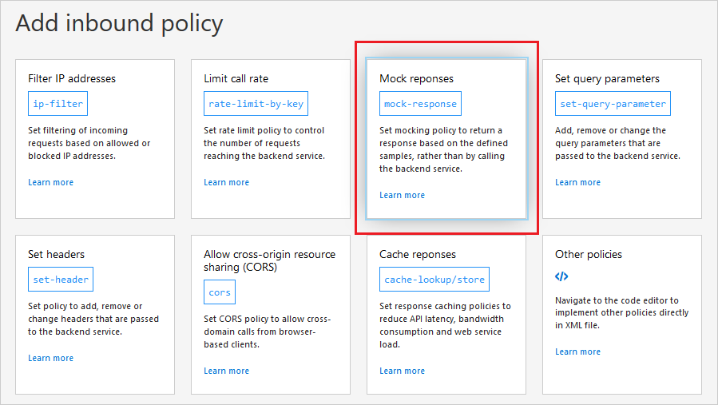
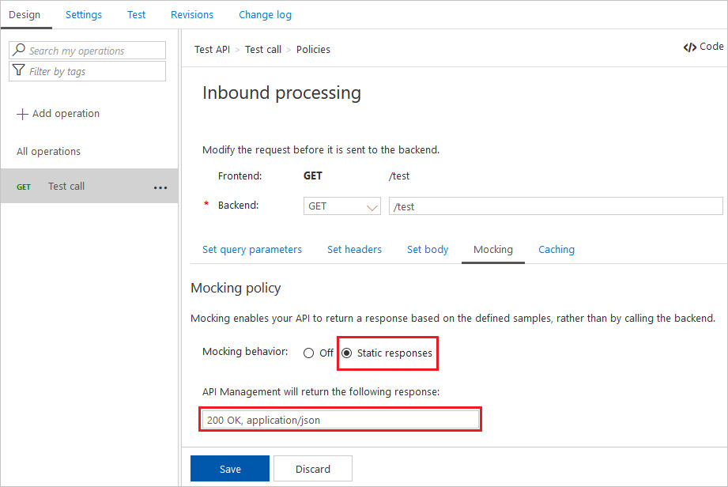
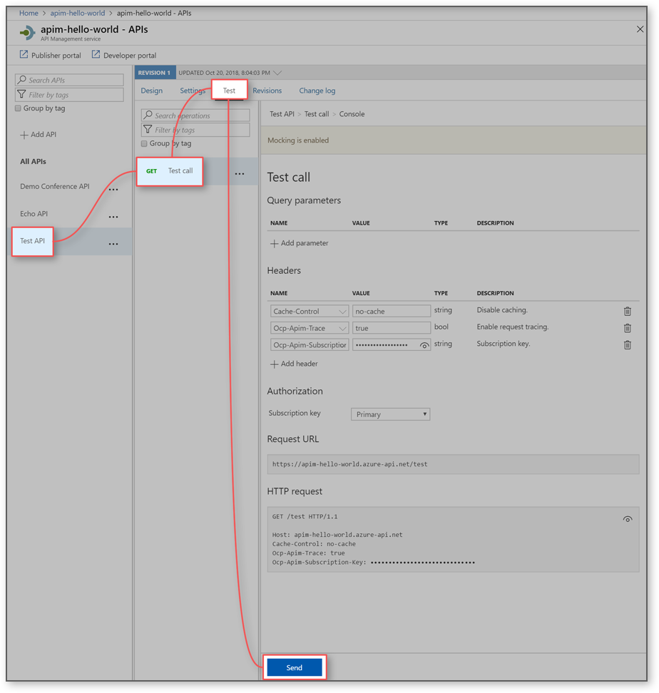
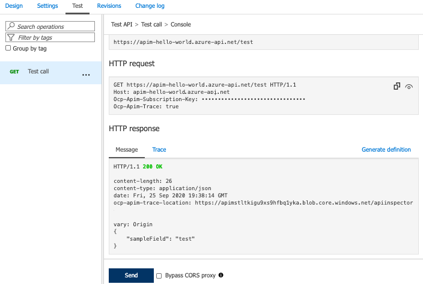

# Mock API responses

Backend APIs can be imported into an APIM API or created and managed manually. The steps in this tutorial show you how to use APIM to create a blank API and manage it manually. The tutorial shows how to set a policy on an API so it returns a mocked response. This method enables developers to proceed with implementation and testing of the APIM instance even if the backend is not available to send real responses. Ability to mock up responses can be useful in a number of scenarios:

+ When the API façade is designed first and the backend implementation comes later. Or, the backend is being developed in parallel.
+ When the backend is temporarily not operational or not able to scale.

In this tutorial, you learn how to:

> [!div class="checklist"]
> * Create a test API 
> * Add an operation to the test API
> * Enable response mocking
> * Test the mocked API

## Prerequisites

+ Learn the [Azure API Management terminology](api-management-terminology.md).
+ Understand the [concept of policies in Azure API Management](api-management-howto-policies.md).
+ Complete the following quickstart: [Create an Azure API Management instance](get-started-create-service-instance.md).

## Create a test API 

The steps in this section show how to create a blank API with no backend. It also shows how to add an operation to the API. Calling the operation after completing steps in this section produces an error. You will get no errors after you complete steps in the "Enable response mocking" section.

1. Select **APIs** from the **API Management** service.
2. From the left menu, select **+ Add API**.
3. Select **Blank API** from the list.
4. Enter "*Test API*" for **Display name**.
5. Enter "*Unlimited*" for **Products**.
6. Select **Create**.

## Add an operation to the test API

1. Select the API you created in the previous step.
2. Click **+ Add Operation**.

    | Setting             | Value                             | Description                                                                                                                                                                                   |
    |---------------------|-----------------------------------|-----------------------------------------------------------------------------------------------------------------------------------------------------------------------------------------------|
    | **Display name**    | *Test call*                       | The name that is displayed in the **Developer portal**.                                                                                                                                       |
    | **URL** (HTTP verb) | GET                               | You can choose from one of the predefined HTTP verbs.                                                                                                                                         |
    | **URL**             | */test*                           | A URL path for the API.                                                                                                                                                                       |
    | **Description**     |                                   | Provide a description of the operation that is used to provide documentation to the developers using this API in the **Developer portal**.                                                    |
    | **Query** tab       |                                   | You can add query parameters. Besides providing a name and description, you can provide values that can be assigned to this parameter. One of the values can be marked as default (optional). |
    | **Request** tab     |                                   | You can define request content types, examples, and schemas.                                                                                                                                  |
    | **Response** tab    | See steps that follow this table. | Define response status codes, content types, examples, and schemas.                                                                                                                           |

3. Select the **Response** tab, located under the URL, Display name, and Description fields.
4. Click **+ Add response**.
5. Select **200 OK** from the list.
6. Under the **Representations** heading on the right, select **+ Add representation**.
7. Enter "*application/json*" into the search box and select the **application/json** content type.
8. In the **Sample** text box, enter  `{ 'sampleField' : 'test' }`.
9. Select **Create**.

## Enable response mocking

1. Select the API you created in the "Create a test API" step.
2. Select the test operation that you added.
3. In the window on the right, click the **Design** tab.
4. In the **Inbound processing** window, click **+ Add policy**.
5. Select the **Mock responses** tile from the gallery.

    

6. In the **API Management response** textbox, type **200 OK, application/json**. This selection indicates that your API should return the response sample you defined in the previous section.

    

7. Click **Save**.

## Test the mocked API

1. Select the API you created in the "Create a test API" step.
2. Open the **Test** tab.
3. Ensure the **Test call** API is selected.

    > [!TIP]
    > A yellow bar with the text **Mocking is enabled** indicates that responses returned from the API Management, sends a mocking policy and not an actual backend response.

4. Select **Send** to make a test call.
5. The **HTTP response** displays the JSON provided as a sample in the first section of the tutorial.

    

## Video

> [!VIDEO https://www.youtube.com/embed/i9PjUAvw7DQ]

## Next steps

In this tutorial, you learned how to:

> [!div class="checklist"]
> * Create a test API
> * Add an operation to the test API
> * Enable response mocking
> * Test the mocked API

Advance to the next tutorial:

> [!div class="nextstepaction"]
> [Transform and protect a published API](transform-api.md)
