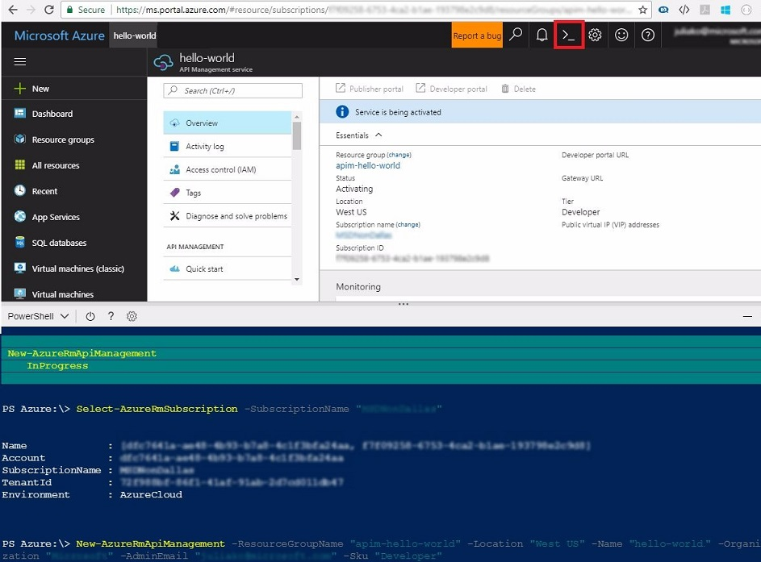

# Create a new Azure API Management service instance

This tutorial describes the steps for creating a new API Management instance using the PowerShell scripts. The quickstart shows you how to use the **Azure Cloud Shell** that you can run from [Azure portal](https://portal.azure.com/).

[!INCLUDE [quickstarts-free-trial-note](../../includes/quickstarts-free-trial-note.md)]



## Launch Azure Cloud Shell

The Azure Cloud Shell is a free shell that you can run directly within the Azure portal. It has common Azure tools preinstalled and configured to use with your account. Click the **Cloud Shell** button on the menu in the upper right of the **Azure** portal (**>_**).

## Create resource group

Create an Azure resource group with [New-AzureRmResourceGroup](/powershell/module/azurerm.resources/new-azurermresourcegroup). A resource group is a logical container into which Azure resources are deployed and managed. 

```azurepowershell-interactive
New-AzureRmResourceGroup -Name myResourceGroup -Location WestUS
```

## Create an API Management service

This is long running operation and could take up to 15 minutes.

```azurepowershell-interactive
New-AzureRmApiManagement -ResourceGroupName "myResourceGroup" -Location "West US" -Name "apim-name" -Organization "myOrganization" -AdminEmail "myEmail" -Sku "Developer"
```

## Clean up resources

When no longer needed, you can use the [Remove-AzureRmResourceGroup](/powershell/module/azurerm.resources/remove-azurermresourcegroup) command to remove the resource group and all related resources.

```azurepowershell-interactive
Remove-AzureRmResourceGroup -Name myResourceGroup
```

## Next steps

> [!div class="nextstepaction"]
> [Import and publish your first API](import-and-publish.md)