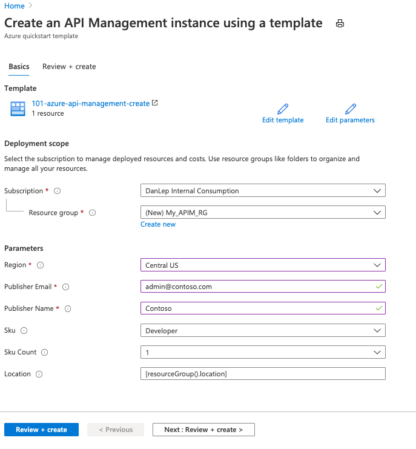

# Quickstart: Create a new Azure API Management service instance using an ARM template

This quickstart describes how to use an Azure Resource Manager template (ARM template) to create an Azure API Management (APIM) service instance. APIM helps organizations publish APIs to external, partner, and internal developers to unlock the potential of their data and services. API Management provides the core competencies to ensure a successful API program through developer engagement, business insights, analytics, security, and protection. APIM enables you to create and manage modern API gateways for existing backend services hosted anywhere. For more information, see the [Overview](api-management-key-concepts.md).

[!INCLUDE [About Azure Resource Manager](../../includes/resource-manager-quickstart-introduction.md)]

If your environment meets the prerequisites and you're familiar with using ARM templates, select the **Deploy to Azure** button. The template will open in the Azure portal.

[](https://portal.azure.com/#create/Microsoft.Template/uri/https%3A%2F%2Fraw.githubusercontent.com%2FAzure%2Fazure-quickstart-templates%2Fmaster%2F101-azure-api-management-create%2fazuredeploy.json)

## Prerequisites

If you don't have an Azure subscription, create a [free account](https://azure.microsoft.com/free/?WT.mc_id=A261C142F) before you begin.

## Review the template

The template used in this quickstart is from [Azure Quickstart Templates](https://azure.microsoft.com/resources/templates/101-azure-api-management-create/).


:::code language="json" source="~/quickstart-templates/101-azure-api-management-create/azuredeploy.json":::

The following resource is defined in the template:

- **[Microsoft.ApiManagement/service](https://docs.microsoft.com/azure/templates/microsoft.apimanagement/service)**

More Azure API Management template samples can be found in [Azure Quickstart Templates](https://azure.microsoft.com/resources/templates/?resourceType=Microsoft.Apimanagement&pageNumber=1&sort=Popular).

## Deploy the template

1. Select the following image to sign in to Azure and open a template. The template creates an API Management service instance in the Developer tier.

    [](https://portal.azure.com/#create/Microsoft.Template/uri/https%3A%2F%2Fraw.githubusercontent.com%2FAzure%2Fazure-quickstart-templates%2Fmaster%2F101-azure-api-management-create%2fazuredeploy.json)

1. Select or enter the following values.
    * **Subscription**: select an Azure subscription.
    * **Resource group**: select **Create new**, enter a unique name for the resource group, and then select **OK**.
    * **Location**: select a location for the resource group. Example: **Central US**.
    * **Publisher Email**: enter an email address to receive notifications.
    * **Publisher Name**: enter the name of the API publisher.
    * **Sku**: accept the default value of **Developer**. This tier isn't for production use. For more information about scaling the API Management tiers, see [upgrade and scale](upgrade-and-scale.md).
    * **Sku count**: accept the default value.
    * **Location**: accept the generated location for the API Management service.

    

 1. Select **Review + Create**, then review the terms and conditions. If you agree, select **Create**.
 1. After the instance has been created successfully, you get a notification:

## Review deployed resources

<!-- This heading must be titled "Review deployed resources" or "Validate the deployment". -->

<!--
Include at least one method that displays the deployed resources. Use a portal screenshot of the resources, or interactive code fences for Azure CLI (`azurecli-interactive`) or Azure PowerShell (`azurepowershell-interactive`).
-->

You can either use the Azure portal to check the deployed resources, or use Azure CLI or Azure PowerShell script to list the deployed resources.

## Clean up resources

<!-- 
The Clean up resources section includes a paragraph that explains how to delete unneeded resources. Include at least one method that shows how to clean up resources. Use a portal screenshot, or interactive code fences for Azure CLI (`azurecli-interactive`) or Azure PowerShell (`azurepowershell-interactive`).
-->

When no longer needed, delete the resource group, which deletes the resources in the resource group.

<!--

Choose Azure CLI, Azure PowerShell, or Azure portal to delete the resource group.

Here are the samples for Azure CLI and Azure PowerShell:

```azurecli-interactive
echo "Enter the Resource Group name:" &&
read resourceGroupName &&
az group delete --name $resourceGroupName &&
echo "Press [ENTER] to continue ..."
```

```azurepowershell-interactive
$resourceGroupName = Read-Host -Prompt "Enter the Resource Group name"
Remove-AzResourceGroup -Name $resourceGroupName
Write-Host "Press [ENTER] to continue..."
```

-->

## Next steps

<!-- 
Make the next steps similar to other quickstarts and use a blue button to link to the next article for your service. Or direct readers to the article: "Tutorial: Create and deploy your first ARM template" to follow the process of creating a template.

To include additional links for more information about the service, it's acceptable to use a paragraph and bullet points.
-->

For a step-by-step tutorial that guides you through the process of creating a template, see:

> [!div class="nextstepaction"]
> [Tutorial: Create and deploy your first ARM template](/azure/azure-resource-manager/templates/template-tutorial-create-first-template)