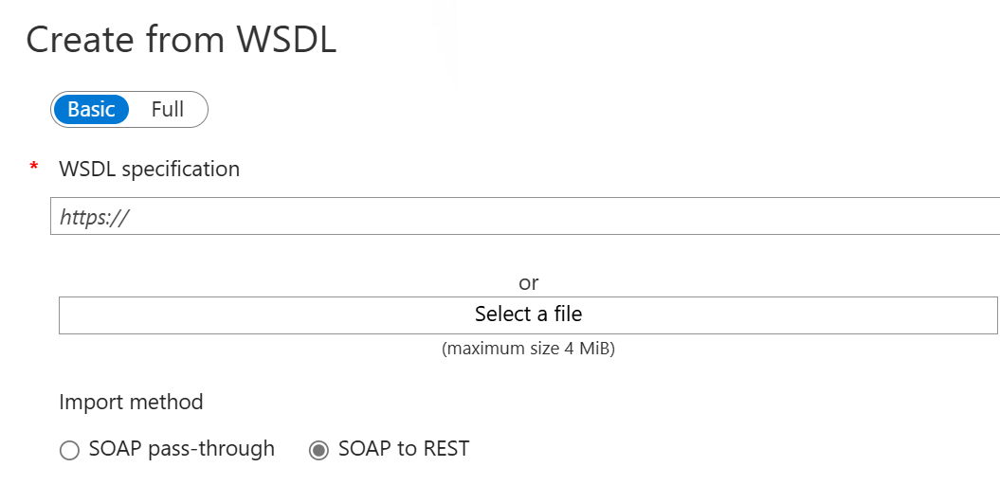

# Import SOAP API to API Management and convert to REST

This article shows how to import a SOAP API as a WSDL specification and then convert it to a REST API. The article also shows how to test the API in API Management.

In this article, you learn how to:

> [!div class="checklist"]
> * Import a SOAP API and convert to REST
> * Test the API in the Azure portal

[!INCLUDE [api-management-wsdl-import](../../includes/api-management-wsdl-import.md)]

## Prerequisites

Complete the following quickstart: [Create an Azure API Management instance](get-started-create-service-instance.md)

[!INCLUDE [api-management-navigate-to-instance.md](../../includes/api-management-navigate-to-instance.md)]

## Import and publish a back-end API

1. From the left menu, under the **APIs** section, select **APIs** > **+ Add API**.
1. Under **Create from definition**, select **WSDL**.

    
1. In **WSDL specification**, enter the URL to your SOAP API, or select **Select a file** to select a local WSDL file.
1. In **Import method**, select **SOAP to REST**. 
    When this option is selected, API Management attempts to make an automatic transformation between XML and JSON. In this case, consumers should call the API as a RESTful API, which returns JSON. API Management converts each request to a SOAP call.

    

1. The following fields are filled automatically with information from the SOAP API: **Display name**, **Name**, **Description**.
1. Enter other API settings. You can set the values during creation or configure them later by going to the **Settings** tab. 

    For more information about API settings, see [Import and publish your first API](import-and-publish.md#import-and-publish-a-backend-api) tutorial.
1. Select **Create**.

## Test the new API in the Azure portal

Operations can be called directly from the Azure portal, which provides a convenient way to view and test the operations of an API.  

1. Select the API you created in the previous step.
2. Select the **Test** tab.
3. Select an operation.

    The page shows fields for query parameters and fields for the headers. One of the headers is **Ocp-Apim-Subscription-Key**, for the subscription key of the product that is associated with this API. If you created the API Management instance, you're an admin already, so the key is filled in automatically. 
1. Press **Send**.

    When the test is successful, the backend responds with **200 OK** and some data.

[!INCLUDE [api-management-navigate-to-instance.md](../../includes/api-management-append-apis.md)]

[!INCLUDE [api-management-define-api-topics.md](../../includes/api-management-define-api-topics.md)]

## Next steps

> [!div class="nextstepaction"]
> [Transform and protect a published API](transform-api.md)