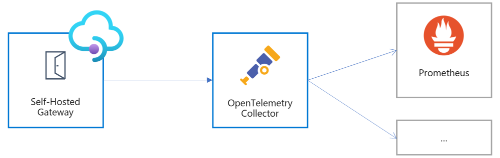

# Observability in the self-hosted gateway

This article explains the observability capabilities that the self-hosted gateway of Azure API Management offers for hybrid and multi-cloud API management.

## Azure Monitor

The self-hosted gateway allows you to send metrics to Azure Monitor, learn more about the Azure Monitor integration in [this article](how-to-configure-cloud-metrics-logs.md).

## OpenTelemetry

[OpenTelemetry](https://opentelemetry.io/) is a set of open-source tools and frameworks for logging, metrics, and tracing in a vendor-neutral way.

[!INCLUDE [preview](./includes/preview/preview-callout-self-hosted-gateway-opentelemetry.md)]

The self-hosted gateway can be configured to automatically collect and send metrics to an [OpenTelemetry Collector](https://opentelemetry.io/docs/concepts/components/#collector). This allows you to bring your own metrics collection and reporting solution for the self-hosted gateway.

> [!NOTE]
> OpenTelemetry is an incubating project of the [Cloud Native Computing Foundation (CNCF) ecosystem](https://www.cncf.io/).

### Metrics

The self-hosted gateway will automatically start measuring the following metrics:

- Requests
- DurationInMs
- BackendDurationInMs
- ClientDurationInMs
- GatewayDurationInMs

They are available in the configured OpenTelemetry Collector with additional dimensions.

## Next steps

-   [Read a whitepaper for additional background on this topic](https://aka.ms/hybrid-and-multi-cloud-api-management)
-   Learn more about the self-hosted gateway, see [Azure API Management self-hosted gateway overview](self-hosted-gateway-overview.md).
-   [Deploy self-hosted gateway to Azure Arc-enabled Kubernetes cluster](how-to-deploy-self-hosted-gateway-azure-arc.md)
-   [Deploy self-hosted gateway to Kubernetes with OpenTelemetry Collector integration](how-to-deploy-self-hosted-gateway-kubernetes-opentelemetry.md)
-   Learn about [configuring to send metrics to Azure Monitor](how-to-configure-cloud-metrics-logs.md)

