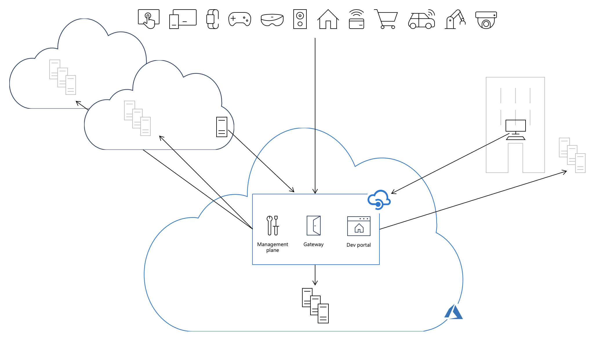
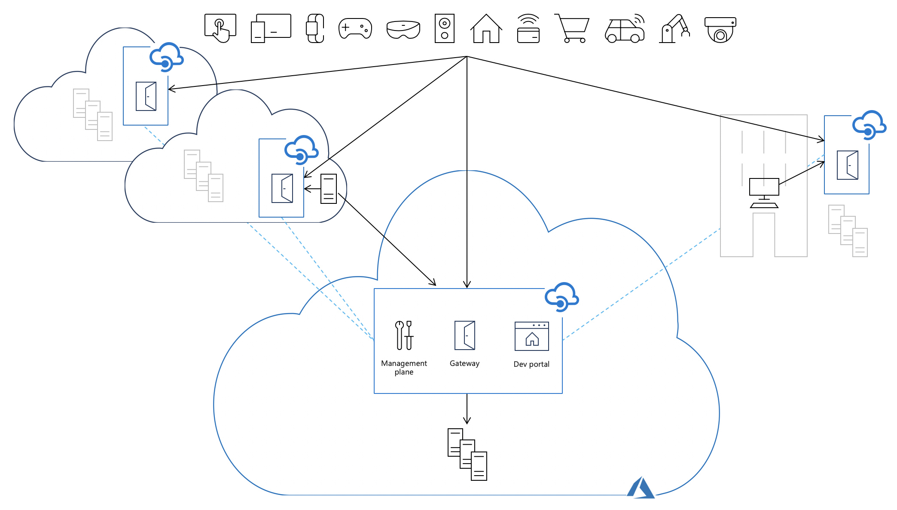

# Self-hosted API Management gateway overview

This article explains how self-hosted gateway feature enables hybrid and multi-cloud API management, presents its high-level architecture, and highlights its fundamental capabilities.

> [!NOTE]
> Self-hosted gateway feature is in preview. During the preview, the self-hosted gateway is available only in the Developer and Premium tiers at no additional charge. Developer tier is limited to a single self-hosted gateway deployment.

## Hybrid and multi-cloud API management

The self-hosted gateway feature expands API Management support for hybrid and multi-cloud environments and enables organizations to efficiently and securely manage APIs hosted on-premises and across clouds from a single API Management service in Azure.

With the self-hosted gateway, customers have the flexibility to deploy a containerized version of the API Management gateway component to the same environments where they host their APIs. All self-hosted gateways are managed from the API Management service they are federated with, thus providing customers with the visibility and unified management experience across all internal and external APIs. Placing the gateways close to the APIs allow customers to optimize API traffic flows and address security and compliance requirements.

Each API Management service is composed of the following key components:

-   Management plane, exposed as an API, used to configure the service via the Azure portal, PowerShell, and other supported mechanisms.
-   Gateway (or data plane) is responsible for proxying API requests, applying policies, and collecting telemetry
-   Developer portal used by developers to discover, learn, and onboard to use the APIs

By default, all these components are deployed in Azure, causing all API traffic (shown as solid black arrows on the picture below) to flow through Azure regardless of where backends implementing the APIs are hosted. The operational simplicity of this model comes at the cost of increased latency, compliance issues, and in some cases, additional data transfer fees.

Deploying self-hosted gateways into the same environments as backend API implementations and adding them to the API Management service allows API traffic to flow directly to the backend APIs, which improves latency, optimizes data transfer costs, and enables compliance while retaining the benefits of having a single point of management and discovery of all APIs within the organization regardless of where their implementations are hosted.

## Packaging and features

The self-hosted gateway is a containerized, functionally-equivalent version of the managed gateway deployed to Azure as part of every API Management service. The self-hosted gateway is available as a Linux-based Docker container from the Microsoft Container Registry. It can be deployed to Docker, Kubernetes, or any other container orchestration solution running on a desktop, server cluster, or cloud infrastructure.

> [!IMPORTANT]
> Some functionality available in the managed gateway is not yet available in preview. Most notably: Log to Event Hub policy, Service Fabric integration, downstream HTTP/2. There is no plan to make a built-in cache available in the self-hosted gateway.

## Connectivity to Azure

The self-hosted gateway requires outbound TCP/IP connectivity to Azure on port 443. Each self-hosted gateway has to be associated with a single API Management service and is configured via its management plane. Self-hosted gateway uses connectivity to Azure for:

-   Reporting its status by sending heartbeat messages every minute
-   Regularly checking for (every 10 seconds) and applying configuration updates whenever they are available
-   Sending request logs and metrics to Azure Monitor, if configured to do so
-   Sending events to Application Insights, if set to do so

When connectivity to Azure is lost, self-hosted gateway will be unable to receive configuration updates, report its status, or upload telemetry.

The self-hosted gateway is designed to "fail static" and can survive the temporary loss of connectivity to Azure. It can be deployed with or without local configuration backup turned on. In the former case, self-hosted gateways will regularly save a backup copy of configuration on a persistent volume attached to the container or pod.

When configuration backup is turned off and connectivity to Azure is interrupted:

-   Self-hosted gateways that are running will continue to function using an in-memory copy of the configuration
-   Stopped self-hosted gateways will not be able to start

When configuration backup is turned on and connectivity to Azure is interrupted:

-   Self-hosted gateways that are running will continue to function using an in-memory copy of the configuration
-   Stopped self-hosted gateways will start using a backup copy of the configuration

When connectivity is restored, each self-hosted gateway affected by the outage will automatically reconnect with its associated API Management service and download all configuration updates that occurred while the gateway was "offline".

## Next steps

-   [Read a whitepaper for additional background on this topic](https://aka.ms/hybrid-and-multi-cloud-api-management)
-   [Deploy self-hosted gateway to Docker](api-management-howto-deploy-self-hosted-gateway-to-docker.md)
-   [Deploy self-hosted gateway to Kubernetes](api-management-howto-deploy-self-hosted-gateway-to-k8s.md)
