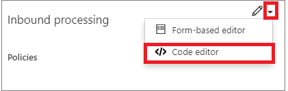

# How to set or edit Azure API Management policies

To set or edit a policy, follow the following steps:

1. Sign in to the Azure portal at [https://portal.azure.com](https://portal.azure.com).
2. Browse to your APIM instance.
3. Click the **APIs** tab.
4. Select one of the APIs that you previously imported.
5. Select the **Design** tab.
6. Select an operation to which you want to apply the policy. If you want to apply the policy to all operations, select **All operations**.
7. Click the triangle next to the **inbound** or **outbound** pencils.
8. Select the **Code editor** item.

    

9. Paste the desired policy code into one of the appropriate blocks.
         
        <policies>
             <inbound>
                 <base />
             </inbound>
             <backend>
                 <base />
             </backend>
             <outbound>
                 <base />
             </outbound>
             <on-error>
                 <base />
             </on-error>
         </policies>
 
For more information, see [Transform APIs](transform-api.md).
