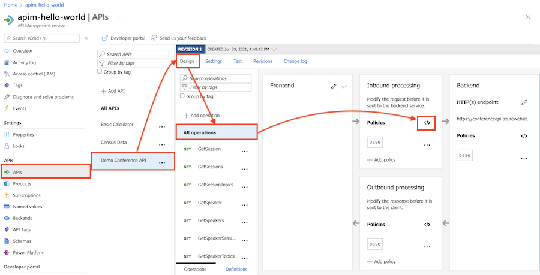
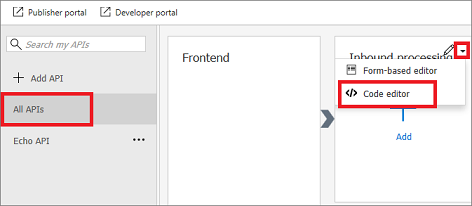
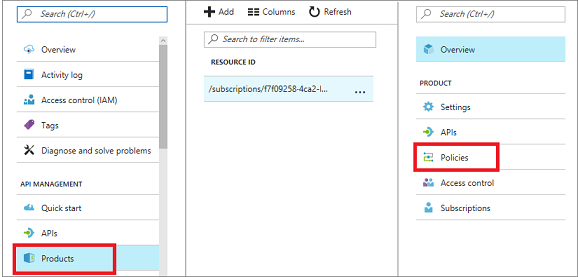
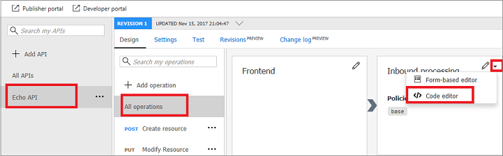
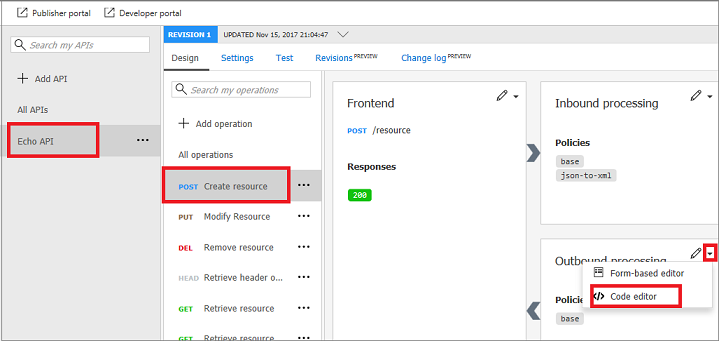

# How to set or edit Azure API Management policies

The policy definition is an XML document that describes a sequence of inbound and outbound statements. The XML can be edited directly in the definition window. You can also select a predefined policy from the list that is provided to the right of the policy window. The statements applicable to the current scope are enabled and highlighted. Clicking an enabled statement adds the appropriate XML at the location of the cursor in the definition view. 

For detailed information about policies, see [Policies in Azure API Management](api-management-howto-policies.md).

## Set or edit a policy

To set or edit a policy, follow the following steps:

1. Sign in to the Azure portal at [https://portal.azure.com](https://portal.azure.com).
2. Browse to your APIM instance.
3. Click the **APIs** tab.

    

4. Select one of the APIs that you previously imported.
5. Select the **Design** tab.
6. Select an operation to which you want to apply the policy. If you want to apply the policy to all operations, select **All operations**.
7. Select the **</>** (code editor) icon in the **Inbound processing** or **Outbound processing** section.
8. Paste the desired policy code into one of the appropriate blocks.
         
        <policies>
             <inbound>
                 <base />
             </inbound>
             <backend>
                 <base />
             </backend>
             <outbound>
                 <base />
             </outbound>
             <on-error>
                 <base />
             </on-error>
         </policies>
 
## Configure scope

Policies can be configured globally or at the scope of a Product, API, or Operation. To begin configuring a policy, you must first select the scope at which the policy should apply.

Policy scopes are evaluated in the following order:

1. Global scope
2. Product scope
3. API scope
4. Operation scope

The statements within policies are evaluated according to the placement of the `base` element, if it is present. Global policy has no parent policy and using the `<base>` element in it has no effect.

To see the policies in the current scope in the policy editor, click **Recalculate effective policy for selected scope**.

### Global scope

Global scope is configured for **All APIs** in your APIM instance.

1. Sign in to the [Azure portal](https://portal.azure.com/) and navigate to your APIM instance.
2. Click **All APIs**.

    

3. Click the triangle icon.
4. Select **Code editor**.
5. Add or edit policies.
6. Press **Save**. 

    The changes are propagated to the API Management gateway immediately.

### Product scope

Product scope is configured for the selected product.

1. Click **Products**.

    

2. Select the product to which you want to apply policies.
3. Click **Policies**.
4. Add or edit policies.
5. Press **Save**. 

### API scope

API scope is configured for **All Operations** of the selected API.

1. Select the **API** you want to apply policies to.

    

2. Select **All operations**
3. Click the triangle icon.
4. Select **Code editor**.
5. Add or edit policies.
6. Press **Save**. 

### Operation scope 

Operation scope is configured for the selected operation.

1. Select an **API**.
2. Select the operation you want to apply policies to.

    

3. Click the triangle icon.
4. Select **Code editor**.
5. Add or edit policies.
6. Press **Save**. 

## Next steps

See the following related topics:

+ [Transform APIs](transform-api.md)
+ [Policy Reference](api-management-policy-reference.md) for a full list of policy statements and their settings
+ [Policy samples](policy-samples.md)