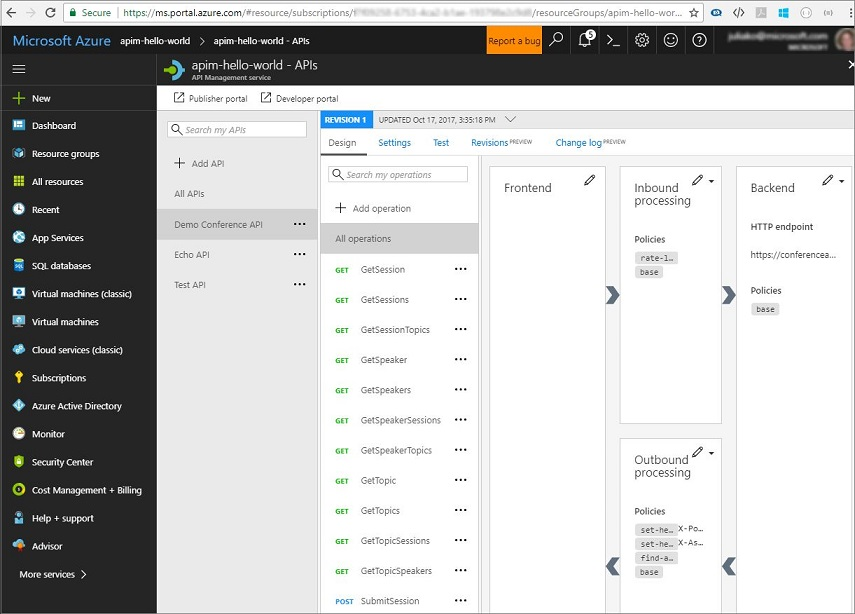
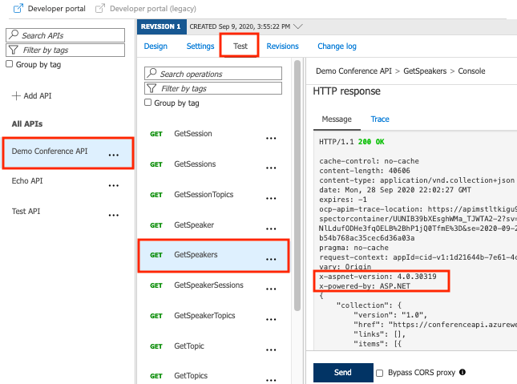
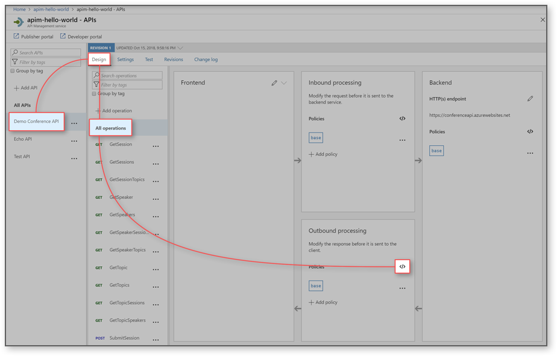
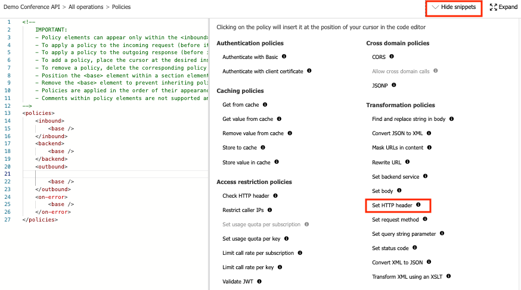
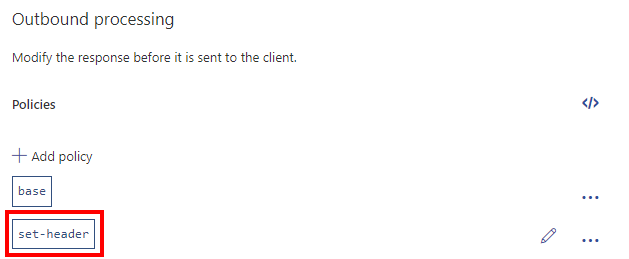
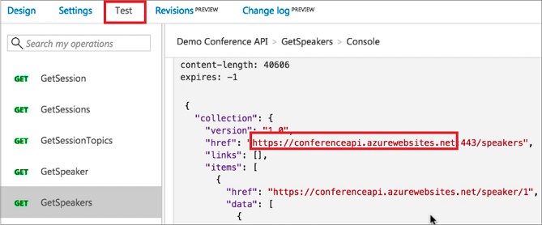
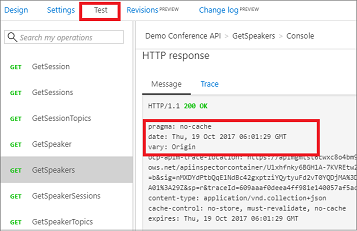
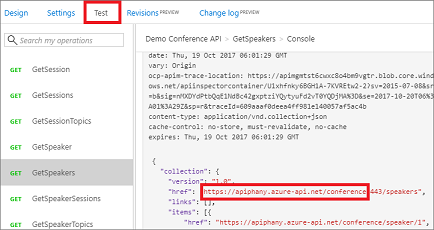
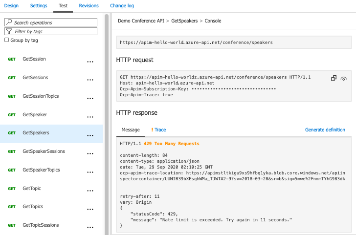

# Transform and protect your API

The tutorial shows how to transform your API so it does not reveal a private backend info. For example, you might want to hide the info about technology stack that is running on the backend. You might also want to hide original URLs that appear in the body of API's HTTP response and instead redirect them to the APIM gateway.

This tutorial also shows you how easy it is to add protection for your backend API by configuring rate limit with Azure API Management. For example, you may want to limit a number of calls the API is called so it is not overused by developers. For more information, see [API Management policies](api-management-policies.md)

In this tutorial, you learn how to:

> [!div class="checklist"]
>
> -   Transform an API to strip response headers
> -   Replace original URLs in the body of the API response with APIM gateway URLs
> -   Protect an API by adding rate limit policy (throttling)
> -   Test the transformations

## Prerequisites

-   Learn the [Azure API Management terminology](api-management-terminology.md).
-   Understand the [concept of policies in Azure API Management](api-management-howto-policies.md).
-   Complete the following quickstart: [Create an Azure API Management instance](get-started-create-service-instance.md).
-   Also, complete the following tutorial: [Import and publish your first API](import-and-publish.md).

[!INCLUDE [api-management-navigate-to-instance.md](../../includes/api-management-navigate-to-instance.md)]

## Transform an API to strip response headers

This section shows how to hide the HTTP headers that you do not want to show to your users. In this example, the following headers get deleted in the HTTP response:

-   **X-Powered-By**
-   **X-AspNet-Version**

### Test the original response

To see the original response:

1. In your APIM service instance, select **APIs** (under **API MANAGEMENT**).
2. Click **Demo Conference API** from your API list.
3. Click the **Test** tab, on the top of the screen.
4. Select the **GetSpeakers** operation.
5. Press the **Send** button, at the bottom of the screen.

The original response should look like this:

### Set the transformation policy

1. Select **Demo Conference API**.
2. On the top of the screen, select **Design** tab.
3. Select **All operations**.
4. In the **Outbound processing** section, click the **</>** icon.
5. Position the cursor inside the **&lt;outbound&gt;** element.
6. In the right window, under **Transformation policies**, click **+ Set HTTP header** twice (to insert two policy snippets).

   

7. Modify your **\<outbound>** code to look like this:

       <set-header name="X-Powered-By" exists-action="delete" />
       <set-header name="X-AspNet-Version" exists-action="delete" />

   

8. Click the **Save** button.

## Replace original URLs in the body of the API response with APIM gateway URLs

This section shows how to hide original URLs that appear in the body of API's HTTP response and instead redirect them to the APIM gateway.

### Test the original response

To see the original response:

1. Select **Demo Conference API**.
2. Click the **Test** tab, on the top of the screen.
3. Select the **GetSpeakers** operation.
4. Press the **Send** button, at the bottom of the screen.

    As you can see the original response looks like this:

    

### Set the transformation policy

1.  Select **Demo Conference API**.
2.  Select **All operations**.
3.  On the top of the screen, select **Design** tab.
4.  In the **Outbound processing** section, click the **</>** icon.
5.  Position the cursor inside the **&lt;outbound&gt;** element and click **Insert policy** button at the top right corner.
6.  In the right window, under **Transformation policies**, click **+ Find and replace string in body**.
7.  Modify your **find-and-replace** code (in the **\<outbound\>** element) to replace the URL to match your APIM gateway. For example:

        <find-and-replace from="://conferenceapi.azurewebsites.net" to="://apiphany.azure-api.net/conference"/>

## Protect an API by adding rate limit policy (throttling)

This section shows how to add protection for your backend API by configuring rate limits. For example, you may want to limit a number of calls the API is called so it is not overused by developers. In this example, the limit is set to 3 calls per 15 seconds for each subscription Id. After 15 seconds, a developer can retry calling the API.

1.  Select **Demo Conference API**.
2.  Select **All operations**.
3.  On the top of the screen, select **Design** tab.
4.  In the **Inbound processing** section, click the **</>** icon.
5.  Position the cursor inside the **&lt;inbound&gt;** element.
6.  In the right window, under **Access restriction policies**, click **+ Limit call rate per key**.
7.  Modify your **rate-limit-by-key** code (in the **\<inbound\>** element) to the following code:

        <rate-limit-by-key calls="3" renewal-period="15" counter-key="@(context.Subscription.Id)" />

## Test the transformations

At this point if you look at the code in the code editor, your policies look like this:

    <policies>
        <inbound>
            <rate-limit-by-key calls="3" renewal-period="15" counter-key="@(context.Subscription.Id)" />
            <base />
        </inbound>
        <backend>
            <base />
        </backend>
        <outbound>
            <set-header name="X-Powered-By" exists-action="delete" />
            <set-header name="X-AspNet-Version" exists-action="delete" />
            <find-and-replace from="://conferenceapi.azurewebsites.net:443" to="://apiphany.azure-api.net/conference"/>
            <find-and-replace from="://conferenceapi.azurewebsites.net" to="://apiphany.azure-api.net/conference"/>
            <base />
        </outbound>
        <on-error>
            <base />
        </on-error>
    </policies>

The rest of this section tests policy transformations that you set in this article.

### Test the stripped response headers

1. Select **Demo Conference API**.
2. Select the **Test** tab.
3. Click the **GetSpeakers** operation.
4. Press **Send**.

    As you can see the headers have been stripped:

    

### Test the replaced URL

1. Select **Demo Conference API**.
2. Select the **Test** tab.
3. Click the **GetSpeakers** operation.
4. Press **Send**.

    As you can see the URL has been replaced.

    

### Test the rate limit (throttling)

1. Select **Demo Conference API**.
2. Select the **Test** tab.
3. Click the **GetSpeakers** operation.
4. Press **Send** three times in a row.

    After sending the request 3 times, you get **429 Too many requests** response.

5. Wait 15 seconds or so and press **Send** again. This time you should get a **200 OK** response.

    

## Video

> [!VIDEO https://channel9.msdn.com/Blogs/AzureApiMgmt/Rate-Limits-and-Quotas/player]

## Next steps

In this tutorial, you learned how to:

> [!div class="checklist"]
>
> -   Transform an API to strip response headers
> -   Replace original URLs in the body of the API response with APIM gateway URLs
> -   Protect an API by adding rate limit policy (throttling)
> -   Test the transformations

Advance to the next tutorial:

> [!div class="nextstepaction"]
> [Monitor your API](api-management-howto-use-azure-monitor.md)
