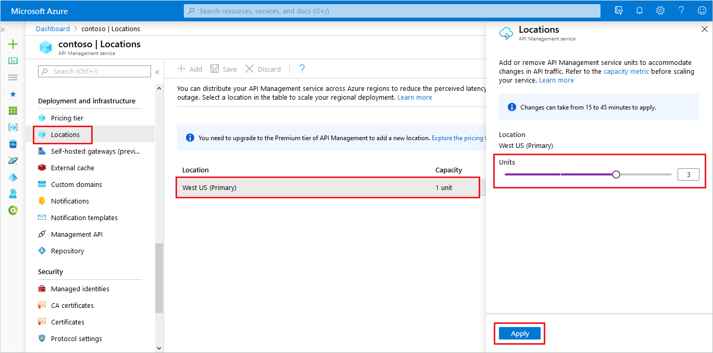

---
# Mandatory fields. See more on aka.ms/skyeye/meta.
title: Upgrade and scale an Azure API Management instance | Microsoft Docs
description: This topic describes how to upgrade and scale an Azure API Management instance.
services: api-management
documentationcenter: ''
author: mikebudzynski
manager: anneta
editor: ''

ms.service: api-management
ms.workload: integration
ms.topic: article
ms.date: 08/18/2018
ms.author: apimpm
---

# Upgrade and scale an Azure API Management instance  

Customers can scale an Azure API Management (APIM) instance by adding and removing units. A **unit** is composed of dedicated Azure resources and has a certain load-bearing capacity expressed as a number of API calls per month. This number does not represent a call limit, but rather a maximum throughput value to allow for rough capacity planning. Actual throughput and latency vary broadly depending on factors such as number and rate of concurrent connections, the kind and number of configured policies, request and response sizes, and backend latency.

Capacity and price of each unit depends on the **tier** in which the unit exists. You can choose between four tiers: **Developer**, **Basic**, **Standard**, **Premium**. If you need to increase capacity for a service within a tier, you should add a unit. If the tier that is currently selected in your APIM instance does not allow adding more units, you need to upgrade to a higher-level tier.

The price of each unit and the available features (for example, multi-region deployment) depends on the tier that you chose for your APIM instance. The [pricing details](https://azure.microsoft.com/pricing/details/api-management/?ref=microsoft.com&utm_source=microsoft.com&utm_medium=docs&utm_campaign=visualstudio) article, explains the price per unit and features you get in each tier. 

>[!NOTE]
>The [pricing details](https://azure.microsoft.com/pricing/details/api-management/?ref=microsoft.com&utm_source=microsoft.com&utm_medium=docs&utm_campaign=visualstudio) article shows approximate numbers of unit capacity in each tier. To get more accurate numbers, you need to look at a realistic scenario for your APIs. See the [Capacity of an Azure API Management instance](api-management-capacity.md) article.

## Prerequisites

To follow the steps from this article, you must:

+ Have an active Azure subscription.

    [!INCLUDE [quickstarts-free-trial-note](../../includes/quickstarts-free-trial-note.md)]

+ Have an APIM instance. For more information, see [Create an Azure API Management instance](get-started-create-service-instance.md).

+ Understand the concept of [Capacity of an Azure API Management instance](api-management-capacity.md).

[!INCLUDE [premium-dev-standard-basic.md](../../includes/api-management-availability-premium-dev-standard-basic.md)]

## Upgrade and scale  

You can choose between four tiers: **Developer**, **Basic**,  **Standard** and **Premium**. The **Developer** tier should be used to evaluate the service; it should not be used for production. The **Developer** tier does not have SLA and you cannot scale this tier (add/remove units). 

**Basic**, **Standard** and **Premium** are production tiers that have SLA and can be scaled. The **Basic** tier is the cheapest tier which has SLA and it can be scaled up to 2 units, **Standard** tier can be scaled to up to four units. You can add any number of units to the **Premium** tier.

The **Premium** tier enables you to distribute a single Azure API Management instance across any number of desired Azure regions. When you initially create an Azure API Management service, the instance contains only one unit and resides in a single Azure region. The initial region is designated as the **primary** region. Additional regions can be easily added. When adding a region, you specify the number of units you want to allocate. For example, you can have one unit in the **primary** region and five units in some other region. You can tailor the number of units to the traffic you have in each region. For more information, see [How to deploy an Azure API Management service instance to multiple Azure regions](api-management-howto-deploy-multi-region.md).

You can upgrade and downgrade to and from any tier. Note that upgrading or downgrading can remove some features - for example, VNETs or multi-region deployment, when downgrading to Standard or Basic from the Premium tier.

>[!NOTE]
>The upgrade or scale process can take from 15 to 45 minutes to apply. You get notified when it is done.

## Use the Azure portal to upgrade and scale

1. Navigate to your APIM instance in the [Azure portal](https://portal.azure.com/).
2. Select **Scale and pricing** from the menu.
3. Pick the desired tier.
4. Specify the number of **units** you want to add. You can either use the slider or type the number of units.  
    If you choose the **Premium** tier, you first need to select a region.
5. Press **Save**.

## Next steps

- [How to deploy an Azure API Management service instance to multiple Azure regions](api-management-howto-deploy-multi-region.md)
- [How to automatically scale an Azure API Management service instance](api-management-howto-autoscale.md)
