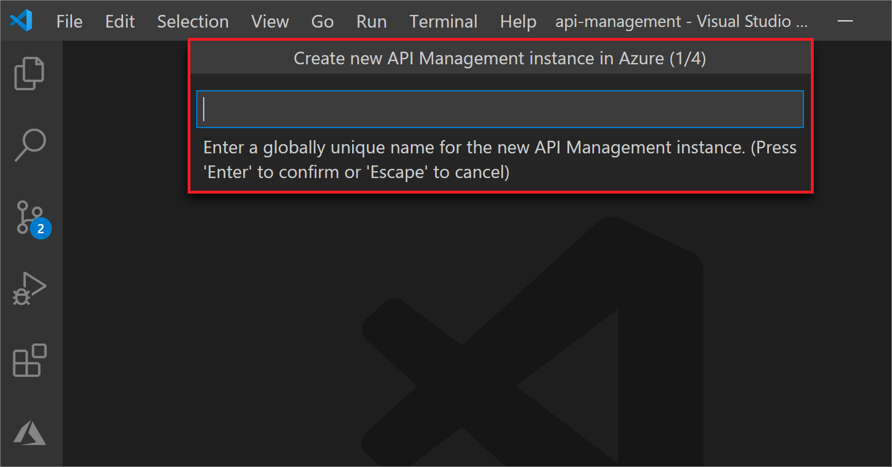
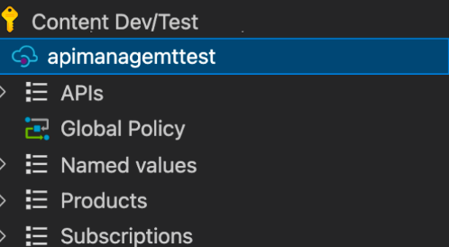
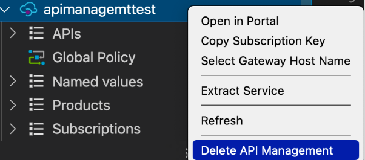

# Quickstart: Create a new Azure API Management service instance using Visual Studio Code

Azure API Management (APIM) helps organizations publish APIs to external, partner, and internal developers to unlock the potential of their data and services. API Management provides the core competencies to ensure a successful API program through developer engagement, business insights, analytics, security, and protection. APIM lets you create and manage modern API gateways for existing backend services hosted anywhere. For more information, see the [Overview](api-management-key-concepts.md) topic.

This quickstart describes the steps to create a new API Management instance using the *Azure API Management Extension* for Visual Studio Code. You can also use the extension to do common management actions on your API Management instance.

## Prerequisites

[!INCLUDE [quickstarts-free-trial-note](../../includes/quickstarts-free-trial-note.md)]

Also, ensure you've installed the following:

- [Visual Studio Code](https://code.visualstudio.com/)

- [Azure API Management Extension for Visual Studio Code](https://marketplace.visualstudio.com/items?itemName=ms-azuretools.vscode-apimanagement&ssr=false#overview)

## Sign in to Azure

Launch Visual Studio Code and open the Azure extension. (If you don't see the Azure icon on the Activity Bar, make sure the *Azure API Management* extension is enabled.)

Select **Sign in to Azure...** to launch a browser window and sign in to your Microsoft account.

## Create an API Management service

Once you're signed in to your Microsoft account, the *Azure: API Management* explorer pane will list your Azure subscription(s).

Right-click on the subscription you'd like to use, and select **Create API Management in Azure**.

In the pane that opens, supply a name for the new API Management instance. It must be globally unique within Azure and consist of 1-50 alphanumeric characters and/or hyphens. It should also start with a letter and end with an alphanumeric character.

A new API Management instance (and parent resource group) will be created with the specified name. By default, the instance is created in the *West US* region with *Consumption* SKU.

> [!TIP]
> If you enable **Advanced Creation** in the *Azure API Management Extension Settings*, you can also specify an [API Management SKU](https://azure.microsoft.com/pricing/details/api-management/), [Azure region](https://azure.status.microsoft/en-us/status), and a [resource group](../azure-resource-manager/management/overview.md) to deploy your API Management instance.
>
> While the *Consumption* SKU takes less than a minute to set up, other SKUs typically take 30-40 minutes to create.

At this point, you're ready to import and publish your first API. You can do that and also do common API Management actions within the extension for Visual Studio Code. See [the tutorial](visual-studio-code-tutorial.md) for more.

## Clean up resources

When no longer needed, remove the API Management instance by right-clicking and selecting **Open in Portal** to [delete the API Management service](get-started-create-service-instance.md#clean-up-resources) and its resource group.

Alternately, you can select **Delete API Management** to only delete the API Management instance (this action doesn't delete its resource group).

## Next steps

> [!div class="nextstepaction"]
> [Import and manage APIs using the API Management Extension](visual-studio-code-tutorial.md)
