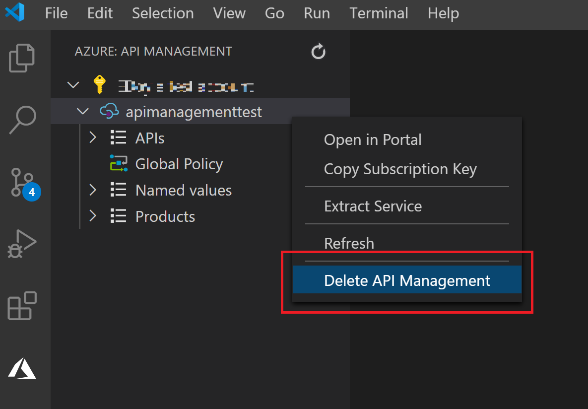

# Tutorial: [...]

In this tutorial, you learn how to use the API Management Extension Preview for Visual Studio Code to perform common management operations on your API Management instance.

You learn how to:

> [!div class="checklist"]
> * Import an API into API Management
> * Manage the API...

## Prerequisites
- Understand [Azure API Management terminology](api-management-terminology.md).
- Ensure you have installed [Visual Studio Code](https://code.visualstudio.com/) and the [Azure API Management Extension for Visual Studio Code (Preview)](https://marketplace.visualstudio.com/items?itemName=ms-azuretools.vscode-apimanagement&ssr=false#overview)

[IS THE CONSUMPTION SKU OK FOR THIS TUTORIAL??]

## (Optioal) Create an API Management service

If you previously used the API Management extension to [create an Azure API Management instance](gvscode-create-service-instance.md) using default settings, you can skip this step. The default settings create the instance in the Consumption SKU in the West US region.

This section shows you how to create an API Management service instance using the API Management extension with customized settings.

1. Launch Visual Studio Code, select Extensions from the Activity Bar, and search for *API Management*.
1. Select the **Manage** icon (a gear), and then select **Extension Settings**.
1. Enable the **Azure API Management: Advanced Creation** setting. You can enable exension settings at the [user or workspace scope](https://code.visualstudio.com/docs/getstarted/settings).
    :::image type="content" source="media/vscode-tutorial-service-instance/enable-advanced-creation-setting.png" alt-text="Enabled advance creation of API Management instance":::
1. Select the **Manage** icon, and ensure that the extension is enabled.
1. Select the Azure icon on the Activity Bar to open the Azure extension.
1. If you're not already signed into Azure, select **Sign in to Azure...** to launch a browser window and sign in to your Microsoft account.
1. Once you're signed in to your Microsoft account, the *Azure: API Management* explorer pane will list your Azure subscription(s).
1. Right-click on the subscription you'd like to use, and select **Create API Management in Azure**.
1. When prompted, select or enter the following:
    1. A name for the new API Management instance. It must be globally unique within Azure and consist of 1-50 alphanumeric characters and/or hyphens, and start with a letter and end with an alphanumeric.
    1. The service tier for the instance. For example, select the Developer tier, an economical option to evaluate Azure API Management. This tier isn't for production use. For more information about scaling the API Management tiers, see [upgrade and scale](upgrade-and-scale.md).
    1. A location for the API Management instance.
    1. A name of a new or existing resource group.

> [!TIP]
> While the *Consumption* SKU takes less than a minute to provision, other SKUs typically take 30-40 minutes to create.

After the instance is created, you're ready to import and publish your first API. 

## Import an API

1. In the Explorer pane, expand the API Management instance you created and right-click **APIs**. Select **Import from OpenAPI Link**. 
1. Enter the following:
    1. An OpenAPI link for content in JSON format: `https://conferenceapi.azurewebsites.net?format=json`.
    This URL is the service that implements a demonstration API. API Management forwards requests to this address. Microsoft provides the backend API used in this example, and hosts it on Azure at https://conferenceapi.azurewebsites.net?format=json.
    1. An API name, such as *demo-conference-api*, that is unique in the API Management instance. This name can contain ony letters, number, and hyphens. The first and last characters must be alphanumeric. This name is used but default in the path to call the API.

After the API is imported successfully, it appears in the Explorer pane.

:::image type="content" source="media/vscode-tutorial-service-instance/import-demo-api.png" alt-text="Imported API in Explorer pane":::

You can edit the API in Visual Studio Code. For example, you can edit the Resource Manager description of the API in the right-hand window to remove the **http** protocol used to access the API. Then select **File** > **Save**.

To edit the OpenAPI format, right-click the API name in the Explorer pane and select **Edit OpenAPI**. Make your changes, and then select **File** > **Save**.

## Test an API

### Get the subscription key

### Test an operation

Select an operation, paste subscription key where `{{SubscriptionKey}}`, select **Send Request**.

:::image type="content" source="../azure-resource-manager/managed-applications/media/request-just-in-time-access/send-request.png" alt-text="Send API request from Visual Studio Code":::

View API response

:::image type="content" source="media/vscode-tutorial-service-instance/test-api-response.png" alt-text="Response to API test operation":::

## Clean up resources

When no longer needed, remove the API Management instance by right-clicking and selecting **Open in Portal** to [delete the API Management service](get-started-create-service-instance.md#clean-up-resources) and its resource group.

Alternately, you can select **Delete API Management** to only delete the API Management instance (this operation doesn't delete its resource group).

## Next steps

> [!div class="nextstepaction"]
> [Import and publish your first API](import-and-publish.md)
