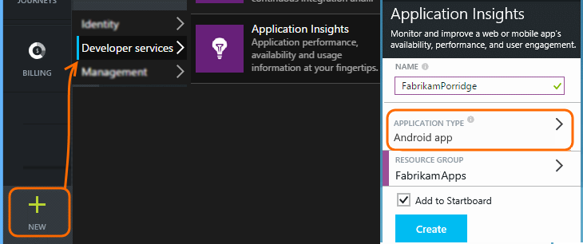
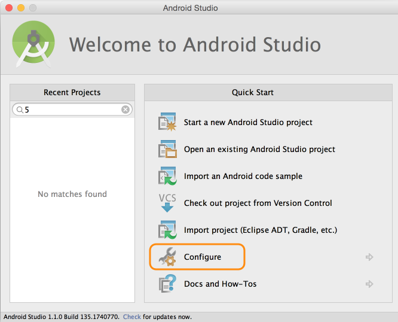
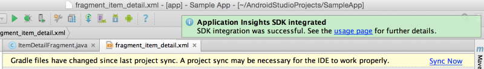

<properties 
    pageTitle="Application Insights for Android apps" 
    description="Analyze usage and performance of your Android app with Application Insights." 
    services="application-insights" 
    documentationCenter=""
    authors="alancameronwills" 
    manager="ronmart"/>

<tags 
    ms.service="application-insights" 
    ms.workload="tbd" 
    ms.tgt_pltfrm="ibiza" 
    ms.devlang="na" 
    ms.topic="article" 
    ms.date="04/23/2015" 
    ms.author="awills"/>

# Application Insights for Android apps

Visual Studio Application Insights lets you monitor your mobile application for usage, events, and crashes.

## Requirements

You'll need:

* A subscription with [Microsoft Azure](http://azure.com). You sign in with a Microsoft account, which you might have for Windows, XBox Live, or other Microsoft cloud services.
* Android Studio
* Android SDK Version 9 or later.

## Create an Application Insights resource

In the [Azure portal][portal], create a new Application Insights resource. Pick the Android option.



The blade that opens is the place where you'll see performance and usage data about your app. To get back to it next time you login to Azure, you should find a tile for it on the start screen. Alternatively click Browse to find it.

## Install the Application Insights plugin into Android Studio

(If you didn't do this already.)

1.  Start Android Studio and configure plugins

    

2.  Select and install the Application Insights Android Studio plugin.

    

## Install the SDK in your application


1.  Select Tools->Integrate Application Insights.

    
    
3.  Create a component in your subscription

    

    Use the instrumentation key you got from your Application Insights resource.

4.  Sync gradle to download the SDK and integrate with your project

    
    
    (Additional information is available from the [usage page](http://go.microsoft.com/fwlink/?LinkID=533220). )
    
At this point the following reference has been added to the modules build.gradle, permissions for `INTERNET` and `ACCESS_NETWORK_STATE`, and a meta-data tag containing the component's instrumentation key were added to the modules's `AndroidManifest.xml`

```java

    dependencies {
    compile 'com.microsoft.azure:applicationinsights-android:+'
    }
```

```xml

    <manifest>
    <uses-permission android:name="android.permission.INTERNET" />
    <uses-permission android:name="android.permission.ACCESS_NETWORK_STATE" />
    
    <application>
        <meta-data
            android:name="com.microsoft.applicationinsights.instrumentationKey"
            android:value="${AI_INSTRUMENTATION_KEY}" />
    </application>
    </manifest>
```

#### Optional: set instrumentation key in code

It is also possible to set the instrumentation key in code. This will override the one set in `AndroidManifest.xml`

```java

    AppInsights.setup(this, "<YOUR-IKEY-GOES-HERE>");
    AppInsights.start();
```


## Use the SDK

Initialize the SDK and start tracking telemetry.

Add the following import to your apps root activity 

```java

     import com.microsoft.applicationinsights.TelemetryClient;
```

And add the following to the activity's `onCreate` callback.

```java

    AppInsights.setup(this);
    AppInsights.start();
```

Once `AppInsights.start()` is called, the SDK will begin tracking android lifecycle activity and any unhandled exceptions. 

> [AZURE.NOTE] Application lifecycle events are only collected in Android SDK version 15 and up (Ice Cream Sandwich+).

In addition to this, custom events, traces, metrics, and handled exceptions can be collected. 
Use any of the [Application Insights API][api] to send telemetry. 

* TrackEvent(eventName) for other user actions
* TrackTrace(logEvent) for [diagnostic logging][diagnostic]
* TrackHandledException(exception) in catch clauses
* TrackMetric(name, value) in a background task to send regular reports of metrics not attached to specific events.

An example of initialization and manual telemetry collection follows.

```java

    public class MyActivity extends Activity {

      @Override
      protected void onCreate(Bundle savedInstanceState) {
        
        AppInsights.setup(this);
        //... other initialization code ...//
        AppInsights.start();
        
        // track telemetry data
        TelemetryClient client = TelemetryClient.getInstance();
        HashMap<String, String> properties = new HashMap<String, String>();
        properties.put("property1", "my custom property");
        client.trackEvent("sample event", properties);
        client.trackTrace("sample trace");
        client.trackMetric("sample metric", 3);
        client.trackHandledException(new Exception("sample exception"));
      }
    }
```

## <a name="run"></a> Run your project

Run your application (SHIFT+F10 in Windows, CTRL+R in OS X) to generate telemetry.

## View your data in Application Insights

Return to http://portal.azure.com and browse to your Application Insights resource.

Click Search to open [Diagnostic Search][diagnostic] - that's where the first events will appear. If you don't see anything, wait a minute or two and click Refresh.


As your app is used, data will appear in the overview blade.


Click on any chart to get more detail. For example, crashes:


## <a name="usage"></a>Next Steps

[Track usage of your app][track]

[Diagnostic search][diagnostic]

[Metric Explorer][metrics]

[Troubleshooting][qna]


<!--Link references-->

[alerts]: app-insights-alerts.md
[android]:app-insights-android.md
[api]: app-insights-custom-events-metrics-api.md
[apiproperties]: app-insights-custom-events-metrics-api.md#properties
[apiref]: http://msdn.microsoft.com/library/azure/dn887942.aspx
[availability]: app-insights-monitor-web-app-availability.md
[azure]: insights-perf-analytics.md
[azure-availability]: insights-create-web-tests.md
[azure-usage]: insights-usage-analytics.md
[azurediagnostic]: insights-how-to-use-diagnostics.md
[client]: app-insights-web-track-usage.md
[config]: app-insights-configuration-with-applicationinsights-config.md
[data]: app-insights-data-retention-privacy.md
[desktop]: app-insights-windows-desktop.md
[detect]: app-insights-detect-triage-diagnose.md
[diagnostic]: app-insights-diagnostic-search.md
[eclipse]: app-insights-java-eclipse.md
[exceptions]: app-insights-web-failures-exceptions.md
[export]: app-insights-export-telemetry.md
[exportcode]: app-insights-code-sample-export-telemetry-sql-database.md
[greenbrown]: app-insights-start-monitoring-app-health-usage.md
[ios]: app-insights-ios.md
[java]: app-insights-java-get-started.md
[javalogs]: app-insights-java-trace-logs.md
[javareqs]: app-insights-java-track-http-requests.md
[knowUsers]: app-insights-overview-usage.md
[metrics]: app-insights-metrics-explorer.md
[netlogs]: app-insights-asp-net-trace-logs.md
[new]: app-insights-create-new-resource.md
[older]: http://www.visualstudio.com/get-started/get-usage-data-vs
[perf]: app-insights-web-monitor-performance.md
[platforms]: app-insights-platforms.md
[portal]: http://portal.azure.com/
[qna]: app-insights-troubleshoot-faq.md
[redfield]: app-insights-monitor-performance-live-website-now.md
[roles]: app-insights-resources-roles-access-control.md
[start]: app-insights-get-started.md
[trace]: app-insights-search-diagnostic-logs.md
[track]: app-insights-custom-events-metrics-api.md
[universal]: app-insights-windows-get-started.md#universal
[usage]: app-insights-web-track-usage.md
[windows]: app-insights-windows-get-started.md
[windowsCrash]: app-insights-windows-crashes.md
[windowsUsage]: app-insights-windows-usage.md
