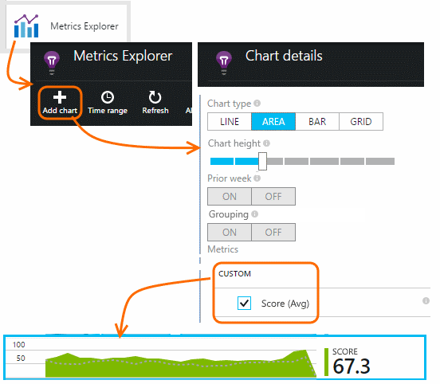
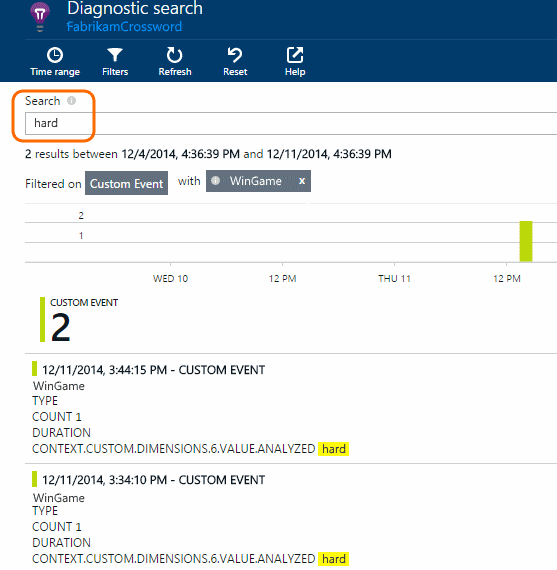

<properties 
	pageTitle="Application Insights API for custom events and metrics" 
	description="Insert a few lines of code in your device or desktop app, web page or service, to track usage and diagnose issues." 
	services="application-insights"
    documentationCenter="" 
	authors="alancameronwills" 
	manager="ronmart"/>
 
<tags 
	ms.service="application-insights" 
	ms.workload="tbd" 
	ms.tgt_pltfrm="ibiza" 
	ms.devlang="na" 
	ms.topic="article" 
	ms.date="05/05/2015" 
	ms.author="awills"/>

# Application Insights API for custom events and metrics 

*Application Insights is in preview.*

Insert a few lines of code in your application to find out what users are doing with it, or to help diagnose issues. You can send telemetry from device and desktop apps, web clients, and web servers. 

The Application Insights data collectors use this API to send standard telemetry such as page views and exception reports, but you can also use it to send your own custom telemetry.

## API summary

The API is uniform across all platforms, apart from a few small variations.

Method | Used for
---|---
[`TrackPageView`](#page-views) | Pages, screens, blades or forms
[`TrackEvent`](#track-event) | User actions and other events. Used to track user behavior or to monitor performance.
[`TrackMetric`](#track-metric) | Performance measurements such as queue lengths not related to specific events
[`TrackException`](#track-exception)|Log exceptions for diagnosis. Trace where they occur in relation to other events and examine stack traces.
[`TrackRequest`](#track-request)| Log the frequency and duration of server requests for performance analysis.
[`TrackTrace`](#track-trace)|Diagnostic log messages. You can also capture 3rd-party logs.

You can [attach properties and metrics](#properties) to most of these telemetry calls. 

## Before you start

If you haven't done these yet:

* Add the Application Insights SDK to your project:
 * [ASP.NET project][greenbrown]
 * [Windows project][windows]
 * [Java project][java] 
 * [JavaScript in each web page][client]   

* In your device or web server code, include:

    *C#:* `using Microsoft.ApplicationInsights;`

    *VB:* `Imports Microsoft.ApplicationInsights`

    *Java:* `import com.microsoft.applicationinsights.TelemetryClient;`

## Construct a TelemetryClient

Construct an instance of TelemetryClient (except in JavaScript in web pages):

*C#:* 

    private TelemetryClient telemetry = new TelemetryClient();

*VB:* 

    Private Dim telemetry As New TelemetryClient

*Java*

    private TelemetryClient telemetry = new TelemetryClient();

We recommend you use one instance of `TelemetryClient` for each request in a web app, or for each session in other apps. You can set properties such as `TelemetryClient.Context.User.Id` to track users and sessions. This information is attached to all events sent by the instance.

TelemetryClient is thread-safe.

## Track Event

Events can be displayed in [Metrics Explorer][metrics] as an aggregated count, and you can also display individual occurrences in [Diagnostic Search][diagnostic].  

Insert events in your code to count how often they use a particular feature, how often they achieve particular goals, or make particular choices. 

For example, in a game app, send an event whenever a user wins the game: 

*JavaScript*

    appInsights.trackEvent("WinGame");

*C#*
    
    telemetry.TrackEvent("WinGame");

*VB*

    telemetry.TrackEvent("WinGame")

*Java*

    telemetry.trackEvent("WinGame");

Click the Custom Events tile on the overview blade:

Click through to see an overview chart and a complete list.

Select the chart and segment it by Event name to see the relative contributions of the most significant events.

From the list below the chart, select an event name. Click through to see individual occurrences of the event.

Click any occurrence to see more detail.

## Filter, search and segment your data with properties

You can attach properties and measurements to your events (and also to metrics, page views, and other telemetry data).

**Properties** are string values that you can use to filter your telemetry in the usage reports. For example if your app provides several games, you'll want to attach the name of the game to each event, so that you can see which games are more popular. 

There's a limit of about 1k on the string length. (If you want to send large chunks of data, use the message parameter of [TrackTrace](#track-trace).)

**Metrics** are numeric values that can be presented graphically. For example, you might want to see if there's a gradual increase in the scores your gamers achieve. The graphs can be segmented by the properties sent with the event, so that you could get separate or stacked graphs for different games.

Metric values should be >= 0 to be correctly displayed.

There are some [limits on the number of properties, property values, and metrics](#limits) that you can use.

*JavaScript*

    appInsights.trackEvent // or trackPageView, trackMetric, ...
      ("WinGame",
         // String properties:
         {Game: currentGame.name, Difficulty: currentGame.difficulty},
         // Numeric metrics:
         {Score: currentGame.score, Opponents: currentGame.opponentCount}
         );

*C#*

    // Set up some properties and metrics:
    var properties = new Dictionary <string, string> 
       {{"game", currentGame.Name}, {"difficulty", currentGame.Difficulty}};
    var metrics = new Dictionary <string, double>
       {{"Score", currentGame.Score}, {"Opponents", currentGame.OpponentCount}};

    // Send the event:
    telemetry.TrackEvent("WinGame", properties, metrics);

*VB*

    ' Set up some properties:
    Dim properties = New Dictionary (Of String, String)
    properties.Add("game", currentGame.Name)
    properties.Add("difficulty", currentGame.Difficulty)

    Dim metrics = New Dictionary (Of String, Double)
    metrics.Add("Score", currentGame.Score)
    metrics.Add("Opponents", currentGame.OpponentCount)

    ' Send the event:
    telemetry.TrackEvent("WinGame", properties, metrics)

*Java*
    
    Map<String, String> properties = new HashMap<String, String>();
    properties.put("game", currentGame.getName());
    properties.put("difficulty", currentGame.getDifficulty());
    
    Map<String, Double> metrics = new HashMap<String, Double>();
    metrics.put("Score", currentGame.getScore());
    metrics.put("Opponents", currentGame.getOpponentCount());
    
    telemetry.trackEvent("WinGame", properties, metrics2/7/2015 12:05:25 AM );

> [AZURE.NOTE] Take care not to log personally identifiable information in properties.

**If you used metrics**, open Metric Explorer and select the metric from the Custom group:

*If your metric doesn't appear, close the selection blade, wait a while, and click Refresh.*

**If you used properties and metrics**, segment the metric by the property:

**In Diagnostic Search**, you can view the properties and metrics of individual occurrences of an event.

Use the Search field to see event occurrences with a particular property value.

[Learn more about search expressions][diagnostic].

#### Alternative way to set properties and metrics

If it's more convenient, you can collect the parameters of an event in a separate object:

    var event = new EventTelemetry();

    event.Name = "WinGame";
    event.Metrics["processingTime"] = stopwatch.Elapsed.TotalMilliseconds;
    event.Properties["game"] = currentGame.Name;
    event.Properties["difficulty"] = currentGame.Difficulty;
    event.Metrics["Score"] = currentGame.Score;
    event.Metrics["Opponents"] = currentGame.Opponents.Length;

    telemetry.TrackEvent(event);

##  Timed events

Sometimes you'd like to chart how long it takes to perform some action. For example, you might like to know how long users take to consider choices in a game. 

You can attach timing data to events. In the web client, instead of calling trackEvent, use these calls:

*JavaScript at web client*

    // At the start of the game:
    appInsights.startTrackEvent(game.id);

    // At the end of the game:
    appInsights.stopTrackEvent(game.id, {GameName: game.name}, {Score: game.score});

Use the same string as the first parameter in the start and stop calls. 

This feature isn't built in to the other SDKs. But you can write your own code such as this:

*C#*

    var stopwatch = System.Diagnostics.Stopwatch.StartNew();

    // ... perform the timed action ...

    stopwatch.Stop();

    var metrics = new Dictionary <string, double>
       {{"processingTime", stopwatch.Elapsed.TotalMilliseconds}};

    // Set up some properties:
    var properties = new Dictionary <string, string> 
       {{"signalSource", currentSignalSource.Name}};

    // Send the event:
    telemetry.TrackEvent("SignalProcessed", properties, metrics);

## Track Metric

Use TrackMetric to send metrics that are not attached to particular events. For example, you could monitor a queue length at regular intervals. 

Metrics are displayed as statistical charts in metric explorer, but unlike events, you can't search for individual occurrences in diagnostic search.

Metric values should be >= 0 to be correctly displayed.

*JavaScript*

    appInsights.trackMetric("Queue", queue.Length);

*C#*

    telemetry.TrackMetric("Queue", queue.Length);

*VB*

    telemetry.TrackMetric("Queue", queue.Length)

*Java*

    telemetry.trackMetric("Queue", queue.Length);

In fact, you might do this in a background thread:

*C#*

    private void Run() {
     var appInsights = new TelemetryClient();
     while (true) {
      Thread.Sleep(60000);
      appInsights.TrackMetric("Queue", queue.Length);
     }
    }

To see the results, open Metrics Explorer and add a new chart. Set it to display your metric.

There are some [limits on the number of metrics](#limits) you can use.

## Page views

In a device or web page app, page view telemetry is sent by default when each screen or page is loaded. But you can change that to track page views at additional or different times. For example, in an app that displays tabs or blades, you might want to track a "page" whenever the user opens a new blade. 

User and session data is sent as properties along with page views, so the user and session charts come alive when there is page view telemetry.

#### Custom page views

*JavaScript*

    appInsights.trackPageView("tab1");

*C#*

    telemetry.TrackPageView("GameReviewPage");

*VB*

    telemetry.TrackPageView("GameReviewPage")

If you have several tabs within different HTML pages, you can specify the URL too:

    appInsights.trackPageView("tab1", "http://fabrikam.com/page1.htm");

#### Timed page views

By using this pair of methods calls instead of trackPageView, you can analyze how long users linger on your pages.

    // At the start of a page view:
    appInsights.startTrackPage(myPage.name);

    // At the completion of a page view:
    appInsights.stopTrackPage(myPage.name, "http://fabrikam.com/page", properties, measurements);

Use the same string as the first parameter in the start and stop calls.

Look at the Page Duration metric in [Metrics Explorer][metrics].

## Track Request

Used by the server SDK to log HTTP requests. 

You can also call it yourself if you want to simulate requests in a context where you don't have the web service module running.

*C#*

    // At start of processing this request:

    // Operation Id is attached to all telemetry and helps you identify
    // telemetry associated with one request:
    telemetry.Context.Operation.Id = Guid.NewGuid().ToString();
    
    var stopwatch = System.Diagnostics.Stopwatch.StartNew();

    // ... process the request ...

    stopwatch.Stop();
    telemetryClient.TrackRequest(requestName, DateTime.Now,
       stopwatch.Elapsed, 
       "200", true);  // Response code, success

## Track Exception

Send exceptions to Application Insights: to [count them][metrics], as an indication of the frequency of a problem; and to [examine individual occurrences][diagnostic].

*C#*

    try
    {
        ...
    }
    catch (Exception ex)
    {
       telemetry.TrackException(ex);
    }

In Windows mobile apps, the SDK catches unhandled exceptions, so that you don't have to log them. In ASP.NET, you can [write code to catch exceptions automatically][exceptions].

## Track Trace 

Use this to help diagnose problems by sending a 'breadcrumb trail' to Application Insights. You can send chunks of diagnostic data, and inspect them in [Diagnostic search][diagnostic]. 

 

[Log adapters][trace] use this API to send third-party logs to the portal.

*C#*

    telemetry.TrackTrace(message, SeverityLevel.Warning, properties);

The size limit on `message` is much higher than limit on  properties. You can search on message content, but (unlike property values) you can't filter on it.

## Set default properties for all telemetry

You can set up a universal initializer so that all new TelemetryClients automatically use your context. 

This includes standard telemetry sent by the platform-specific telemetry modules, such as web server request tracking.

*C#*

    // Telemetry initializer class
    public class MyTelemetryInitializer : IContextInitializer
    {
        public void Initialize (TelemetryContext context)
        {
            context.Properties["AppVersion"] = "v2.1";
        }
    }

    // In the app initializer such as Global.asax.cs:

    protected void Application_Start()
    {
        // ...
        TelemetryConfiguration.Active.ContextInitializers
        .Add(new MyTelemetryInitializer());
    }

*Java*

    import com.microsoft.applicationinsights.extensibility.ContextInitializer;
    import com.microsoft.applicationinsights.telemetry.TelemetryContext;

    public class MyTelemetryInitializer implements ContextInitializer {
      @Override
      public void initialize(TelemetryContext context) {
        context.getProperties().put("AppVersion", "2.1");
      }
    }

    // load the context initializer
    TelemetryConfiguration.getActive().getContextInitializers().add(new MyTelemetryInitializer());

## Set instrumentation key in code for all telemetry

Instead of getting the instrumentation key from the configuration file, you can set it in your code. You might want to do this, for example, to send telemetry from test installations to a different Application Insights resource than telemetry from the live application.

Set the key in an initialization method, such as global.aspx.cs in an ASP.NET service:

*C#*

    protected void Application_Start()
    {
      Microsoft.ApplicationInsights.Extensibility.
        TelemetryConfiguration.Active.InstrumentationKey = 
          // - for example -
          WebConfigurationManager.Settings["ikey"];
      ...

*JavaScript*

    appInsights.config.instrumentationKey = myKey; 

In web pages, you might want to set it from the web server's state, rather than coding it literally into the script. For example, in a web page generated in an ASP.NET app:

*JavaScript in Razor*

    <script type="text/javascript">
    // Standard Application Insights web page script:
    var appInsights = window.appInsights || function(config){ ...
    // Modify this part:
    }({instrumentationKey:  
      // Generate from server property:
      @Microsoft.ApplicationInsights.Extensibility.
         TelemetryConfiguration.Active.InstrumentationKey"
    }) // ...

## Set defaults for selected custom telemetry

If you just want to set default property values for some of the custom events that you write, you can set them in a TelemetryClient. They are attached to every telemetry item sent from that client. 

*C#*

    using Microsoft.ApplicationInsights.DataContracts;

    var gameTelemetry = new TelemetryClient();
    gameTelemetry.Context.Properties["Game"] = currentGame.Name;
    // Now all telemetry will automatically be sent with the context property:
    gameTelemetry.TrackEvent("WinGame");
    
*VB*

    Dim gameTelemetry = New TelemetryClient()
    gameTelemetry.Context.Properties("Game") = currentGame.Name
    ' Now all telemetry will automatically be sent with the context property:
    gameTelemetry.TrackEvent("WinGame")

*Java*

    import com.microsoft.applicationinsights.TelemetryClient;
    import com.microsoft.applicationinsights.TelemetryContext;
    ...

    TelemetryClient gameTelemetry = new TelemetryClient();
    TelemetryContext context = gameTelemetry.getContext();
    context.getProperties().put("Game", currentGame.Name);
    
    gameTelemetry.TrackEvent("WinGame");
    
Individual telemetry calls can override the default values in their property dictionaries.

##  Set the instrumentation key for selected custom telemetry

*C#*
    
    var telemetry = new TelemetryClient();
    telemetry.Context.InstrumentationKey = "---my key---";
    // ...

## Flushing data

Normally the SDK sends data at times chosen to minimize impact on the user. However, in some cases you might want to flush the buffer - for example, if you are using the SDK in an application that shuts down.

*C#*

    telemetry.Flush();

Note that the function is synchronous.

## Disable standard telemetry

You can [disable selected parts of the standard telemetry][config] by editing `ApplicationInsights.config`. You could do this, for example, if you want to send your own TrackRequest data. 

[Learn more][config].

## Developer mode

During debugging, it's useful to have your telemetry expedited through the pipeline so that you can see results immediately. You also get additional messages that help you trace any problems with the telemetry. Switch it off in production, as it may slow down your app.

*C#*
    
    TelemetryConfiguration.Active.TelemetryChannel.DeveloperMode = true;

*VB*

    TelemetryConfiguration.Active.TelemetryChannel.DeveloperMode = True

## TelemetryContext

TelemetryClient has a Context property, which contains a number of values that are sent along with all telemetry data. They are normally set by the standard telemetry modules, but you can also set them yourself. 

If you set any of these values yourself, consider removing the relevant line from [ApplicationInsights.config][config], so that your values and the standard values don't get confused.

* **Component** Identifies the app and its version
* **Device** Data about the device on which the app is running (in web apps, this is the server or client device from which the telemetry is sent)
* **InstrumentationKey** Identifies the Application Insights resource in Azure where the telemetry will appear. Usually picked up from ApplicationInsights.config
* **Location** Identifies the geographic location of the device.
* **Operation** In web apps, the current HTTP request. In other app types, you can set this to group events together.
 * **Id**: A generated value that correlates different events, so that when you inspect any event in Diagnostic Search, you can find "Related items"
 * **Name**: The URL of the HTTP request
 * **SyntheticSource**: If not null or empty, this string indicates that the source of the request has been identified as a robot or web test. By default it will be excluded from calculations in Metrics Explorer.
* **Properties** Properties that are sent with all telemetry data. Can be overridden in individual Track* calls.
* **Session** Identifies the user's session. The Id is set to a generated value, which is changed when the user has not been active for a while.
* **User** Allows users to be counted. In a web app, if there is a cookie, the user Id is taken from that. If there isn't, a new one is generated. If your users have to login to your app, you could set the id from their authenticated ID, so as to provide a more reliable count that is correct even if the user signs in from a different machine. 

## Limits

There are some limits on the number of metrics and events per application.

1. Up to 500 telemetry data points per second per instrumentation key (that is, per application). This includes both the standard telemetry sent by the SDK modules, and custom events, metrics and other telemetry sent by your code.
1.	Maximum of 200 unique metric names and 200 unique property names for your application. Metrics include data send via TrackMetric as well as measurements on other  data types such as Events.  Metrics and property names are global per instrumentation key, not scoped to data type.
2.	Properties can be used for filtering and group-by only while they have less than 100 unique values for each property. After the unique values exceed 100, the property can still be used for search and filtering but no longer for filters.
3.	Standard properties such as Request Name and Page URL are limited to 1000 unique values per week. After 1000 unique values, additional values are marked as "Other values". The original value can still be used for full text search and filtering.

* *Q: How long is data kept?*

    See [Data retention and privacy][data].

## Reference docs

* [ASP.NET reference](https://msdn.microsoft.com/library/dn817570.aspx)
* [Java reference](http://dl.windowsazure.com/applicationinsights/javadoc/)

* *Q: Is there a REST API?*

    Yes, but we aren't publishing it yet.

## Next steps

[Search events and logs][diagnostic]

[Troubleshooting][qna]

<!--Link references-->

[client]: app-insights-javascript.md
[config]: app-insights-configuration-with-applicationinsights-config.md
[data]: app-insights-data-retention-privacy.md
[diagnostic]: app-insights-diagnostic-search.md
[exceptions]: app-insights-asp-net-exceptions.md
[greenbrown]: app-insights-start-monitoring-app-health-usage.md
[java]: app-insights-java-get-started.md
[metrics]: app-insights-metrics-explorer.md
[qna]: app-insights-troubleshoot-faq.md
[trace]: app-insights-search-diagnostic-logs.md
[windows]: app-insights-windows-get-started.md

