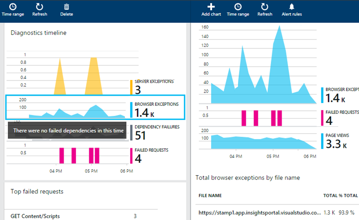
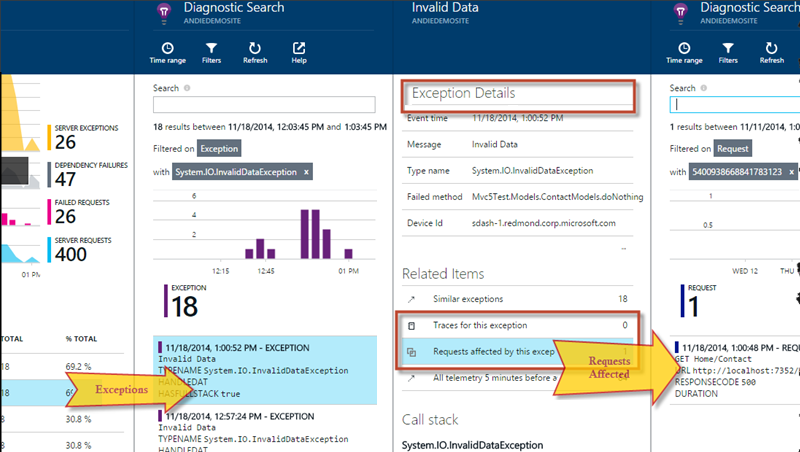

<properties 
	pageTitle="Exception telemetry for ASP.NET apps in Application Insights" 
	description="Configure your app to get a compelling diagnostic experience by capturing exceptions along with request telemetry." 
	services="application-insights" 
    documentationCenter=""
	authors="alancameronwills" 
	manager="keboyd"/>

<tags 
	ms.service="application-insights" 
	ms.workload="tbd" 
	ms.tgt_pltfrm="ibiza" 
	ms.devlang="na" 
	ms.topic="article" 
	ms.date="04/02/2015" 
	ms.author="awills"/>
 
# Exception telemetry for .NET apps in Application Insights  

[Visual Studio Application Insights][start] lets you monitor your live application for its availability, performance and usage. Exception telemetry is of course, a central piece of this. This article looks at the compelling diagnostics experience enabled by capturing exceptions along with request telemetry. You'll learn how to configure your application so as to make sure you capture all the exceptions for failed requests, in any .NET application (Framework 4.0+). 

There are some situations where Application Insights can't automatically capture all the exceptions you might like to see because they are cleared before they get to its HTTPModule. But you can use [Application Insights SDK][api] to send all the unhandled exceptions, plus any exceptions that are handled in your application but that you'd still like to have reported. 

## Rich diagnostics with exceptions

Capturing exceptions along with request and page-view telemetry is a powerful diagnostic experience, especially since it's possible to get handled and unhandled exceptions from both client and server.

The good experience starts on the Overview screen, where you can see at a glance when failed requests are correlated with server or browser exceptions, and click through to get a breakdown of specific exceptions:

 
Drill into any exception to see its occurrences, and then click further to see what requests were affected by it:

Or instead, you can start from a failed request and get to the exceptions associated with it:

From the exception reports you can get a stack listing and see what's going on. To learn more about reading and searching the exception data, see [Diagnostic search][diagnostic].

This is clearly a powerful diagnostic experience, and to start getting it you only have to add Application Insights to your project in Visual Studio, or install Status Monitor on your server. To collect browser-side data, you [add a script to your master page][client], though this is done for you when you create a new web project.

Those tools will get you all the request telemetry and browser exceptions, and some of the server side exceptions. But in many cases, there's a bit more you have to do to get all the server-side exceptions. It's slightly different for each technology, and that's what the rest of this blog is about.

## How to capture exception telemetry

You don't usually have to load them yourself, but it's helpful to be aware that the Application Insights tools load the following packages:

* [Application Insights for Web Applications](https://www.nuget.org/packages/Microsoft.ApplicationInsights.Web/), which collects the server-side data by using an [HTTP Module](https://msdn.microsoft.com/library/ms178468.aspx). 
* [Application Insights .NET SDK](https://www.nuget.org/packages/Microsoft.ApplicationInsights/) which includes the TrackException API. We'll look at how use this to send exception telemetry that the HTTPModule doesn't see. 
* On the client side, [Application Insights JavaScript SDK](https://www.nuget.org/packages/Microsoft.ApplicationInsights.JavaScript/) is loaded by the web page script. 

The Application Insights HTTP Module captures server side Request telemetry, and it also captures any unhandled exceptions when the HTTPResponse has status code 400 and above. Unfortunately, in most project types and depending on the [CustomErrors](https://msdn.microsoft.com/library/h0hfz6fc.aspx) configuration, the exception information might have been cleared lower in the stack, so that our HTTP Module doesn't see it. But you can fix this so that all unhandled exceptions are reported. You just have to write a few lines of code using the TrackException API. (You can of course use the same API to send data from your own exception handlers.) We will go over how you can collect unhandled exceptions for the following application types in the sections below. 

## MVC

If the [CustomErrors](https://msdn.microsoft.com/library/h0hfz6fc.aspx) configuration is `Off`, then exceptions will be available for the [HTTP Module](https://msdn.microsoft.com/library/ms178468.aspx) to collect. However, if it is `RemoteOnly` (default), or `On`, then the exception will be cleared and not available for Application Insights to automatically collect. You can fix that by overriding the [System.Web.Mvc.HandleErrorAttribute class](http://msdn.microsoft.com/library/system.web.mvc.handleerrorattribute.aspx), and applying the overridden class as shown for the different MVC versions below ([github source](https://github.com/AppInsightsSamples/Mvc2UnhandledExceptions/blob/master/MVC2App/Controllers/AiHandleErrorAttribute.cs)):

    using System;
    using System.Web.Mvc;
    using Microsoft.ApplicationInsights;

    namespace MVC2App.Controllers
    {
      [AttributeUsage(AttributeTargets.Class | AttributeTargets.Method, Inherited = true, AllowMultiple = true)] 
      public class AiHandleErrorAttribute : HandleErrorAttribute
      {
        public override void OnException(ExceptionContext filterContext)
        {
            if (filterContext != null && filterContext.HttpContext != null && filterContext.Exception != null)
            {
                //If customError is Off, then AI HTTPModule will report the exception
                if (filterContext.HttpContext.IsCustomErrorEnabled)
                {   //or reuse instance (recommended!). see note above  
                    var ai = new TelemetryClient();
                    ai.TrackException(filterContext.Exception);
                } 
            }
            base.OnException(filterContext);
        }
      }
    }

#### MVC 2

Replace the HandleError attribute with your new attribute in your controllers.

    namespace MVC2App.Controllers
    {
       [AiHandleError]
       public class HomeController : Controller
       {
    ...

[Sample](https://github.com/AppInsightsSamples/Mvc2UnhandledExceptions)

#### MVC 3

Register `AiHandleErrorAttribute` as a global filter in Global.asax.cs:

    public class MyMvcApplication : System.Web.HttpApplication
    {
      public static void RegisterGlobalFilters(GlobalFilterCollection filters)
      {
         filters.Add(new AiHandleErrorAttribute());
      }
     ...

[Sample](https://github.com/AppInsightsSamples/Mvc3UnhandledExceptionTelemetry)

#### MVC 4, MVC5

Register AiHandleErrorAttribute as a global filter in FilterConfig.cs:

    public class FilterConfig
    {
      public static void RegisterGlobalFilters(GlobalFilterCollection filters)
      {
        // Default replaced with the override to track unhandled exceptions
        filters.Add(new AiHandleErrorAttribute());
      }
    }

[Sample](https://github.com/AppInsightsSamples/Mvc5UnhandledExceptionTelemetry)

## Web API 1.x

Override System.Web.Http.Filters.ExceptionFilterAttribute:

    using System.Web.Http.Filters;
    using Microsoft.ApplicationInsights;

    namespace WebAPI.App_Start
    {
      public class AiExceptionFilterAttribute : ExceptionFilterAttribute
      {
        public override void OnException(HttpActionExecutedContext actionExecutedContext)
        {
            if (actionExecutedContext != null && actionExecutedContext.Exception != null)
            {  //or reuse instance (recommended!). see note above 
                var ai = new TelemetryClient();
                ai.TrackException(actionExecutedContext.Exception);    
            }
            base.OnException(actionExecutedContext);
        }
      }
    }

You could add this overridden attribute to specific controllers, or add it to the global filter configuration in the WebApiConfig class: 

    using System.Web.Http;
    using WebApi1.x.App_Start;

    namespace WebApi1.x
    {
      public static class WebApiConfig
      {
        public static void Register(HttpConfiguration config)
        {
            config.Routes.MapHttpRoute(name: "DefaultApi", routeTemplate: "api/{controller}/{id}",
                defaults: new { id = RouteParameter.Optional });
            ...
            config.EnableSystemDiagnosticsTracing();

            // Capture exceptions for Application Insights:
            config.Filters.Add(new AiExceptionFilterAttribute());
        }
      }
    }

[Sample](https://github.com/AppInsightsSamples/WebApi_1.x_UnhandledExceptions)

There are a number of cases that the exception filters cannot handle. For example:

* Exceptions thrown from controller constructors. 
* Exceptions thrown from message handlers. 
* Exceptions thrown during routing. 
* Exceptions thrown during response content serialization. 

## Web API 2.x

Add an implementation of IExceptionLogger:

    using System.Web.Http.ExceptionHandling;
    using Microsoft.ApplicationInsights;

    namespace ProductsAppPureWebAPI.App_Start
    {
      public class AiExceptionLogger : ExceptionLogger
      {
        public override void Log(ExceptionLoggerContext context)
        {
            if (context !=null && context.Exception != null)
            {//or reuse instance (recommended!). see note above 
                var ai = new TelemetryClient();
                ai.TrackException(context.Exception);
            }
            base.Log(context);
        }
      }
    }

Add this to the services in WebApiConfig:

    using System.Web.Http;
    using System.Web.Http.ExceptionHandling;
    using ProductsAppPureWebAPI.App_Start;

    namespace WebApi2WithMVC
    {
      public static class WebApiConfig
      {
        public static void Register(HttpConfiguration config)
        {
            // Web API configuration and services

            // Web API routes
            config.MapHttpAttributeRoutes();

            config.Routes.MapHttpRoute(
                name: "DefaultApi",
                routeTemplate: "api/{controller}/{id}",
                defaults: new { id = RouteParameter.Optional }
            );
            config.Services.Add(typeof(IExceptionLogger), new AiExceptionLogger()); 
        }
      }
  }

[Sample](https://github.com/AppInsightsSamples/WebApi_2.x_UnhandledExceptions)

As alternatives, you could:

2. Replace the only ExceptionHandler with a custom implementation of IExceptionHandler. This is only called when the framework is still able to choose which response message to send (not when the connection is aborted for instance) 
3. Exception Filters (as described in the section on Web API 1.x controllers above) - not called in all cases.

## WCF

Add a class that extends Attribute and implements IErrorHandler and IServiceBehavior.

    using System;
    using System.Collections.Generic;
    using System.Linq;
    using System.ServiceModel.Description;
    using System.ServiceModel.Dispatcher;
    using System.Web;
    using Microsoft.ApplicationInsights;

    namespace WcfService4.ErrorHandling
    {
      public class AiLogExceptionAttribute : Attribute, IErrorHandler, IServiceBehavior
      {
        public void AddBindingParameters(ServiceDescription serviceDescription,
            System.ServiceModel.ServiceHostBase serviceHostBase,
            System.Collections.ObjectModel.Collection<ServiceEndpoint> endpoints,
            System.ServiceModel.Channels.BindingParameterCollection bindingParameters)
        {
        }

        public void ApplyDispatchBehavior(ServiceDescription serviceDescription, 
            System.ServiceModel.ServiceHostBase serviceHostBase)
        {
            foreach (ChannelDispatcher disp in serviceHostBase.ChannelDispatchers)
            {
                disp.ErrorHandlers.Add(this);
            }
        }

        public void Validate(ServiceDescription serviceDescription, 
            System.ServiceModel.ServiceHostBase serviceHostBase)
        {
        }

        bool IErrorHandler.HandleError(Exception error)
        {//or reuse instance (recommended!). see note above 
            var ai = new TelemetryClient();

            ai.TrackException(error);
            return false;
        }

        void IErrorHandler.ProvideFault(Exception error, 
            System.ServiceModel.Channels.MessageVersion version, 
            ref System.ServiceModel.Channels.Message fault)
        {
        }
      }
    }

Add the attribute to the service implementations:

    namespace WcfService4
    {
        [ServiceContract]
        [AiLogException]
        public interface IService1
        {
     ...

[Sample](https://github.com/AppInsightsSamples/WCFUnhandledExceptions)

## Web forms/pages

For web forms/pages, the HTTP Module will be able to collect the exceptions when there are no redirects configured with CustomErrors.

But if you have eligible redirects, then add the following lines to the Application_Error function in Global.asax.cs. (Add a Global.asax file if you don't already have one.)

    void Application_Error(object sender, EventArgs e)
    {
      if (HttpContext.Current.IsCustomErrorEnabled && Server.GetLastError  () != null)
      {
         //or reuse instance (recommended!)
         var ai = new TelemetryClient();

         ai.TrackException(Server.GetLastError());
      }
    }

<!--Link references-->

[alerts]: app-insightss-alerts.md
[android]: https://github.com/Microsoft/AppInsights-Android
[api]: app-insights-custom-events-metrics-api.md
[apiproperties]: app-insights-custom-events-metrics-api.md#properties
[apiref]: http://msdn.microsoft.com/library/azure/dn887942.aspx
[availability]: app-insights-monitor-web-app-availability.md
[azure]: insights-perf-analytics.md
[azure-availability]: insights-create-web-tests.md
[azure-usage]: insights-usage-analytics.md
[azurediagnostic]: insights-how-to-use-diagnostics.md
[client]: app-insights-web-track-usage.md
[config]: app-insights-configuration-with-applicationinsights-config.md
[data]: app-insights-data-retention-privacy.md
[desktop]: app-insights-windows-desktop.md
[detect]: app-insights-detect-triage-diagnose.md
[diagnostic]: app-insights-diagnostic-search.md
[eclipse]: app-insights-java-eclipse.md
[exceptions]: app-insights-web-failures-exceptions.md
[export]: app-insights-export-telemetry.md
[exportcode]: app-insights-code-sample-export-telemetry-sql-database.md
[greenbrown]: app-insights-start-monitoring-app-health-usage.md
[java]: app-insights-java-get-started.md
[javalogs]: app-insights-java-trace-logs.md
[javareqs]: app-insights-java-track-http-requests.md
[knowUsers]: app-insights-overview-usage.md
[metrics]: app-insights-metrics-explorer.md
[netlogs]: app-insights-asp-net-trace-logs.md
[new]: app-insights-create-new-resource.md
[older]: http://www.visualstudio.com/get-started/get-usage-data-vs
[perf]: app-insights-web-monitor-performance.md
[platforms]: app-insights-platforms.md
[portal]: http://portal.azure.com/
[qna]: app-insights-troubleshoot-faq.md
[redfield]: app-insights-monitor-performance-live-website-now.md
[roles]: app-insights-role-based-access-control.md
[start]: app-insights-get-started.md
[trace]: app-insights-search-diagnostic-logs.md
[track]: app-insights-custom-events-metrics-api.md
[usage]: app-insights-web-track-usage.md
[windows]: app-insights-windows-get-started.md
[windowsCrash]: app-insights-windows-crashes.md
[windowsUsage]: app-insights-windows-usage.md

