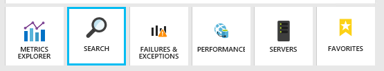

<properties 
	pageTitle="Explore .NET trace logs in Application Insights" 
	description="Search logs generated with Trace, NLog, or Log4Net." 
	services="application-insights" 
    documentationCenter=".net"
	authors="alancameronwills" 
	manager="keboyd"/>

<tags 
	ms.service="application-insights" 
	ms.workload="tbd" 
	ms.tgt_pltfrm="ibiza" 
	ms.devlang="na" 
	ms.topic="article" 
	ms.date="03/27/2015" 
	ms.author="awills"/>
 
# Explore .NET trace logs in Application Insights  

If you use NLog, log4Net or System.Diagnostics.Trace for diagnostic tracing in your ASP.NET application, you can have your logs sent to [Visual Studio Application Insights][start], where you can explore and search them. Your logs will be merged with the other telemetry coming from your application, so that you can identify the traces associated with servicing each user request, and correlate them with other events and exception reports.

You can also write log traces, event and exception reports using the Application Insights SDK.

If you haven't yet [set up Application Insights for your project][start], do that now.

##  Install an adapter for your logging framework

If you use a logging framework - log4Net, NLog or System.Diagnostics.Trace - you can install an adapter that sends these logs to Application Insights along with other telemetry. 

1. If you plan to use log4Net or NLog, install it in your project. 
2. In Solution Explorer, right-click your project and choose **Manage NuGet Packages**.
3. Select Online > All, select **Include Prerelease** and search for "Microsoft.ApplicationInsights"

    

4. Select the appropriate package - one of:
  + Microsoft.ApplicationInsights.TraceListener (to capture System.Diagnostics.Trace calls)
  + Microsoft.ApplicationInsights.NLogTarget
  + Microsoft.ApplicationInsights.Log4NetAppender

The NuGet package installs the necessary assemblies, and also modifies web.config or app.config.

#### Insert diagnostic log calls

If you use System.Diagnostics.Trace, a typical call would be:

    System.Diagnostics.Trace.TraceWarning("Slow response - database01");

If you prefer log4net or NLog:

    logger.Warn("Slow response - database01");

## Using the Trace API directly

You can call the Application Insights trace API directly. The logging adapters use this API. 

For example:

    var telemetry = new Microsoft.ApplicationInsights.TelemetryClient();
    telemetry.TrackTrace("Slow response - database01");

## Explore your logs

In your app's overview blade in [the Application Insights portal][portal], choose [Search][diagnostic].

You can, for example:

* Filter on log traces, or on items with specific properties
* Inspect a specific item in detail.
* Find other telemetry relating to the same user request (that is, with the same OperationId) 
* Save the configuration of this page as a Favorite

## Next steps

[Diagnose failures and exceptions in ASP.NET][exceptions]

[Learn more about Diagnostic Search][diagnostic].

## Troubleshooting

### I get an error "Instrumentation key cannot be empty"

Looks like you installed the logging adapter Nuget package without installing Application Insights.

In Solution Explorer, right-click `ApplicationInsights.config` and choose **Update Application Insights**. You'll get a dialog that invites you to sign in to Azure and either create an Application Insights resource, or re-use an existing one. That should fix it.

### I can see traces in diagnostic search, but not the other events

It can sometimes take a while for all the events and requests to get through the pipeline.

### How much data is retained?

Up to 500 events per second from each application. Events are retained for seven days.

## Next steps

* [Set up availability and responsiveness tests][availability]
* [Troubleshooting][qna]

<!--Link references-->

[availability]: app-insights-monitor-web-app-availability.md
[diagnostic]: app-insights-diagnostic-search.md
[exceptions]: app-insights-web-failures-exceptions.md
[portal]: http://portal.azure.com/
[qna]: app-insights-troubleshoot-faq.md
[start]: app-insights-get-started.md

