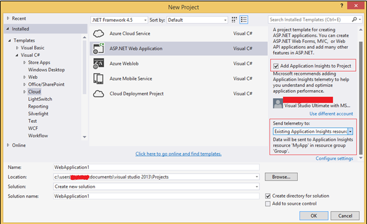
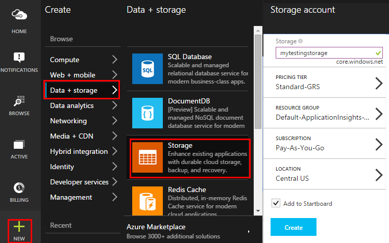
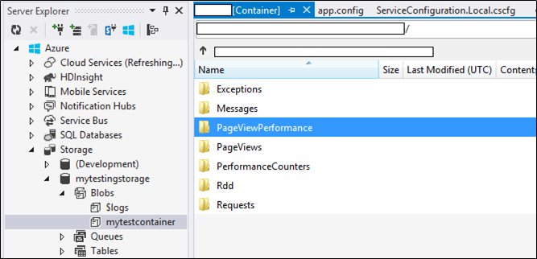
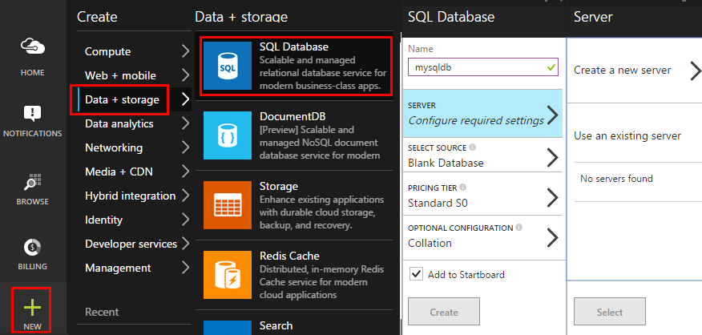

<properties 
	pageTitle="Code sample: export telemetry to SQL Database from Application Insights" 
	description="Code your own analysis of telemetry in Application Insights by using the continuous export feature." 
	services="application-insights" 
    documentationCenter=""
	authors="mazharmicrosoft" 
	manager="klin"/>

<tags 
	ms.service="application-insights" 
	ms.workload="tbd" 
	ms.tgt_pltfrm="ibiza" 
	ms.devlang="na" 
	ms.topic="article" 
	ms.date="04/07/2015" 
	ms.author="awills"/>
 
# Code sample: load telemetry into SQL Database from Application Insights

This article shows how to move your telemetry from [Visual Studio Application Insights][start] into an Azure SQL database by using [Continuous Export][export] and a small amount of code. 

Continuous export moves your telemetry into Azure Storage in JSON format, so we'll write some code to parse the JSON objects and create rows in a database table.

(More generally, Continuous Export is the way to do your own analysis of the telemetry your apps send to Application Insights. You could adapt this code sample to do other things with the exported telemetry.)

We'll start with the assumption that you already have the app you want to monitor.

## Add Application Insights SDK

To monitor your application, you [add an Application Insights SDK][start] to your application. There are different SDKs and helper tools for different platforms, IDEs and languages. You can monitor web pages, Java or ASP.NET web servers, and mobile devices of several kinds. All the SDKs send telemetry to the [Application Insights portal][portal], where you can use our powerful analysis and diagnostic tools, and export the data to storage.

To get started:

1. Get an [account in Microsoft Azure](http://azure.microsoft.com/pricing/).
2. In the [Azure portal][portal], add a new Application Insights resource for your app:

    

    (Your app type and subscription might be different.)
3. Open Quick Start to find how to set up the SDK for your app type.

    

    If your app type isn't listed, take a look at the [Getting Started][start] page.

4. In this example, we're monitoring a web app, so we can use the Azure tools in Visual Studio to install the SDK. We tell it the name of our Application Insights resource:

    

## Create storage in Azure

1. Create a storage account in your subscription in the [Azure portal][portal].

    

2. Create a container

    

## Start continuous export to Azure storage

1. In the Azure portal, browse to the Application Insights resource you created for your application.

    

2. Create a continuous export.

    

    Select the storage account you created earlier:

    
    
    Set the event types you want to see:

    

Now sit back and let people use your application for a while. Telemetry will come in and you'll see statistical charts in [metric explorer][metrics] and individual events in [diagnostic search][diagnostic]. 

And also, the data will export to your storage, where you can inspect the content. For example, there's a storage browser in Visual Studio:

The events are written to blob files in JSON format. Each file may contain one or more events. So we'd like to write some code to read the event data and filter out the fields we want. There are all kinds of things we could do with the data, but our plan today is to write some code to move the data to a SQL database. That will make it easy to run lots of interesting queries.

## Create an Azure SQL Database

Once again starting from your subscription in [Azure portal][portal], create the database (and a new server, unless you've already got one) to which you'll write the data.

Make sure that the database server allows access to Azure services:

## Create a worker role 

Now we can write [some code](https://sesitai.codeplex.com/) to parse the JSON in the exported blobs, and create records in the database. Since the export store and the database are both in Azure, we'll run the code in an Azure worker role.

#### Create worker role project

In Visual Studio, create a new project for the worker role:

#### Connect to the storage account

In Azure, get the connection string from your Storage account:

In Visual Studio, configure the worker role settings with the Storage account connection string:

#### Packages

In Solution Explorer, right-click your Worker Role project and choose Manage NuGet Packages.
Search for and install these packages: 

 * EntityFramework 6.1.2 or later - We'll use this to generate the DB table schema on the fly, based on the content of the JSON in the blob.
 * JsonFx -	We'll use this for flattening the JSON to C# class properties.

Use this tool to generate C# Class out of our single JSON document. It requires some minor changes like flattening JSON arrays into single C# property in turn single column in DB table (ex. urlData_port) 

 * [JSON C# class generator](http://jsonclassgenerator.codeplex.com/)

## Code 

You can put this code in `WorkerRole.cs`.

#### Imports

    using Microsoft.WindowsAzure.Storage;

    using Microsoft.WindowsAzure.Storage.Blob;

#### Retrieve the storage connection string

    private static string GetConnectionString()
    {
      return Microsoft.WindowsAzure.CloudConfigurationManager.GetSetting("StorageConnectionString");
    }

#### Run the worker at regular intervals

Replace the existing run method, and choose the interval you prefer. It should be at least one hour, because the export feature completes one JSON object in an hour.

    public override void Run()
    {
      Trace.TraceInformation("WorkerRole1 is running");

      while (true)
      {
        Trace.WriteLine("Sleeping", "Information");

        Thread.Sleep(86400000); //86400000=24 hours //1 hour=3600000
                
        Trace.WriteLine("Awake", "Information");

        ImportBlobtoDB();
      }
    }

#### Insert each JSON object as a table row

    public void ImportBlobtoDB()
    {
      try
      {
        CloudStorageAccount account = CloudStorageAccount.Parse(GetConnectionString());

        var blobClient = account.CreateCloudBlobClient();
        var container = blobClient.GetContainerReference(FilterContainer);

        foreach (CloudBlobDirectory directory in container.ListBlobs())//Parent directory
        {
          foreach (CloudBlobDirectory subDirectory in directory.ListBlobs())//PageViewPerformance
       	  {
            foreach (CloudBlobDirectory dir in subDirectory.ListBlobs())//2015-01-31
            {
              foreach (CloudBlobDirectory subdir in dir.ListBlobs())//22
              {
                foreach (IListBlobItem item in subdir.ListBlobs())//3IAwm6u3-0.blob
                {
                  itemname = item.Uri.ToString();
                  ParseEachBlob(container, item);
                  AuditBlob(container, directory, subDirectory, dir, subdir, item);
                } //item loop
              } //subdir loop
            } //dir loop
          } //subDirectory loop
        } //directory loop
      }
      catch (Exception ex)
      {
		//handle exception
      }
    }

#### Parse each blob

    private void ParseEachBlob(CloudBlobContainer container, IListBlobItem item)
    {
      try
      {
        var blob = container.GetBlockBlobReference(item.Parent.Prefix + item.Uri.Segments.Last());
    
        string json;
    
        using (var memoryStream = new MemoryStream())
        {
          blob.DownloadToStream(memoryStream);
          json = System.Text.Encoding.UTF8.GetString(memoryStream.ToArray());
    
          IEnumerable<string> entities = json.Split('\n').Where(s => !string.IsNullOrWhiteSpace(s));
    
          recCount = entities.Count();
          failureCount = 0; //resetting failure count
    
          foreach (var entity in entities)
          {
            var reader = new JsonFx.Json.JsonReader();
            dynamic output = reader.Read(entity);
    
            Dictionary<string, object> dict = new Dictionary<string, object>();
    
            GenerateDictionary((System.Dynamic.ExpandoObject)output, dict, "");
    
            switch (FilterType)
            {
              case "PageViewPerformance":
    
              if (dict.ContainsKey("clientPerformance"))
                {GenerateDictionary(((System.Dynamic.ExpandoObject[])dict["clientPerformance"])[0], dict, "");
    	        }
    
              if (dict.ContainsKey("context_custom_dimensions"))
              {
                if (dict["context_custom_dimensions"].GetType() == typeof(System.Dynamic.ExpandoObject[]))
                {GenerateDictionary(((System.Dynamic.ExpandoObject[])dict["context_custom_dimensions"])[0], dict, "");
                }
              }
    
            PageViewPerformance objPageViewPerformance = (PageViewPerformance)GetObject(dict);
    
            try
            {
              using (var db = new TelemetryContext())
              {
                db.PageViewPerformanceContext.Add(objPageViewPerformance);
                db.SaveChanges();
              }
            }
            catch (Exception ex)
            {
              failureCount++;
            }
            break;
    
            default:
            break;
          }
        }
      }
    }
    catch (Exception ex)
    {
      //handle exception 
    }
    }

#### Prepare a dictionary for each JSON document

    private void GenerateDictionary(System.Dynamic.ExpandoObject output, Dictionary<string, object> dict, string parent)
        {
            try
            {
                foreach (var v in output)
                {
                    string key = parent + v.Key;
                    object o = v.Value;

                    if (o.GetType() == typeof(System.Dynamic.ExpandoObject))
                    {
                        GenerateDictionary((System.Dynamic.ExpandoObject)o, dict, key + "_");
                    }
                    else
                    {
                        if (!dict.ContainsKey(key))
                        {
                            dict.Add(key, o);
                        }
                    }
                }
            }
            catch (Exception ex)
            {
      		//handle exception 
    	    }
        }

#### Cast the JSON document into C# class telemetry object properties

     public object GetObject(IDictionary<string, object> d)
        {
            PropertyInfo[] props = null;
            object res = null;

            try
            {
                switch (FilterType)
                {
                    case "PageViewPerformance":

                        props = typeof(PageViewPerformance).GetProperties();
                        res = Activator.CreateInstance<PageViewPerformance>();
                        break;

                    default:
                        break;
                }

                for (int i = 0; i < props.Length; i++)
                {
                    if (props[i].CanWrite && d.ContainsKey(props[i].Name))
                    {
                        props[i].SetValue(res, d[props[i].Name], null);
                    }
                }
            }
            catch (Exception ex)
            {
      		//handle exception 
    	    }

            return res;
        }

#### PageViewPerformance class file generated out of JSON document

    public class PageViewPerformance
    {
    	public int Id { get; set; }

        public string url { get; set; }

        public int urlData_port { get; set; }

        public string urlData_protocol { get; set; }

        public string urlData_host { get; set; }

        public string urlData_base { get; set; }

        public string urlData_hashTag { get; set; }

        public double total_value { get; set; }

        public double networkConnection_value { get; set; }

        public double sendRequest_value { get; set; }

        public double receiveRequest_value { get; set; }

        public double clientProcess_value { get; set; }

        public string name { get; set; }

        public string internal_data_id { get; set; }

        public string internal_data_documentVersion { get; set; }

        public DateTime? context_data_eventTime { get; set; }

        public string context_device_id { get; set; }

        public string context_device_type { get; set; }

        public string context_device_os { get; set; }

        public string context_device_osVersion { get; set; }

        public string context_device_locale { get; set; }

        public string context_device_userAgent { get; set; }

        public string context_device_browser { get; set; }

        public string context_device_browserVersion { get; set; }

        public string context_device_screenResolution_value { get; set; }

        public string context_user_anonId { get; set; }

        public string context_user_anonAcquisitionDate { get; set; }

        public string context_user_authAcquisitionDate { get; set; }

        public string context_user_accountAcquisitionDate { get; set; }

        public string context_session_id { get; set; }

        public bool context_session_isFirst { get; set; }

        public string context_operation_id { get; set; }

        public double context_location_point_lat { get; set; }

        public double context_location_point_lon { get; set; }

        public string context_location_clientip { get; set; }

        public string context_location_continent { get; set; }

        public string context_location_country { get; set; }

        public string context_location_province { get; set; }

        public string context_location_city { get; set; }
    }

#### DBcontext for SQL interaction by Entity Framework

	public class TelemetryContext : DbContext
    {
        public DbSet<PageViewPerformance> PageViewPerformanceContext { get; set; }
        public TelemetryContext()
            : base("name=TelemetryContext")
        {
        }
    }

Add your DB connection string with name `TelemetryContext` in `app.config`.

## Schema (information only)

This is the schema for the table that will be generated for PageView.

> [AZURE.NOTE] You don't have to run this script. The attributes in the JSON determine the columns in the table.

    CREATE TABLE [dbo].[PageViewPerformances](
	[Id] [uniqueidentifier] NOT NULL,
	[url] [nvarchar](max) NULL,
	[urlData_port] [int] NOT NULL,
	[urlData_protocol] [nvarchar](max) NULL,
	[urlData_host] [nvarchar](max) NULL,
	[urlData_base] [nvarchar](max) NULL,
	[urlData_hashTag] [nvarchar](max) NULL,
	[total_value] [float] NOT NULL,
	[networkConnection_value] [float] NOT NULL,
	[sendRequest_value] [float] NOT NULL,
	[receiveRequest_value] [float] NOT NULL,
	[clientProcess_value] [float] NOT NULL,
	[name] [nvarchar](max) NULL,
	[User] [nvarchar](max) NULL,
	[internal_data_id] [nvarchar](max) NULL,
	[internal_data_documentVersion] [nvarchar](max) NULL,
	[context_data_eventTime] [datetime] NULL,
	[context_device_id] [nvarchar](max) NULL,
	[context_device_type] [nvarchar](max) NULL,
	[context_device_os] [nvarchar](max) NULL,
	[context_device_osVersion] [nvarchar](max) NULL,
	[context_device_locale] [nvarchar](max) NULL,
	[context_device_userAgent] [nvarchar](max) NULL,
	[context_device_browser] [nvarchar](max) NULL,
	[context_device_browserVersion] [nvarchar](max) NULL,
	[context_device_screenResolution_value] [nvarchar](max) NULL,
	[context_user_anonId] [nvarchar](max) NULL,
	[context_user_anonAcquisitionDate] [nvarchar](max) NULL,
	[context_user_authAcquisitionDate] [nvarchar](max) NULL,
	[context_user_accountAcquisitionDate] [nvarchar](max) NULL,
	[context_session_id] [nvarchar](max) NULL,
	[context_session_isFirst] [bit] NOT NULL,
	[context_operation_id] [nvarchar](max) NULL,
	[context_location_point_lat] [float] NOT NULL,
	[context_location_point_lon] [float] NOT NULL,
	[context_location_clientip] [nvarchar](max) NULL,
	[context_location_continent] [nvarchar](max) NULL,
	[context_location_country] [nvarchar](max) NULL,
	[context_location_province] [nvarchar](max) NULL,
	[context_location_city] [nvarchar](max) NULL,
    CONSTRAINT [PK_dbo.PageViewPerformances] PRIMARY KEY CLUSTERED 
    (
     [Id] ASC
    )WITH (PAD_INDEX = OFF, STATISTICS_NORECOMPUTE = OFF, IGNORE_DUP_KEY = OFF, ALLOW_ROW_LOCKS = ON, ALLOW_PAGE_LOCKS = ON) ON [PRIMARY]
    ) ON [PRIMARY] TEXTIMAGE_ON [PRIMARY]

    GO

    ALTER TABLE [dbo].[PageViewPerformances] ADD  DEFAULT (newsequentialid()) FOR [Id]
    GO

[Download](https://sesitai.codeplex.com/) the complete working code, change the `app.config` settings & publish the worker role to Azure to see it in action.

<!--Link references-->

[diagnostic]: app-insights-diagnostic-search.md
[export]: app-insights-export-telemetry.md
[metrics]: app-insights-metrics-explorer.md
[portal]: http://portal.azure.com/
[start]: app-insights-get-started.md

