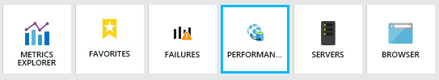
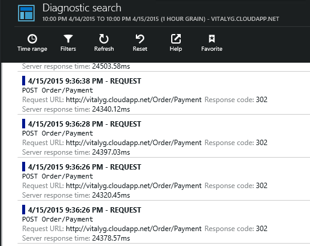

<properties 
	pageTitle="Diagnosing issues with dependencies in Application Insights" 
	description="Find failures and slow performance caused by depeendencies" 
	services="application-insights" 
    documentationCenter=""
	authors="alancameronwills" 
	manager="ronmart"/>

<tags 
	ms.service="application-insights" 
	ms.workload="tbd" 
	ms.tgt_pltfrm="ibiza" 
	ms.devlang="na" 
	ms.topic="article" 
	ms.date="04/16/2015" 
	ms.author="awills"/>
 
# Diagnosing issues with dependencies in Application Insights

A *dependency* is an external component that is called by your app. It's typically a service called using HTTP, or a database, or a file system. In Visual Studio Application Insights, you can easily see how long your application waits for dependencies and how often a dependency call fails.

## Where you can use it

Out of the box dependency monitoring is currently available for:

* ASP.NET web apps and services running on an IIS server or on Azure

For other types, such as Java web apps or device apps, you can write your own monitor using the TrackDependency API.

The out-of-the-box dependency monitor currently reports calls to these  types of dependencies:

* SQL databases
* ASP.NET web and wcf services
* Local or remote HTTP calls
* Azure DocumentDb, table, blob storage, and queue

Again, you could write your own SDK calls to monitor other dependencies.

## Setting up dependency monitoring

To get dependency monitoring, you must:

* Use [Status Monitor](app-insights-monitor-performance-live-website-now.md) on your IIS server and use it to enable monitoring
* Add the [Application Insights Extension](insights-perf-analytics.md) to your Azure Web App or VM.

(For an Azure VM, you can either use install the extension from the Azure control panel, or install the Status Monitor just as you would on any machine.)

You can do the above steps to an already-deployed web app. To get standard dependency monitoring, you don't have to add Application Insights to your source project. 

## Diagnosing dependency performance issues

To assess the performance of requests at your server:

Scroll down to look at the grid of requests:

The top one is taking very long. Let's see if we can find out where the time is spent.

Click that row to see individual request events:

Click any long-running instance to inspect it further.

> AZURE.NOTE Scroll down a bit to choose an instance. Latency in the pipeline might mean that the data for the top instances is incomplete.

Scroll down to the remote dependency calls related to this request:

It looks like most of the time servicing this request was spent in a call to a local service. 

Select that row to get more information:

The detail includes sufficient information to diagnose the problem.

## Failures

If there are failed requests, click the chart.

Click through a request type and request instance, to find a failed call to a remote dependency.

<!--Link references-->

