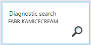
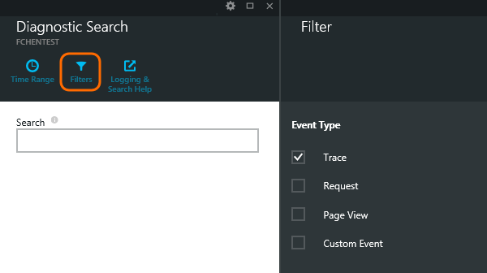
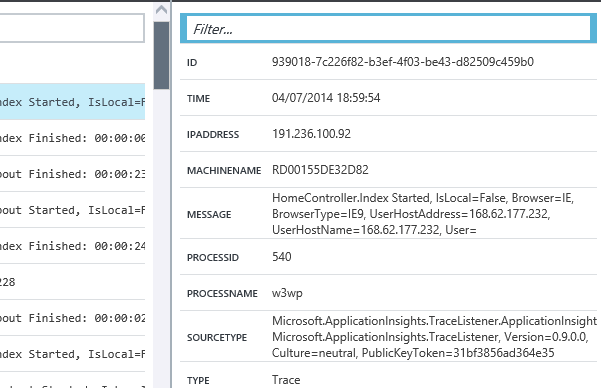

<properties title="Using Diagnostic Search in Application Insights" pageTitle="Using Diagnostic Search" description="Search and filter individual events, requests, and log traces." metaKeywords="analytics web test" authors="awills"  manager="kamrani" />

<tags ms.service="application-insights" ms.workload="tbd" ms.tgt_pltfrm="ibiza" ms.devlang="na" ms.topic="article" ms.date="2015-01-09" ms.author="awills" />
 
# Using Diagnostic Search in Application Insights

Diagnostic Search is the blade in [Application Insights][start] that you use to find and explore individual telemetry events, such as page views, exceptions, or web requests. And you can view log traces and events that you have coded.

## View the telemetry sent by your application

Diagnostic Search opens automatically when you click through from some charts on you Application Insights Overview blade. You can also open it explicitly:

   
The report lists telemetry over the time range and filters you choose. 

Select any telemetry item to see key fields and related items. If you want to see the full set of fields, click "...". 

To filter the full set of fields, use plain strings (without wildcards). The available fields depend on the type of telemetry.

## Filter event types

Open the Filter blade and choose the event types you want to see.

The event types are:

* **[Trace](#trace)** - Diagnostic logs including TrackTrace,  log4Net, NLog, and System.Diagnostic.Trace calls.
* **[Request](#requests)** - HTTP requests received by your server application, including pages, scripts, images, style files and data. These events are used to create the request and response overview charts.
* **[Page View](#pages)** - Telemetry sent by the web client, used to create page view reports. 
* **[Custom Event](#events)** - If you inserted calls to TrackEvent() in order to [monitor usage][track], you can search them here.
* **[Exception](#exceptions)** - Uncaught exceptions in the server, and those that you log by using TrackException().

### Filter on property values

You can filter events on the values of their properties. The available properties depend on the event types you selected. 

For example, pick out a specific type of exception.

Choosing no values of a particular property has the same effect as choosing all values; it switches off filtering on that property.

## Search the data

Set a time range and search for terms. Searches over a shorter range are faster. 

Search for terms, not substrings. Terms are alphanumeric strings including some punctuation such as '.' and '_'. For example:

<table>
  <tr><th>term</th><th>is NOT matched by</th><th>but these do match</th></tr>
  <tr><td>HomeController.About</td><td>about home</td><td>h*about home*</td></tr>
  <tr><td>IsLocal</td><td>local is *local</td><td>isl* islocal i*l</td></tr>
  <tr><td>New Delay</td><td>w d</td><td>new delay n* AND d*</td></tr>
</table>

Here are the search expressions you can use:

<table>
                    <tr>
                      <th>
                        
Sample query

                      </th>
                      <th>
                        
Effect

                      </th>
                    </tr>
                    <tr>
                      <td>
                        

                          slow
                        

                      </td>
                      <td>
                        
Find all events in the date range whose fields include the term "slow"

                      </td>
                    </tr>
                    <tr>
                      <td>
                        

                          database??
                        

                      </td>
                      <td>
                        
Matches database01, databaseAB, ...

                        
? is not allowed at the start of a search term.

                      </td>
                    </tr>
                     <tr>
                      <td>
                        

                          database*
                        

                      </td>
                      <td>
                        
Matches database, database01, databaseNNNN

                        
* is not allowed at the start of a search term

                      </td>
                    </tr>
                   <tr>
                      <td>
                        

                          apple AND banana
                        

                      </td>
                      <td>
                        
Find events that contain both terms. Use capital "AND", not "and".

                      </td>
                    </tr>
                    <tr>
                      <td>
                        

                          apple OR banana
                        

                        

                          apple banana
                        

                      </td>
                      <td>
                        
Find events that contain either term. Use "OR", not "or".

                        
Short form.

                      </td>
                    </tr>
                    <tr>
                      <td>
                        

                          apple NOT banana
                        

                        

                          apple -banana
                        

                      </td>
                      <td>
                        
Find events that contain one term but not the other.

                        
Short form.

                      </td>
                    </tr>
                    <tr>
                      <td>
                        
app* AND banana NOT (grape OR pear)

                        

                          app* AND banana -(grape pear)
                        

                      </td>
                      <td>
                        
Logical operators and bracketing.

                        
Shorter form.

                      </td>
                    </tr>
       <!-- -- fielded search feature not ready yet --
                    <tr>
                      <td>
                        

                          message:slow
                        

                        

                          ipaddress:(10.0.0.* OR 192.168.0.*)
                        

                        

                          properties.logEventInfo.level:Error
                        

                      </td>
                      <td>
                        
Match the specified field. By default, all fields are searched. To see what fields are available, select an event to look at its detail.

                      </td>
                    </tr>
 -->
</table>

## Send more telemetry to Application Insights

In addition to the out-of-the-box telemetry sent by Application Insights SDK, you can:

* Capture log traces from your favorite logging framework. This means you can search through your log traces and correlate them with page views, exceptions, and other events.
* Write code to send custom events, page views, and exceptions. 

[Learn how to send logs and custom telemetry to Application Insights][trace]
 

## Q & A

### How much data is retained?

Up to 500 events per second from each application. Events are retained for seven days.

## Next steps

* [Send logs and custom telemetry to Application Insights][trace]
* [Set up availability and responsiveness tests][availability]
* [Troubleshooting][qna]

[AZURE.INCLUDE [app-insights-learn-more](../includes/app-insights-learn-more.md)]

