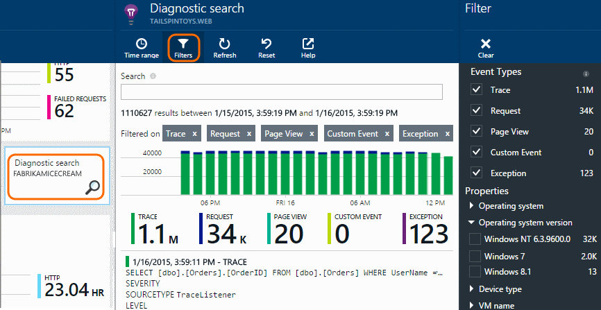
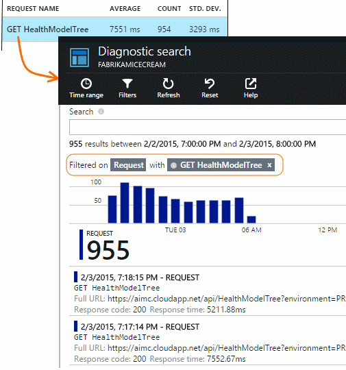
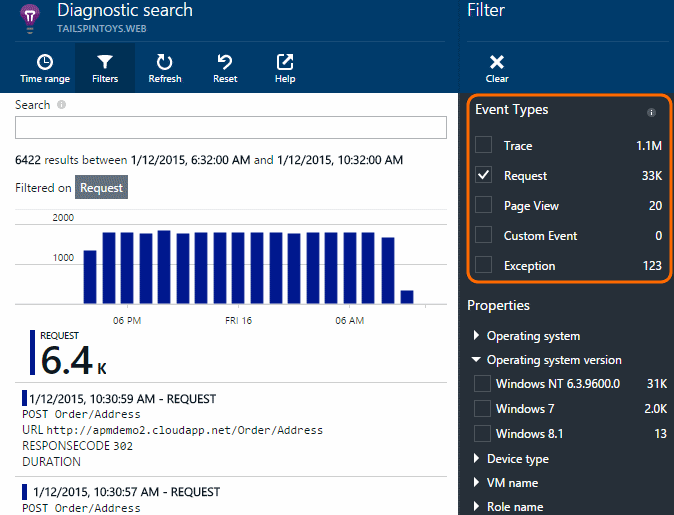
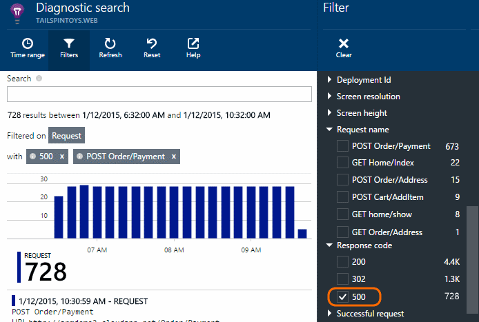
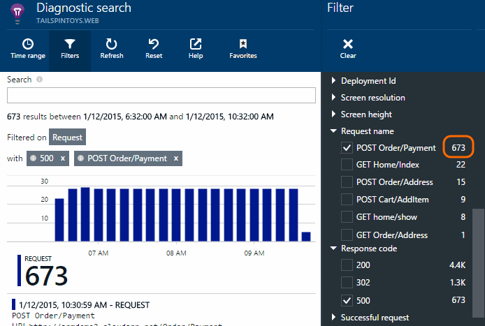
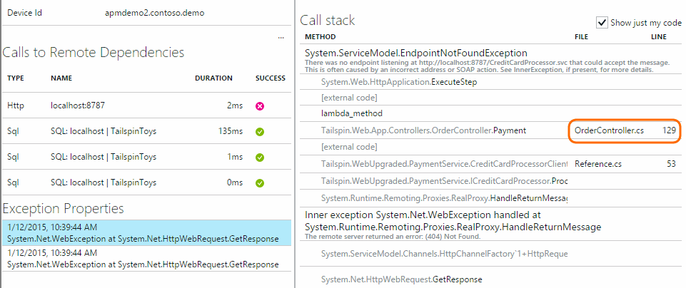
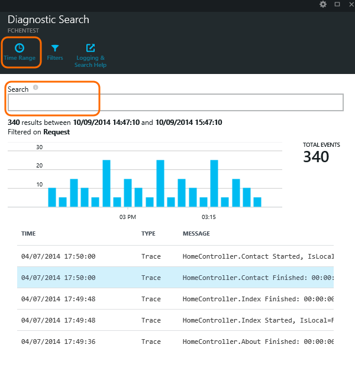

<properties 
	pageTitle="Using Diagnostic Search" 
	description="Search and filter individual events, requests, and log traces." 
	services="application-insights" 
    documentationCenter=""
	authors="alancameronwills" 
	manager="ronmart"/>

<tags 
	ms.service="application-insights" 
	ms.workload="tbd" 
	ms.tgt_pltfrm="ibiza" 
	ms.devlang="na" 
	ms.topic="article" 
	ms.date="04/22/2015" 
	ms.author="awills"/>
 
# Using Diagnostic Search in Application Insights

Diagnostic Search is the blade in [Application Insights][start] that you use to find and explore individual telemetry items, such as page views, exceptions, or web requests. And you can view log traces and events that you have coded.

## When do you see Diagnostic Search?

You can open diagnostic search explicitly:

It also opens when you click through some charts and grid items. In this case, its filters are pre-set to focus on the type of item you selected. 

For example, if your application is a web service, the overview blade shows a chart of volume of requests. Click it and you get to a more detailed chart, with a listing showing how many requests have been made for each URL. Click any row, and you get a list of the individual requests for that URL:

The main body of Diagnostic Search is a list of telemetry items - server requests, page views, custom events that you have coded, and so on. At the top of the list is a summary chart showing counts of events over time.

## Inspect individual items

Select any telemetry item to see key fields and related items. If you want to see the full set of fields, click "...". 

To find the full set of fields, use plain strings (without wildcards). The available fields depend on the type of telemetry.

## Filter event types

Open the Filter blade and choose the event types you want to see. (If, later, you want to restore the filters with which you opened the blade, click Reset.)

The event types are:

* **Trace** - Diagnostic logs including TrackTrace,  log4Net, NLog, and System.Diagnostic.Trace calls.
* **Request** - HTTP requests received by your server application, including pages, scripts, images, style files and data. These events are used to create the request and response overview charts.
* **Page View** - Telemetry sent by the web client, used to create page view reports. 
* **Custom Event** - If you inserted calls to TrackEvent() in order to [monitor usage][track], you can search them here.
* **Exception** - Uncaught exceptions in the server, and those that you log by using TrackException().

## Filter on property values

You can filter events on the values of their properties. The available properties depend on the event types you selected. 

For example, pick out requests with a specific response code.

Choosing no values of a particular property has the same effect as choosing all values; it switches off filtering on that property.

### Narrow your search

Notice that the counts to the right of the filter values show how many occurrences there are in the current filtered set. 

In this example, it's clear that the `Reports/Employees` request results in the majority of the 500 errors:

Additionally if you want to also see what other events were happening during this time, you can check **Include events with undefined properties**.

## Inspect individual occurrences

Add that request name to the filter set, and you can then inspect individual occurrences of that event.

For Request events, the details show exceptions that occurred while the request was being processed.

Click through an exception to see its detail.

## Find events with the same property

Find all the items with the same property value:

## Search by metric value

Get all the requests response time > 5s.  Times are represented in ticks: 10 000 ticks = 1ms.

## Search the data

You can search for terms in any of the property values. This is particularly useful if you have written [custom events][track] with property values. 

You might want to set a time range, as searches over a shorter range are faster. 

Search for terms, not substrings. Terms are alphanumeric strings including some punctuation such as '.' and '_'. For example:

term|is *not* matched by|but these do match
---|---|---
HomeController.About|about home|h\*about home\*
IsLocal|local is \*local|isl\* islocal i\*l\*
New Delay|w d|new delay n\* AND d\*

Here are the search expressions you can use:

Sample query | Effect 
---|---
slow|Find all events in the date range whose fields include the term "slow"
database??|Matches database01, databaseAB, ... ? is not allowed at the start of a search term.
database*|Matches database, database01, databaseNNNN * is not allowed at the start of a search term
apple AND banana|Find events that contain both terms. Use capital "AND", not "and".
apple OR banana apple banana|Find events that contain either term. Use "OR", not "or". Short form.
apple NOT banana apple -banana|Find events that contain one term but not the other. Short form.
app* AND banana -(grape pear)|Logical operators and bracketing.
"Metric": 0 TO 500 "Metric" : 500 TO * | Find events that contain the named measurement within the value range.

## Save your search

When you've set all the filters you want, you can save the search as a favorite. If you work in an organizational account, you can choose whether to share it with other team members.

To see the search again, **go to the overview blade** and open Favorites:

If you saved with Relative time range, the re-opened blade has the latest data. If you saved with Absolute time range, you see the same data every time.

## Send more telemetry to Application Insights

In addition to the out-of-the-box telemetry sent by Application Insights SDK, you can:

* Capture log traces from your favorite logging framework in [.NET][netlogs] or [Java][javalogs]. This means you can search through your log traces and correlate them with page views, exceptions, and other events. 
* [Write code][track] to send custom events, page views, and exceptions. 

[Learn how to send logs and custom telemetry to Application Insights][trace].

## Q & A

### How much data is retained?

Up to 500 events per second from each application. Events are retained for seven days.

### How can I see POST data in my server requests?

We don't log the POST data automatically, but you can use [TrackTrace or log calls][trace]. Put the POST data in the message parameter. You can't filter on the message the way you can properties, but the size limit is longer.

## Next steps

* [Send logs and custom telemetry to Application Insights][trace]
* [Set up availability and responsiveness tests][availability]
* [Troubleshooting][qna]

<!--Link references-->

[availability]: app-insights-monitor-web-app-availability.md
[javalogs]: app-insights-java-trace-logs.md
[netlogs]: app-insights-asp-net-trace-logs.md
[qna]: app-insights-troubleshoot-faq.md
[start]: app-insights-get-started.md
[trace]: app-insights-search-diagnostic-logs.md
[track]: app-insights-custom-events-metrics-api.md

