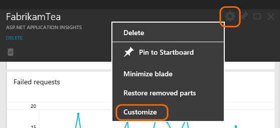

<properties title="Explore your metrics" pageTitle="Explore your metrics" description="Analyze usage, availability and performance of your on-premises or Microsoft Azure web application with Application Insights." metaKeywords="analytics monitoring application insights" authors="awills"  />

<tags ms.service="application-insights" ms.workload="tbd" ms.tgt_pltfrm="ibiza" ms.devlang="na" ms.topic="article" ms.date="01/01/1900" ms.author="awills" />
 
# Explore your metrics 

If you haven't yet [set up your web project for Application Insights][start], do that now.

Here are the reports you can expect to see on your application's blade in Application Insights. To get to the page from Visual Studio, right-click your web project and choose Open Application Insights. To get to it from the Microsoft Azure Preview start board, choose Browse, Application Insights, and then select your project.

+ [Application Health](#health) 
+ [Usage Analytics](#usage)
+ [Video: Monitoring performance](#video)
+ [Next steps](#next)

## Application Health

Application health is monitored by instrumenting your application's code.

### Average response time

Measures the time between a web request entering your application and the response being returned.

The points show a moving average. If there are a lot of requests, there might be some that deviate from the average without an obvious peak or dip in the graph.

Look for unusual peaks. In general, expect response time to rise with a rise in requests. If the rise is disproportionate, your app might be hitting a resource limit such as CPU or the capacity of a service it uses.

### Requests

The number of requests received in a specified period. Compare this with the results on other charts to see how your app behaves as the load varies.

### Web tests

[Web tests][availability] show the results of web requests sent to your server at regular intervals from Application Insights servers around the world.

Check to see if the results vary along with the request count.

[How to set up web tests][availability].

### Slowest requests

Shows which requests might need performance tuning.

### Diagnostic search

If you've [set up diagnostic logging][diagnostic], click through to see the latest events.

### Failed requests

A count of requests that threw uncaught exceptions.

### Monitoring performance

[WACOM.VIDEO monitoring-performance-with-application-insights]

## Usage Analytics

Usage data comes partly from the server and partly from the [scripts in the web pages][start].

### Sessions per browser

A *session* is a period that starts when a user opens any page on your website, and ends after the user has not sent any web request for a timeout period of 30 minutes. 

Click through to zoom into the chart.

### Top page views

Shows total counts in the last 24 hours.

Click through to see graphs of page views over the past week.

### Tracking usage
[WACOM.VIDEO tracking-usage-with-application-insights]

## Rearrange the tiles

## Next steps

[Set up web tests][availability]

[Capture and search diagnostic logs][diagnostic]

[Troubleshooting][qna]

## Learn more

* [Application Insights][root]
* [Add Application Insights to your project][start]
* [Monitor a live web server now][redfield]
* [Explore metrics in Application Insights][explore]
* [Diagnostic log search][diagnostic]
* [Availability tracking with web tests][availability]
* [Usage tracking with events and metrics][usage]
* [Q & A and troubleshooting][qna]

<!--Link references-->

[root]: ../app-insights-get-started/
[start]: ../app-insights-monitor-application-health-usage/
[redfield]: ../app-insights-monitor-performance-live-website-now/
[explore]: ../app-insights-explore-metrics/
[diagnostic]: ../app-insights-search-diagnostic-logs/ 
[availability]: ../app-insights-monitor-web-app-availability/
[usage]: ../app-insights-track-usage-custom-events-metrics/
[qna]: ../app-insights-troubleshoot-faq/
