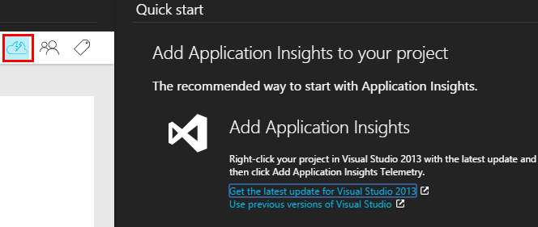

<properties 
	pageTitle="Code sample: process telemetry exported from Application Insights" 
	description="Code your own analysis of telemetry in Application Insights by using the continuous export feature." 
	services="application-insights" 
    documentationCenter=""
	authors="alancameronwills" 
	manager="keboyd"/>

<tags 
	ms.service="application-insights" 
	ms.workload="tbd" 
	ms.tgt_pltfrm="ibiza" 
	ms.devlang="na" 
	ms.topic="article" 
	ms.date="03/30/2015" 
	ms.author="awills"/>
 
# Code sample: process telemetry exported from Application Insights 

If you’d like to use your own code to analyze telemetry from [Visual Studio Application Insights][start], set up [Continuous Export][export]. This feature pipes your telemetry into Azure Storage. There you can read it or write code to process it in any way you like. Here we’ll walk through the complete process of setting up the export, and show you how to write code to move the telemetry into a SQL database.

We’ll have to do a few things before we write the code:

* Set up Application Insights for the application we’re monitoring
* Create some Azure Storage to receive the continuous export
* Switch on continuous export
* Create a SQL database
* Then we can write the code to move the telemetry from Storage into the SQL database

## Set up Application Insights

To monitor your application, you [add an Application Insights SDK][start] to your application. There are different SDKs and helper tools for different platforms, IDEs and languages. You can monitor web pages, Java or ASP.NET web servers, and mobile devices of several kinds. All the SDKs send telemetry to the [Application Insights portal][portal], where you can use our powerful analysis and diagnostic tools, or export the data to storage.

To get started:

1. Get an [account in Microsoft Azure](http://azure.microsoft.com/pricing/).
2. In the [Azure portal][portal], add a new Application Insights resource for your app:

    

    (Your app type and subscription might be different.)
3. Open Quick Start to find how to set up the SDK for your app type.
    
    If your app type isn’t listed, take a look at the [Getting Started][start] page.

4. In this example, we’re monitoring a web app, so we can use the Azure tools in Visual Studio to install the SDK. We tell it the name of our Application Insights resource:
    

## Create storage in Azure

1. Create a storage account in your subscription in the [Azure portal][portal].
    
2. Create a container
    

## Switch on Continuous Export

1. In the Azure portal, browse to the Application Insights resource you created for your application.
    
2. Create a continuous export.
    

    Select the storage account you created earlier:

    
    
    Set the event types you want to see:

    

Now sit back and let people use your application for a while. Telemetry will come in and you’ll see statistical charts in [metric explorer][metrics] and individual events in [diagnostic search][diagnostic]. 

And also, the data will export to your storage, where you can inspect the content. For example, there’s a storage browser in Visual Studio:

The content of the blobs is JSON. So we’d like to write some code to read that content and parse it. There are all kinds of things we could do with the data, but our plan today is to write some code to move the data to a SQL database. That will make it easy to run lots of interesting queries.

## Create an Azure SQL Database

Once again starting from your subscription in [Azure portal][portal], create the database (and a new server, unless you’ve already got one) to which you’ll write the data.

Make sure that the database server allows access to Azure services:

## Parsing the blobs

Now we can write some code to parse the JSON in the exported blobs, and create records in the database. Since the export store and the database are both in Azure, we’ll run the code in an Azure worker role.

1.	In Visual Studio, create a new project for the worker role:
    

    

1.	Configure the worker role settings with the Storage account connection string:

    

2.	In Solution Explorer, right-click your Worker Role project and choose Manage NuGet Packages.
Search for and install these packages: 
 * EntityFramework 6.1.2 or later - We’ll use this to generate the DB table schema on the fly, based on the content of the JSON in the blob.
 * JsonFx -	We’ll use this for flattening the JSON to C# class properties.

## Code

#### Imports

    using Microsoft.WindowsAzure.Storage;

    using Microsoft.WindowsAzure.Storage.Blob;

#### Replacement for the worker role Run method

    public override void Run()
    {
      Trace.TraceInformation("WorkerRole1 is running");

      while (true)
      {
        Trace.WriteLine("Sleeping", "Information");

        Thread.Sleep(86400000); //86400000-24 hours //1 hour-3600000
                
        Trace.WriteLine("Awake", "Information");

        ImportBlobtoDB();
      }
    }

#### Insert each JSON object as a row in the DB

    public void ImportBlobtoDB()
    {
      try
      {
        CloudStorageAccount account = CloudStorageAccount.Parse(GetConnectionString());

        var blobClient = account.CreateCloudBlobClient();
        var container = blobClient.GetContainerReference(FilterContainer);

        foreach (CloudBlobDirectory directory in container.ListBlobs())//Parent directory
        {
          foreach (CloudBlobDirectory subDirectory in directory.ListBlobs())//PageViewPerformance
       	  {
            foreach (CloudBlobDirectory dir in subDirectory.ListBlobs())//2015-01-31
            {
              foreach (CloudBlobDirectory subdir in dir.ListBlobs())//22
              {
                foreach (IListBlobItem item in subdir.ListBlobs())//3IAwm6u3-0.blob
                {
                  itemname = item.Uri.ToString();
                  ParseEachBlob(container, item);
                  AuditBlob(container, directory, subDirectory, dir, subdir, item);
                } //item loop
              } //subdir loop
            } //dir loop
          } //subDirectory loop`
        } //directory loop
      }
      catch (Exception ex)
      {
		//handle exception
      }
    }

#### Parse each blob

    private void ParseEachBlob(CloudBlobContainer container, IListBlobItem item)
    {
      try
      {
        var blob = container.GetBlockBlobReference(item.Parent.Prefix + item.Uri.Segments.Last());
    
        string json;
    
        using (var memoryStream = new MemoryStream())
        {
          blob.DownloadToStream(memoryStream);
          json = System.Text.Encoding.UTF8.GetString(memoryStream.ToArray());
    
          IEnumerable<string> entities = json.Split('\n').Where(s => !string.IsNullOrWhiteSpace(s));
    
          recCount = entities.Count();
          failureCount = 0; //resetting failure count
    
          foreach (var entity in entities)
          {
            var reader = new JsonFx.Json.JsonReader();
            dynamic output = reader.Read(entity);
    
            Dictionary<string, object> dict = new Dictionary<string, object>();
    
            GenerateDictionary((System.Dynamic.ExpandoObject)output, dict, "");
    
            switch (FilterType)
            {
              case "PageViewPerformance":
    
              if (dict.ContainsKey("clientPerformance"))
                {GenerateDictionary(((System.Dynamic.ExpandoObject[])dict["clientPerformance"])[0], dict, "");
    	        }
    
              if (dict.ContainsKey("context_custom_dimensions"))
              {
                if (dict["context_custom_dimensions"].GetType() == typeof(System.Dynamic.ExpandoObject[]))
                {GenerateDictionary(((System.Dynamic.ExpandoObject[])dict["context_custom_dimensions"])[0], dict, "");
                }
              }
    
            PageViewPerformance objPageViewPerformance = (PageViewPerformance)GetObject(dict);
    
            try
            {
              using (var db = new TelemetryContext())
              {
                db.PageViewPerformanceContext.Add(objPageViewPerformance);
                db.SaveChanges();
              }
            }
            catch (Exception ex)
            {
              failureCount++;
            }
            break;
    
            default:
            break;
          }
        }
      }
    }
    catch (Exception ex)
    {
      //handle exception 
    }
    }

#### Prepare a dictionary for each JSON document

    private void GenerateDictionary(System.Dynamic.ExpandoObject output, Dictionary<string, object> dict, string parent)
        {
            try
            {
                foreach (var v in output)
                {
                    string key = parent + v.Key;
                    object o = v.Value;

                    if (o.GetType() == typeof(System.Dynamic.ExpandoObject))
                    {
                        GenerateDictionary((System.Dynamic.ExpandoObject)o, dict, key + "_");
                    }
                    else
                    {
                        if (!dict.ContainsKey(key))
                        {
                            dict.Add(key, o);
                        }
                    }
                }
            }
            catch (Exception ex)
            {//handle exception }
        }

#### Cast the JSON document into C# class telemetry object properties

     public object GetObject(IDictionary<string, object> d)
        {
            PropertyInfo[] props = null;
            object res = null;

            try
            {
                switch (FilterType)
                {
                    case "PageViewPerformance":

                        props = typeof(PageViewPerformance).GetProperties();
                        res = Activator.CreateInstance<PageViewPerformance>();
                        break;

                    default:
                        break;
                }

                for (int i = 0; i < props.Length; i++)
                {
                    if (props[i].CanWrite && d.ContainsKey(props[i].Name))
                    {
                        props[i].SetValue(res, d[props[i].Name], null);
                    }
                }
            }
            catch (Exception ex)
            {	//handle exception }

            return res;
        }

[AZURE.INCLUDE [app-insights-learn-more](../includes/app-insights-learn-more.md)]

