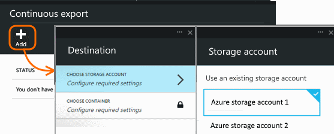

<properties pageTitle="Export telemetry from Application Insights" description="Export diagnostic and usage data continuously to storage in Microsoft Azure, and download it from there." authors="awills" manager="kamrani"/>

<tags ms.service="application-insights" ms.workload="tbd" ms.tgt_pltfrm="ibiza" ms.devlang="na" ms.topic="article" ms.date="2014-12-11" ms.author="awills"/>
 
# Export telemetry from Application Insights

The telemetry you see in the Application Insights portal can be exported to storage in Microsoft Azure in JSON format. From there you can download and write whatever code you need to process it.  

##  Set up telemetry export

On your application's Overview blade in the Application Insights portal, open Continuous Export: 

Add an export, and choose an [Azure storage account](http://azure.microsoft.com/documentation/articles/storage-introduction/) where you want to put the data:

Once you’ve created your export, it starts going. (You only get data that arrives after you create the export.)

To stop the stream, delete the export. Doing so doesn’t delete your data.

##  Get your telemetry
When you open your blob store with a tool such as [Server Explorer](http://msdn.microsoft.com/library/azure/ff683677.aspx), you’ll see a container with a set of blob files. The URI of each file is application-id/telemetry-type/date/time. 

The date and time are when the telemetry was deposited in the store – not the time it was generated. So if you write code to download the data, it can move linearly through the data.

To download this data programmatically, use the [blob store REST API](http://azure.microsoft.com/documentation/articles/storage-dotnet-how-to-use-blobs/#configure-access) or the [Azure PowerShell cmdlets](http://msdn.microsoft.com/library/azure/dn806401.aspx).

Or consider [DataFactory](http://azure.microsoft.com/services/data-factory/), in which you can set up pipelines to manage data at scale.

## Analyze your stuff

OK, so now you’ve got your data on your own machine. What's in there?

### What do you get?

The exported data is the raw telemetry we receive from your application, except: 

* Web test results aren’t currently included. 
* We add location data which we calculate from the client IP address.  

Calculated metrics are not included. For example, we don’t export average CPU utilisation, but we do export the raw telemetry from which the average is computed.

### What does it look like?

Unformatted JSON. If you want to sit and stare at it, try a viewer such as Notepad++ with the JSON plug-in:

### How to process it?

On a small scale, you can write some code to pull apart your data, read it into a spreadsheet, and so on.

On larger scales, consider [HDInsight](http://azure.microsoft.com/services/hdinsight/) - Hadoop clusters in the cloud. HDInsight provides a variety of technologies for managing and analyzing big data.

## Delete your old data
Please note that you are responsible for managing your storage capacity and deleting the old data if necessary. 

## Coming soon

* Stop, edit, resume.
* Choose which telemetry types to export.

## Q & A

* *But all I want is a one-time download of a chart.*  
 We’re working on that one separately. 

* *I set up an export, but there's no data in my store.*
 Did Application Insights receive any telemetry from your app since you set up the export? You'll only receive new data.

* *Can I export straight to my own on-premises store?* 
 No, sorry. Our export engine needs to rely on a big open throat to push the data into.  

* *Is there any limit to the amount of data you put in my store?* 
 No. We’ll keep pushing data in until you delete the export. We’ll stop if we hit the outer limits for blob storage, but that’s pretty huge. It’s up to you to control how much storage you use.  

[AZURE.INCLUDE [app-insights-learn-more](../includes/app-insights-learn-more.md)]

