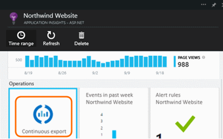
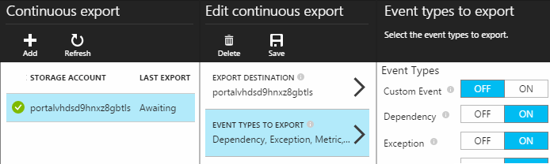
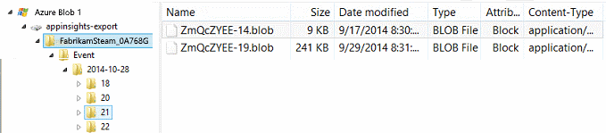

<properties 
	pageTitle="Continous export of telemetry from Application Insights" 
	description="Export diagnostic and usage data to storage in Microsoft Azure, and download it from there." 
	services="application-insights" 
    documentationCenter=""
	authors="alancameronwills" 
	manager="ronmart"/>

<tags 
	ms.service="application-insights" 
	ms.workload="tbd" 
	ms.tgt_pltfrm="ibiza" 
	ms.devlang="na" 
	ms.topic="article" 
	ms.date="04/27/2015" 
	ms.author="awills"/>
 
# Export telemetry from Application Insights

Want to do some customised analysis on your telemetry? Or maybe you'd like an email alert on events with specific properties? Continuous Export is ideal for this. The events you see in the Application Insights portal can be exported to storage in Microsoft Azure in JSON format. From there you can download your data and write whatever code you need to process it.  

##  Set up continuous export

On your application's Overview blade in the Application Insights portal, open Continuous Export: 

Add an export, and choose an [Azure storage account](storage-introduction.md) where you want to put the data:

Choose the event types you'd like to export:

Once you've created your export, it starts going. (You only get data that arrives after you create the export.)

If you want to change the event types later, just edit the export:

To stop the stream, click Disable. When you click Enable again, the stream will restart with new data. You won't get the data that arrived in the portal while export was disabled.

To stop the stream permanently, delete the export. Doing so doesn't delete your data from storage.
#### Can't add or change an export?

* To add or change exports, you need Owner, Contributor or Application Insights Contributor access rights. [Learn about roles][roles].

##  What events do you get?

The exported data is the raw telemetry we receive from your application, except: 

* Web test results aren't currently included. 
* We add location data which we calculate from the client IP address.  

Calculated metrics are not included. For example, we don't export average CPU utilisation, but we do export the raw telemetry from which the average is computed.

##  How do you get them?

When you open your blob store with a tool such as [Server Explorer](http://msdn.microsoft.com/library/azure/ff683677.aspx), you'll see a container with a set of blob files. The URI of each file is application-id/telemetry-type/date/time. 

The date and time are UTC and are when the telemetry was deposited in the store - not the time it was generated. So if you write code to download the data, it can move linearly through the data.

To download this data programmatically, use the [blob store REST API](storage-dotnet-how-to-use-blobs.md#configure-access) or the [Azure PowerShell cmdlets](http://msdn.microsoft.com/library/azure/dn806401.aspx).

Or consider [DataFactory](http://azure.microsoft.com/services/data-factory/), in which you can set up pipelines to manage data at scale.

We start writing a new blob in each hour (if events are received). So you should always process up to the previous hour, but wait for the current hour to complete.

[Code sample][exportcode]

##  What does the data look like?

* Each blob is a text file that contains multiple '\n'-separated rows.
* Each row is an unformatted JSON document. If you want to sit and stare at it, try a viewer such as Notepad++ with the JSON plug-in:

Time durations are in ticks, where 10 000 ticks = 1ms. For example, these values show a time of 10ms to send a request from the browser, 30ms to receive it, and 1.8s to process the page in the browser:

	"sendRequest": {"value": 10000.0},
	"receiveRequest": {"value": 30000.0},
	"clientProcess": {"value": 17970000.0}

## How to process it?

On a small scale, you can write some code to pull apart your data, read it into a spreadsheet, and so on. For example:

    private IEnumerable<T> DeserializeMany<T>(string folderName)
    {
      var files = Directory.EnumerateFiles(folderName, "*.blob", SearchOption.AllDirectories);
      foreach (var file in files)
      {
         using (var fileReader = File.OpenText(file))
         {
            string fileContent = fileReader.ReadToEnd();
            IEnumerable<string> entities = fileContent.Split('\n').Where(s => !string.IsNullOrWhiteSpace(s));
            foreach (var entity in entities)
            {
                yield return JsonConvert.DeserializeObject<T>(entity);
            }
         }
      }
    }

Or you can move it into a SQL database - see the [code sample][exportcode].

On larger scales, consider [HDInsight](http://azure.microsoft.com/services/hdinsight/) - Hadoop clusters in the cloud. HDInsight provides a variety of technologies for managing and analyzing big data.

## Delete your old data
Please note that you are responsible for managing your storage capacity and deleting the old data if necessary. 

## If you regenerate your storage key...

If you change the key to your storage, continuous export will stop working. You'll see a notification in your Azure account. 

Open the Continuous Export blade and edit your export. Edit the Export Destination, but just leave the same storage selected. Click OK to confirm.

The continuous export will restart.

## Code Sample

[Move exported data into a SQL database][exportcode]

## Q & A

* *But all I want is a one-time download of a chart.*  
 
    We're working on that one separately. 

* *I set up an export, but there's no data in my store.*

    Did Application Insights receive any telemetry from your app since you set up the export? You'll only receive new data.

* *I tried to set up an export, but was denied access*

    If the account is owned by your organization, you have to be a member of the owners or contributors groups.

    <!-- Your account has to be either a paid-for account, or in the free trial period. -->

* *Can I export straight to my own on-premises store?* 

    No, sorry. Our export engine needs to rely on a big open throat to push the data into.  

* *Is there any limit to the amount of data you put in my store?* 

    No. We'll keep pushing data in until you delete the export. We'll stop if we hit the outer limits for blob storage, but that's pretty huge. It's up to you to control how much storage you use.  

* *I regenerated the key to my storage or changed the name of the container, and now the export doesn't work.*

    Edit the export and open the export destination blade. Leave the same storage selected as before, and click OK to confirm. Export will restart. If the change was within the past few days, you won't lose data.

* *Can I pause the export?*

    Yes. Click Disable.

<!--Link references-->

[exportcode]: app-insights-code-sample-export-telemetry-sql-database.md
[roles]: app-insights-resources-roles-access-control.md

