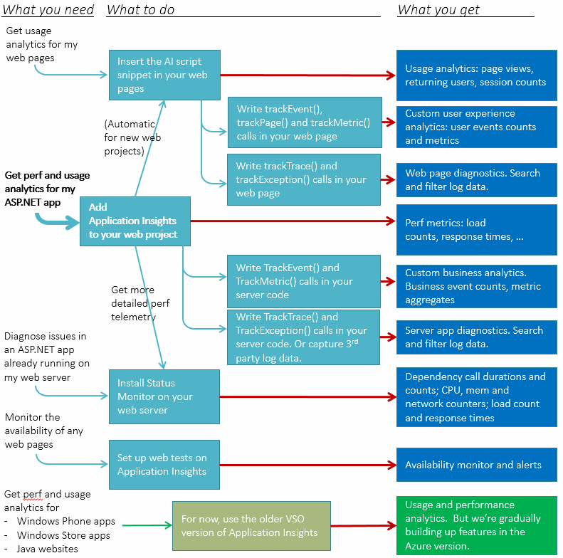

<properties title="Application Insights" pageTitle="Application Insights - start monitoring your app's health and usage" description="Analyze usage, availability and performance of your on-premises or Microsoft Azure web application with Application Insights." metaKeywords="analytics monitoring application insights" authors="awills"  manager="kamrani" />

<tags ms.service="application-insights" ms.workload="tbd" ms.tgt_pltfrm="ibiza" ms.devlang="na" ms.topic="article" ms.date="2014-09-24" ms.author="awills" />

# Application Insights - Start monitoring your app's health and usage

*Application Insights is in preview.*

Application Insights lets you monitor your live application for:

* **Availability** - We'll test your URLs every few minutes from around the world.
* **Performance**  - Detect and diagnose perf issues and exceptions.
* **Usage** - Find out what users are doing with your app, so that you can make it better for them.

Configuration is very easy, and you'll see results in minutes. We currently support ASP.NET web apps (on your own servers or on Azure).

## Get started

Start with any combination, in any order, of the entry points on the left of this chart. Pick the routes that work for you. If you're developing an ASP.NET web app, start by adding Application Insights to your web project - it's easy to add the other bits later.

You'll need an account in [Microsoft Azure](http://azure.com) (unless you use the VSO version).

<table >
<tr><th>What you need</th><th colspan="2">What to do</th><th>What you get</th></tr>
<tr><td>Get perf and usage analytics for my ASP.NET app</td><td colspan="2"><a href="../app-insights-start-monitoring-app-health-usage/">Add Application Insights to your web project</a></td><td>Performance metrics: load counts, response times, ...</td></tr>
<tr><td></td><td></td><td><a href="../app-insights-web-track-usage-custom-events-metrics/">Send events and metric from your server code</a></td><td>Custom business analytics</td></tr>
<tr><td></td><td></td><td><a href="../app-insights-search-diagnostic-logs/">Send trace and exception telemetry from your server, or capture 3rd party log data.</td><td>Server app diagnostics. Search and filter log data.</a></td></tr>
<tr><td>Get usage analytics for my web pages (on any platform)</td><td colspan="2"><a href="../app-insights-web-track-usage/">Insert the AI script in your web pages</a></td><td>Usage analytics: page views, returning users, session counts</td></tr>
<tr><td></td><td>&nbsp;&nbsp;</td><td><a href="../app-insights-web-track-usage-custom-events-metrics/">Write event and metric calls in your web page scripts</a></td><td>Custom user experience analytics</td></tr>
<tr><td></td><td></td><td><a href="../app-insights-search-diagnostic-logs/">Write trace and diagnostic calls in your web page scripts</a></td><td>Search and filter log data.</td></tr>
<tr><td>Diagnose issues in an ASP.NET app already running on my web server</td><td colspan="2"><a href="../app-insights-monitor-performance-live-website-now/">Install Status Monitor on your web server</a></td><td>Dependency call durations and counts; CPU, mem and network counters; load counts, response times</td></tr>
<tr><td>Monitor the availability of any web pages</td><td colspan="2"><a href="../app-insights-monitor-web-app-availability/">Set up web tests on Application Insights</a></td><td>Availability monitor and alerts</td></tr>
<tr><td>Get perf and usage analytics for Windows Phone apps, Windows Store apps, or Java websites</td><td colspan="2"><a href="http://msdn.microsoft.com/library/dn481095.aspx">For now, use the older VSO version of Application Insights</a></td><td>Usage and performance analytics. <a href="http://msdn.microsoft.com/library/dn793604.aspx">We're gradually building up features in the Azure version.</a></td></tr>
</table>

<!--

  <map name="startmap">
    <area shape="rect" coords="151,70,308,139" href="../app-insights-web-track-usage/" />
    <area shape="rect" coords="319,137,536,207" href="../app-insights-web-track-usage-custom-events-metrics/" />
    <area shape="rect" coords="319,217,536,290" href="../app-insights-search-diagnostic-logs/" />
    <area shape="rect" coords="112,276,268,345" href="../app-insights-start-monitoring-app-health-usage/" />
    <area shape="rect" coords="319,358,536,431" href="../app-insights-web-track-usage-custom-events-metrics/" />
    <area shape="rect" coords="319,434,536,512" href="../app-insights-search-diagnostic-logs/" />
    <area shape="rect" coords="151,518,308,595" href="../app-insights-monitor-performance-live-website-now/" />
    <area shape="rect" coords="151,619,308,685" href="../app-insights-monitor-web-app-availability/" />
    <area shape="rect" coords="242,703,464,774" href="../app-insights-monitor-web-app-availability/" />

    <area shape="rect" coords="557,69,784,140" href="../app-insights-web-track-usage/" />
    <area shape="rect" coords="557,147,784,209" href="../app-insights-web-track-usage-custom-events-metrics/" />
    <area shape="rect" coords="557,230,784,273" href="../app-insights-search-diagnostic-logs/" />
    <area shape="rect" coords="557,288,784,356" href="../app-insights-web-monitor-performance/" />
    <area shape="rect" coords="557,372,784,431" href="../app-insights-web-track-usage-custom-events-metrics/" />
    <area shape="rect" coords="557,450,784,498" href="../app-insights-search-diagnostic-logs/" />
    <area shape="rect" coords="557,516,784,597" href="../app-insights-monitor-performance-live-website-now/" />
    <area shape="rect" coords="557,630,784,677" href="../app-insights-monitor-web-app-availability/" />

    <area shape="rect" coords="6,30,130,90" href="../app-insights-web-track-usage/" />
    <area shape="rect" coords="6,226,130,285" href="../app-insights-start-monitoring-app-health-usage/" />
    <area shape="rect" coords="6,461,130,542" href="../app-insights-monitor-performance-live-website-now/" />
    <area shape="rect" coords="6,577,130,634" href="http://msdn.microsoft.com/library/dn481095.aspx" />
 </map>

  

-->

Here's a graphical version:

## Videos

#### Introduction

> [AZURE.VIDEO application-insights-introduction]

#### Get started

> [AZURE.VIDEO getting-started-with-application-insights]

## Application Insights - learn more

* [Application Insights - get started][start]
* [Start monitoring web app health and usage][greenbrown]
* [Monitor a live web server now][redfield]
* [Monitor performance in web applications][perf]
* [Search diagnostic logs][diagnostic]
* [Availability tracking with web tests][availability]
* [Track usage][usage]
* [Track custom events and metrics][track]
* [Q & A and troubleshooting][qna]

<!--Link references-->

[start]: ../app-insights-get-started/
[greenbrown]: ../app-insights-start-monitoring-app-health-usage/
[redfield]: ../app-insights-monitor-performance-live-website-now/
[perf]: ../app-insights-web-monitor-performance/
[diagnostic]: ../app-insights-search-diagnostic-logs/ 
[availability]: ../app-insights-monitor-web-app-availability/
[usage]: ../app-insights-web-track-usage/
[track]: ../app-insights-web-track-usage-custom-events-metrics/
[qna]: ../app-insights-troubleshoot-faq/
