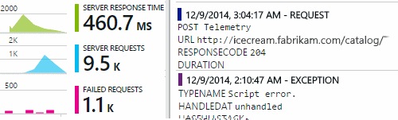
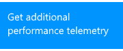
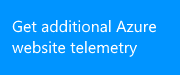
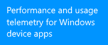
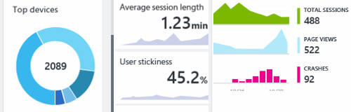

<properties 
	pageTitle="Get started with Application Insights" 
	description="Analyze usage, availability and performance of your on-premises or Microsoft Azure web application with Application Insights." 
	services="application-insights" 
    documentationCenter=""
	authors="alancameronwills" 
	manager="ronmart"/>

<tags 
	ms.service="application-insights" 
	ms.workload="tbd" 
	ms.tgt_pltfrm="ibiza" 
	ms.devlang="na" 
	ms.topic="article" 
	ms.date="04/26/2015" 
	ms.author="awills"/>

# Get started with Visual Studio Application Insights

*Application Insights is in preview.*

Detect issues, solve problems and continuously improve your applications. Quickly diagnose any problems in your live application. Understand what your users do with it.

Configuration is very easy, and you'll see results within minutes.

We currently support iOS, Android, and Windows apps; J2EE and ASP.NET web applications, WCF services. (They don't have to run or be developed on Azure.) Our JavaScript SDK runs in any web pages.

## Get started

Start with any combination, in any order, of the entry points on the left of this map. Follow the path that works for you.

Application Insights works by adding an SDK into your app, which sends telemetry to the [Azure portal](http://portal.azure.com). There are different SDKs for the many combinations of platforms, languages and IDEs that are supported.

You'll need an account in [Microsoft Azure](http://azure.com). You might already have access to a group account through your organization, or you might want to get a Pay-as-you-go account. (While Application Insights is in Preview, it's free.)

What you want | What to do | What you get
---|---|---
  | <a href="app-insights-start-monitoring-app-health-usage.md">Add Application Insights SDK to your web project</a>    | 
 |<a href="app-insights-monitor-performance-live-website-now.md">Install Status Monitor on your IIS server</a>    | 
|<a href="insights-perf-analytics.md">Enable Insights in your Azure web app or VM</a>    | 
|<a href="app-insights-java-get-started.md">Add the SDK to your Java project</a>  | 
|<a href="app-insights-web-track-usage.md">Insert the Application Insights script into your web pages</a>  | 
|<a href="app-insights-monitor-web-app-availability.md">Create web tests</a>  | 
|<a href="app-insights-windows-get-started.md">Add Application Insights to your device app project</a>  | 

## Support and feedback

* Questions and Issues:
 * [Troubleshooting][qna]
 * [MSDN Forum](https://social.msdn.microsoft.com/Forums/vstudio/en-US/home?forum=ApplicationInsights)
 * [StackOverflow](http://stackoverflow.com/questions/tagged/ms-application-insights)
* Bugs:
 * [Connect](https://connect.microsoft.com/VisualStudio/Feedback/LoadSubmitFeedbackForm?FormID=6076)
* Suggestions:
 * [User Voice](http://visualstudio.uservoice.com/forums/121579-visual-studio/category/77108-application-insights)

## Videos

#### Introduction

> [AZURE.VIDEO application-insights-for-asp-net]

#### Get started

> [AZURE.VIDEO getting-started-with-application-insights]

<!--Link references-->

[qna]: app-insights-troubleshoot-faq.md

